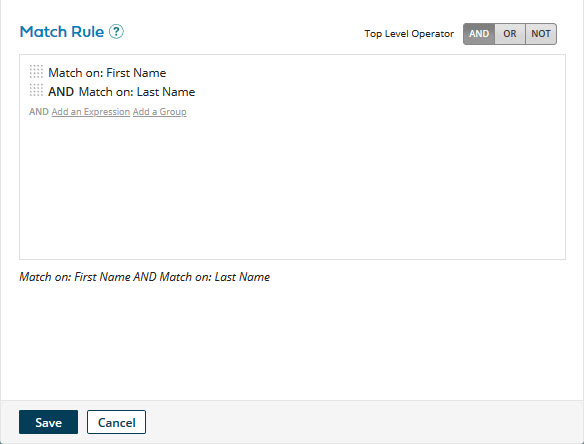
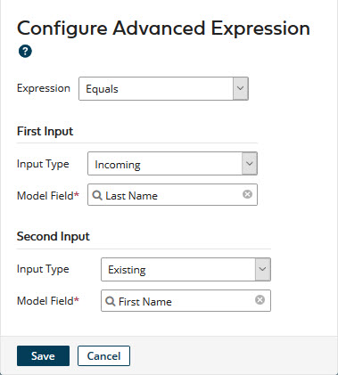
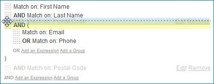

# Modifying a match rule 

<head>
  <meta name="guidename" content="DataHub"/>
  <meta name="context" content="GUID-70e6d252-e8de-40a1-a0c3-61d43794c4e5"/>
</head>

You can modify a match rule in a model in reaction to changes in requirements.

## About this task

Following is the general procedure for modifying a match rule. For details about step 2 refer to the linked task topics.

## Procedure

1.  In the **Match Rules** tab, click the match rule.

    The Match Rule dialog appears and takes focus.

    

2.  Do any of the following:

    1.  To remove an expression, pause on it and click **Remove**.

        

    2.  To remove an expression group, pause on its top delimiter and click **Remove**.

        When you remove an expression group, its member expressions are also removed.

    3.  To edit a simple expression, pause on it and click **Edit**. Then in the **Match on** list select the field in the model to which to match.

        

    4.  To edit an advanced expression, pause on it and click **Edit**. Then follow the steps in the Related task about adding an advanced expression to a match rule.

        

    5.  To change a simple expression to an advanced expression, pause the pointer on it and click **Edit**. Then click **Advanced Configuration** and follow the steps in Related task about adding an advanced expression to a match rule.

    6.  To edit an expression group, pause on its top delimiter and click **Edit**. Then make changes and click **Save**.

        

    7.  To change the Boolean operator relating root-level grouped expressions, click the desired **Top Level Operator** — **AND**, **OR** or **NOT**.

    8.  To add an expression or expression group \(simple or advanced\), follow the steps in the corresponding Related task.

    9.  To reorder expressions and expression groups, drag and drop their reorder icons .

        As you drag a reorder icon, a dashed horizontal line dynamically shows the position into which the expression or expression group would be moved if you were to drop the icon at the current pointer location.

        

        When you change the position of an expression group, its member expressions move along with it.

3.  Click **Save**.

    The Match Rule dialog closes, and the newly modified match rule is shown in the Match Rules tab.