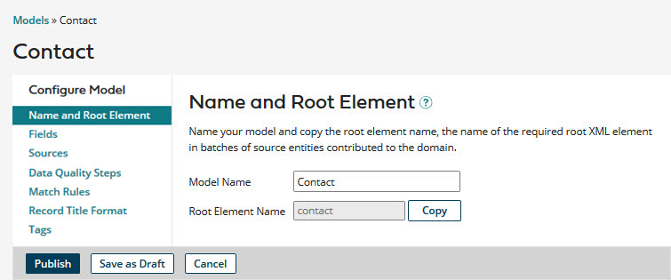
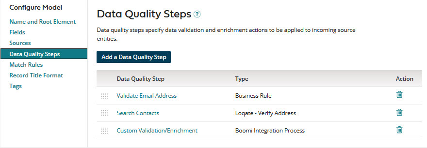
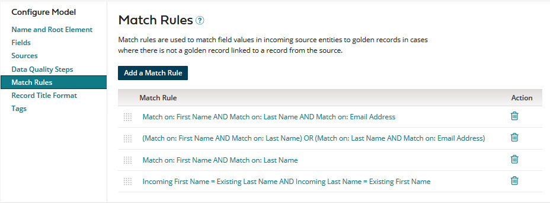
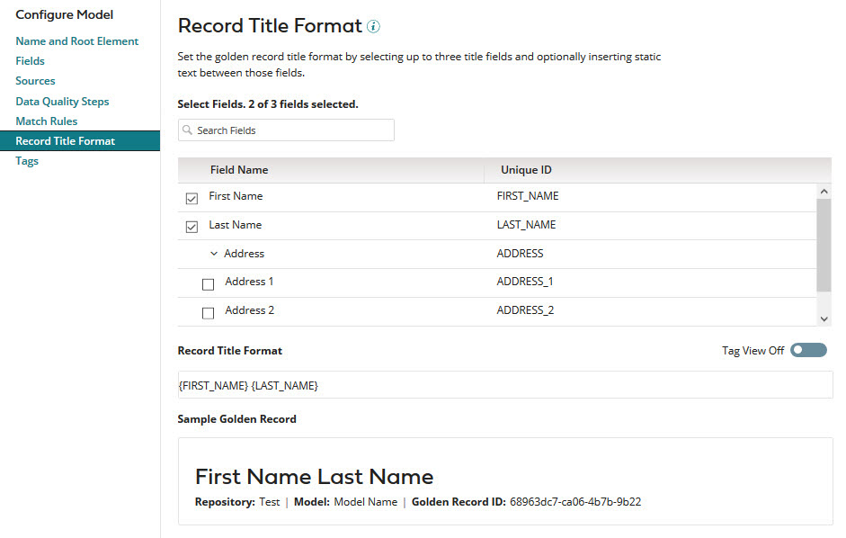
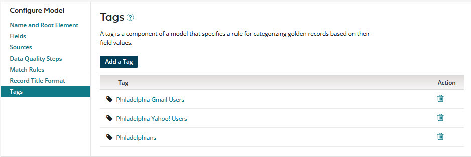

# Modifying a model 

<head>
  <meta name="guidename" content="DataHub"/>
  <meta name="context" content="GUID-41eeab47-1198-4e42-aa85-bb0622162d97"/>
</head>

Modifying or renaming a model can become necessary when requirements change. If the model is published and a draft version exists, you can modify only the draft version — the published version is read-only.

## Procedure

1.  In the **Models** page, click the name of the model you want to modify.

    The page loads.

2. **Optional**: To rename the model, select the **Name and Root Element** tab and type the new name in the **Model Name** field.

    

    :::note
    
    Once a model is saved as a draft, its **Root Element Name** cannot be changed.

    :::

3. **Optional**:  To modify the field structure for golden records, select the **Fields** tab and use the tools there to add, group, modify or delete fields. You can add fields manually or by using the Import Fields wizard or the Boomi Suggest wizard.

If the field will contain sensitive data, you can select a masking option to mask data from users that that cannot view masked data. Read [Setting up user accounts and access](/docs/Atomsphere/Master%20Data%20Hub/Getting%20started/r-mdm-User_Management_5f47b2da-d5cc-4c88-bdfd-0a255d69323a.md) to learn more. Select one of the following options from the **Mask** drop-down:

- **All** - hides entire data. Not available for Reference data types. 
- **Partial Mask** - hides a portion of the data. Not available for Boolean and Reference data types. 
- **Partial Show** - reveals a portion of the data. Not available for Boolean and Reference data types. 
- **None** - reveals entire data. 

4.**Optional**:  To add, modify, or delete data quality steps, select the **Data Quality Steps** tab and use the tools there.

5.**Optional**:  To add, modify, or delete match rules, select the **Match Rules** tab and use the tools there.

6.**Optional**:  To modify the golden record title format, select the **Record Title Format** tab and use the tools there. You can only include unmasked fields. 

7.  **Optional**: To add, modify, or delete tags, select the **Tags** tab and use the tools there.

    

8.  Do one of the following:

    -   Save the model as a draft.

    -   Publish the model.