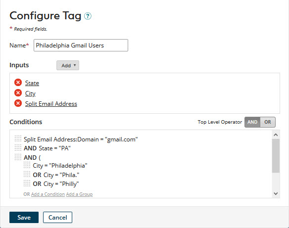

# Modifying a tag 

<head>
  <meta name="guidename" content="DataHub"/>
  <meta name="context" content="GUID-d06f2451-d772-4a17-8bf1-fa34098332b5"/>
</head>

You can modify a tag in a model in reaction to changes in requirements.

## Procedure

1.  In the **Tags** tab, click the tag.

    The Configure Tag dialog appears and takes focus.

    

2.  Do any of the following:

    1.  To change the tag’s name, type the new name in the **Name** field.

    2.  To delete an input field or function, click  next to it, then click **OK**.

    3.  To modify an input field, click the input in the Inputs section, edit it in the dialog and click **OK**.

    4.  To modify an input function, click the input in the Inputs section and edit the function’s input parameters and output\(s\) in the dialog\(s\). When you are done, click **OK** in the last dialog.

    5.  To change the Boolean operator relating root-level grouped conditions, click the desired **Top Level Operator** — **AND** or **OR**.

    6.  To add an input field or function, follow the steps in the corresponding Related task.

    7.  To remove a condition, pause the pointer on it in the Conditions section and click **Remove**.

    8.  To remove a condition group, pause the pointer on its top delimiter in the Conditions section and click **Remove**.

        When you remove a condition group, its member conditions are also removed.

    9.  To edit a condition, pause the pointer on it in the Conditions section and click **Edit**. Then make changes and click **Save**.

    10. To edit a condition group, pause the pointer on its top delimiter in the Conditions section and click **Edit**. Then make changes and click **Save**.

    11. To add a condition or condition group, follow the steps in the corresponding Related task.

    12. To reorder conditions and condition groups, drag and drop their reorder icons .

        As you drag a reorder icon, a dashed horizontal line dynamically shows the position into which the condition or condition group would be moved if you were to drop the icon at the current pointer location.

        When you change the position of a condition group, its member conditions move along with it.

3.  Click **Save**.

    The dialog closes, and focus is restored to the **Tags** tab. If you changed the tag’s name \(step 2a\), the new name is shown.