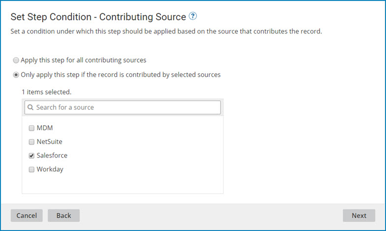
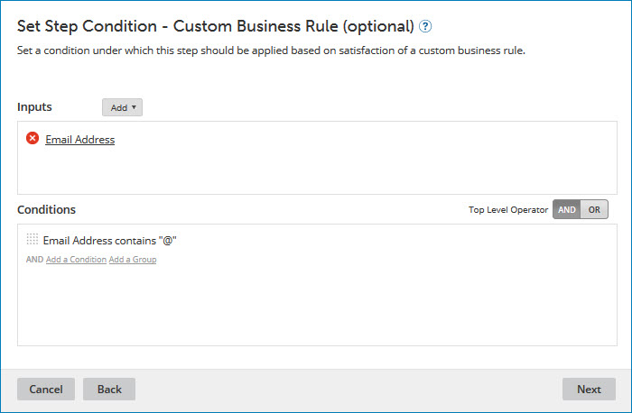

# Modifying a Integration process call data quality step 

<head>
  <meta name="guidename" content="DataHub"/>
  <meta name="context" content="GUID-9349736b-547a-42a0-ae5c-e80eeff6de92"/>
</head>

You can modify a Integration process call data quality step in a model in reaction to changes in requirements.

## Procedure

1.  **Optional**: In Integration, either:

    -   Build a new process and deploy it to the repository to which the model is or will be deployed.

        or

    -   Modify the process referenced in the data quality step and deploy the new revision to the repository to which the model is or will be deployed.

    See the Related topics. You can defer deployment until after you actually modify the data quality step \(steps 2–10\).

2.  In the Boomi DataHub model page, select the **Data Quality Steps** tab, and click the data quality step name.

    The Data Quality Step wizard opens to the Process Call screen.

    

3.  If in step 1 you built a new process for this data quality step, in the **Process** list, select the process.

4.  Click **Next**.

    The wizard advances to the Set Step Condition —Contributing Source screen.

    

5.  To modify the criteria for applying the data quality step for source record updates based on their contributing source, do one of the following:

    -   To apply the step for source record updates regardless of their contributing source, select **Apply this step for all contributing sources**.

        To apply the step for source record updates contributed by particular sources, select**Only apply this step if the record is contributed by selected sources** and select the sources by turning on their check boxes below.

6.  Click **Next**.

    The wizard advances to the Set Step Condition - Field Changes screen.

    

7. **Optional**:  To modify the criteria for applying the data quality step to source entities updating matching golden records, do one of the following:

    -   To apply the step even if a source entity does not populate or change the values of golden record fields, select **Apply this step regardless of field changes**. Selecting this option may be advantageous for domains with relatively dynamic source data.

    -   To apply the step only if a source entity populates or changes the value of any golden record field, select **Only apply this step if any fields changed**.

    -   To apply the step only if a source entity populates or changes the values of one or more selected golden record fields, select **Only apply this step if selected fields changed** and select the fields by turning on their check boxes below.

8.  Click **Next**.

    The wizard advances to the Set Step Condition - Custom Business Rule \(optional\) screen.

    

9.  **Optional**: Do one of the following with regard to the option to specify a business rule to determine whether the data quality step is applied to a given incoming source entity:

    -   To require entities to satisfy a business rule, configure the business rule using the Inputs and Conditions controls.

        The steps are analogous to those for configuring inputs and conditions in a business rule data quality step — see the Related task.

    -   To modify a configured business rule, use the Inputs and Conditions controls to make the changes.

    -   To discontinue usage of a previously configured business rule, delete all Conditions.

10. Click **Next**.

    The wizard advances to the Name the Step screen.

    

11. **Optional**: To change the data quality step’s name, type the new name in the **Data Quality Step Name** field.

12. Click **Finish**.

    The wizard closes, and the data quality step is modified.