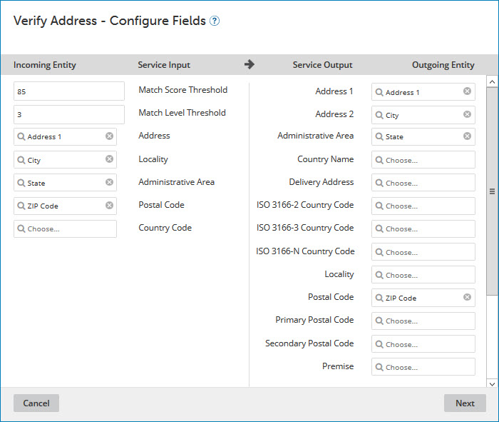

# Modifying an ordinary data quality step 

<head>
  <meta name="guidename" content="DataHub"/>
  <meta name="context" content="GUID-39a7f32e-8a75-441c-adce-45316e2096bd"/>
</head>

You can modify an ordinary data quality step in a model in reaction to changes in requirements.

## Procedure

1.  In the **Data Quality Steps** tab, click the data quality step name.

    The Data Quality Step wizard opens to the Configure Fields screen.

    

2. **Optional**:  Under **Incoming Entity**, for each object property for which you want to select a different field in the whose value will be sent to the service for validation, select the desired field.

    :::note
    
    For Loqate data quality steps, optionally modify the following settings:

    -   **Match Score Threshold** — the required similarity between input data and the closest reference data match as a percentage. A value of 100 specifies complete similarity. The default is 85.

    -   **Match Level Threshold** — the level, expressed as an integer, to which the input data matches reference data after validation and enrichment. The minimum value, 0, specifies no match level. The maximum value, 5, specifies matching at the delivery point \(building or structure\) level. The default is 3.

    :::

3. **Optional**: Under **Outgoing Entity**, for each object property for which you want to select a different field whose value in a source entity will be updated to reflect data retrieved from the service, select the desired field.

4.  Click **Next**.

    The wizard advances to the Set Step Condition- Contributing Source screen.

    

5. **Optional**:  To modify the criteria for applying the step for source record updates based on their contributing source, do one of the following:

    -   To apply the step for source record updates regardless of their contributing source, select **Apply this step for all contributing sources.**

    -   To apply the step for source record updates contributed by particular sources, select **Only apply this step if the record is contributed by selected sources** and select the sources by turning on their check boxes below.

6.  Click **Next**.

    The wizard advances to the Set Step Condition - Field Changes screen.

    

7. **Optional**:  To modify the criteria for applying the data quality step to source entities updating matching golden records, do one of the following:

    -   To apply the step even if a source entity does not populate or change the values of golden record fields selected as inputs \(step 2\) or outputs \(step 3\), select **Apply this step regardless of field changes**. Selecting this option may be advantageous for domains with relatively dynamic source data.

    -   To apply the step only if a source entity populates or changes the values of golden record fields selected as inputs \(step 2\) or outputs \(step 3\), select **Only apply this step if any Input or Output has changed.**

        .

8.  Click **Next**.

    The wizard advances to the Set Step Condition - Custom Business Rule \(optional\) screen.

    

9. **Optional**:   Do one of the following with regard to the option to specify a business rule to determine whether the data quality step is applied to a given incoming source entity:

    -   To require entities to satisfy a business rule, configure the business rule using the Inputs and Conditions controls.

        The steps are analogous to those for configuring inputs and conditions in a business rule data quality step — see the Related task.

    -   To modify a configured business rule, use the Inputs and Conditions controls to make the changes.

    -   To discontinue usage of a previously configured business rule, delete all Conditions.

10. Click **Next**.

    The wizard advances to the Step Name and Connection Settings screen.

    

11. **Optional**: To change the data quality step’s name, type the new name in the **Data Quality Step Name** field.

12. **Optional**: To change the user name for accessing D&B in a D&B data quality step, type the new user name in the **User Name** field.

13. **Optional**: To change the password for accessing D&B in a D&B data quality step or the API key for accessing Loqate in a Loqate data quality step, click `<Encrypted\>`, type the password or key in the **Password** field, and click **Apply**.

14. Click **Finish**.

    The wizard closes, and the data quality step is modified.