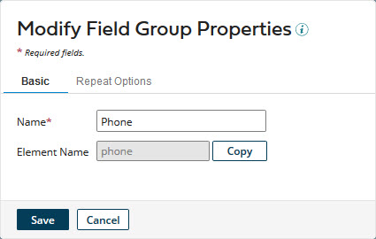

# Modifying the properties of a field group 

<head>
  <meta name="guidename" content="DataHub"/>
  <meta name="context" content="GUID-9dbfb9ee-790f-4f7d-9295-e99476feaccb"/>
</head>

You can modify the properties of a field group in response to changes in requirements.

## Procedure

1.  In the **Fields** tab, click the field group name.

    The Modify Field Group Properties dialog appears and takes focus.

    

    Modify Field Group Properties dialog

2.  Type the new name in the **Name** field.

3.  To change the field group’s repeat options, select the **Repeat Options** tab and do the following. Otherwise, skip to step 4.

    

    1.  To make the field group repeatable, select **Can Repeat**. Otherwise, clear it and skip to step 4.

    2.  To set or change the collection name, in the **Collection Name** field, type the new collection name.

    3.  To set or change the method by which collection items in incoming entities are matched with collection items in golden records, select the desired **Identify By** option:

        -   To enable matching based on order of occurrence, select **Occurrence**.

        -   To enable matching by value, select **Key**.

    4.  If **Identify By** is set to **Key**, to create or edit the key fields list, do the following.

        -   To add a key field, click the **Collection Keys** field, select the field in the chooser and click ** Add a key field**.

        -   To remove a key field, click ** Delete this value** adjacent to the field in the list.

        If you do not explicitly select key fields, all of the field group’s fields are designated as keys.

4.  Click **Save**.

    The dialog closes, and the list entry for the field group updates to reflect the change.