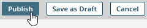

# Publishing a model 

<head>
  <meta name="guidename" content="DataHub"/>
  <meta name="context" content="GUID-eb005b41-9581-4887-8b16-1dbff5069544"/>
</head>

Once you publish a model (or a new version of a previously published model), you can deploy the model (or version) to repositories. A deployed model in a repository corresponds to a master data domain.

## Before you begin

You cannot publish a model if:

- A field specified in a match rule is deleted from the model.

- A field specified in a tag definition is deleted from the model.

- The id field is the model’s only field.

- The name of a non-reference field in the model is longer than 64 characters.

- The name of a reference field in the model is longer than 53 characters minus the number of characters in the model’s root element name. For example, a model with the root element name contact \(seven characters\) cannot be published if it has a reference field with a name longer than 46 characters.

- The name of a collection in the model is longer than 58 characters minus the number of characters in the model’s root element name. For example, a model with the root element name contact \(seven characters\) cannot be published if it has a collection with a name longer than 51 characters.

- The model does not have at least one match rule.

- A match rule in the model consists only of a fuzzy match expression or grouped fuzzy match expressions.

- A match rule in the model contains a fuzzy match expression grouped using an OR or NOT operator.

The failure of a publishing operation is indicated by a dialog containing a description of the error\(s\).

## Procedure

1.  In the page, click **Publish**.

    

    A dialog appears.

    

    If you removed a source from the model, an alert dialog appears warning you that publishing the model and deploying it will remove the source from the domain in the repository. 

    :::note
    
    It is not possible to publish a new version of a previously published model without making changes to the model.

    :::

2. **Optional**:  In the text box, type a note documenting the changes to the model, or, in the case of the initial publication, describing the model. Your note is truncated if it exceeds 4000 characters.

3.  Click **Save**.

    If the has unsaved changes, they are saved \(as if **Save as Draft** had been clicked\). Then the model is published. An alert dialog confirms the model is published and ready for deployment to repositories.

    

4.  In the alert dialog, click **Close**.

    The **Models** page loads. The list entry for the confirms its newly published state and shows the version number.