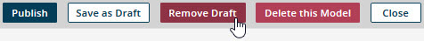

# Removing a draft version of a model 

<head>
  <meta name="guidename" content="DataHub"/>
  <meta name="context" content="GUID-be306326-7add-4ade-b7e9-c42ed601291f"/>
</head>

If you no longer need a draft version of a model, you can remove it. If there is a previously published version of the model, removing the draft reverts the model to the last published version.

## Procedure

1.  In the model page, click **Remove Draft**.

    

    A confirmation dialog appears.

2.  To confirm your request, click **OK**.

    Unsaved changes to the model are discarded; if the model was saved as a draft, the draft is discarded. Then the **Models** page loads.