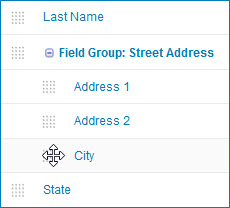
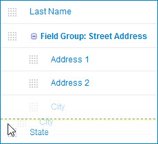

# Removing a field from a field group 

<head>
  <meta name="guidename" content="DataHub"/>
  <meta name="context" content="GUID-cd35c2bf-e4d5-4e25-87eb-7f7911e9460d"/>
</head>

Removing a field from a field group is a drag-and-drop operation.

## About this task

To delete a field group without deleting all of its fields, first individually remove from the field group each field you want to keep as described below.

## Procedure

1.  In the **Fields** tab, expand the field group.

2.  Drag the reorder icon  for the field you want to remove.

    

    As you drag, a dashed horizontal line dynamically shows the position into which the field would be moved if you were to drop the icon at the pointer location.

    

3.  Drop the icon above or below the top or bottom extent of the field group.