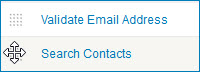
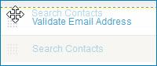

# Reordering data quality steps 

<head>
  <meta name="guidename" content="DataHub"/>
  <meta name="context" content="GUID-770cee71-842f-41ea-8e87-bef180061752"/>
</head>

You can change the order in which data quality steps in a model are applied, in reaction to changes in requirements.

## Procedure

1.  In the **Data Quality Steps** tab, drag and drop reorder icons  for data quality steps until they are in the desired order.

    

    As you drag a reorder icon, a dashed horizontal line dynamically shows the position into which the data quality step would be moved if you were to drop the icon at the pointer location.

    