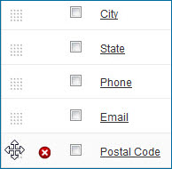
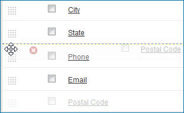

# Reordering fields and field groups 

<head>
  <meta name="guidename" content="DataHub"/>
  <meta name="context" content="GUID-ed3866e7-181b-446d-a080-6f1336bfe56f"/>
</head>

Reordering fields and field groups are drag-and-drop operations.

## Procedure

1.  In the **Fields** tab, drag and drop reorder icons  for fields and field groups until they are in the desired order.

    

    As you drag a reorder icon, a dashed horizontal line dynamically shows the position into which the field or field group would be moved if you were to drop the icon at the pointer location.

    

    When you change the position of a field group, its member fields move along with it.

    :::note
    
    The id field must be first and therefore does not have a reorder icon.

    :::