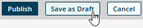

# Saving a model as a draft 

<head>
  <meta name="guidename" content="DataHub"/>
  <meta name="context" content="GUID-29bbcc8f-306a-487d-bd5e-d8568327a4b8"/>
</head>

If a model you have created is not ready to deploy, save it as a draft to ensure you will be able to continue to refine it later.

## Before you begin

A model cannot be saved as a draft if either of the following is true:

- The name of a non-reference field in the model is longer than 64 characters.

- The name of a reference field in the model is longer than 53 characters minus the number of characters in the model’s root element name. For example, a model with the root element name contact (seven characters) cannot be saved if it has a reference field with a name longer than 46 characters.

- The name of a collection in the model is longer than 58 characters minus the number of characters in the model’s root element name. For example, a model with the root element name contact (seven characters) cannot be saved if it has a collection with a name longer than 51 characters.

## Procedure

1.  In the page, click **Save as Draft**.

    

    A result message appears for a few moments near the lower-right corner of the page.