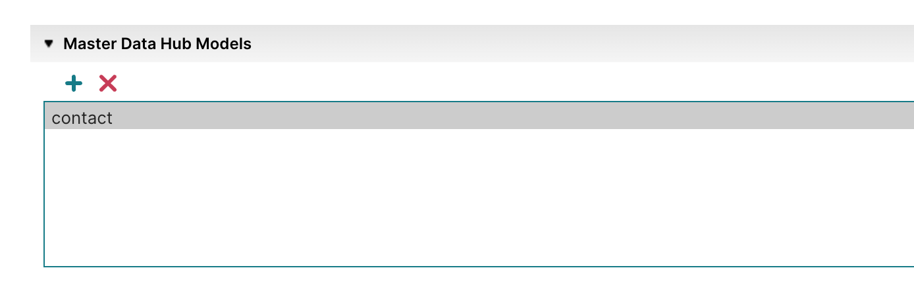

# Sharing a model with an account group 

<head>
  <meta name="guidename" content="DataHub"/>
  <meta name="context" content="GUID-5b8d8902-4fd8-4497-9d3c-11d7b1990032"/>
</head>

Account groups help you manage resources between your primary Boomi Enterprise Platform account and multiple sub-accounts. For example, you may be a [Boomi partner](https://boomi.com/partners/) with multiple customer sub-accounts in your account groups. You can share a published model with your customer accounts so they can use it as a template. Read [Account Group settings](/docs/Atomsphere/Platform/c-atm-Account_group_management_3997faa4-569c-4092-83ff-b0ff9a3ce161.md) and [Account groups example](/docs/Atomsphere/Platform/c-atm-Account_groups_example_c2e6b5c2-e830-48db-b7d2-ec5a1becf8d2.md) for information on the use case for account groups. 

## Prerequisites

- Administrator privileges
- Account groups enabled on the Boomi Enterprise Platform. Enable the Account Groups feature by navigating to **Settings** > **Account Information and Setup** > **Restricted Features**. Contact your account representative for more information 
- Published model. You can only share published models

## Before you begin

You can share models from your primary Boomi account with your connected sub-accounts. If you want to share with only specific accounts, create an account group and add accounts to it. Otherwise, add the account to the All Accounts group.  Read [Adding an account group](/docs/Atomsphere/Platform/t-atm-Adding_an_account_group_35c1fa9e-473d-4d9e-a50f-057d9b55112d.md) and [Adding an account to an account group](/docs/Atomsphere/Platform/t-atm-Adding_an_account_to_an_account_group_ce258c12-e0b2-4bcd-b2e4-b5fe33c65179.md) to learn more. 

## Procedure

1.  Select **Settings** > **Account Information and Setup** > **Account Groups**. 

2.  Do one of the following:

    1. Select your account group that contains specific accounts. 
    2. Select **All Accounts**.

3. If the accounts are listed in the group, proceed to step 4. Otherwise, click the plus icon and search for the account you want to add. 

4.  Select the **Resources** tab.

5.  In the Resources tab, scroll to the bottom of the screen and click the plus icon next to the **Master Data Hub Models** section.

7.  Select the model you want to share. 

8.  Click **OK**. To switch back to the Boomi DataHub service, select Boomi DataHub in the Boomi services menu.