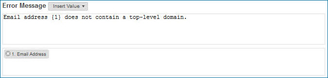

# Specifying the error message template for a business rule 

<head>
  <meta name="guidename" content="DataHub"/>
  <meta name="context" content="GUID-66968252-b76c-435b-aad4-82f25bbaf76f"/>
</head>

Specifying the error message template for a business rule is part of the process of configuring a business rule, which is a required step in adding a business rule data quality step to a model and an optional step in adding another type of data quality step.

## Procedure

1.  In the Error Message section of the Configure Business Rule screen, do one of the following:

    -   If the template is to begin with static text, in the template editor type the portion that precedes the first dynamically inserted value.

    -   If the template is to begin with a dynamically inserted value, click **Insert Value** and in the list, select the output whose value will be inserted. Outputs are listed by alias for selection.

    If you insert a value, \{1\} appears in the template editor as a reference to the value. A button appears in the box below labeled with “1.” and the alias of the output you selected. If the output you selected is one of multiple outputs of an input function, the alias of the function input is also shown.

    

2.  Repeat step 1 as needed, alternating between typed text and dynamically inserted values, until the template is complete.

    Each time you insert a value in the template editor, the output you select is assigned the next number in sequence for referencing in the template — for example, \{2\}. Once you insert a value, you can cut and paste its reference or type the reference directly in the template editor.