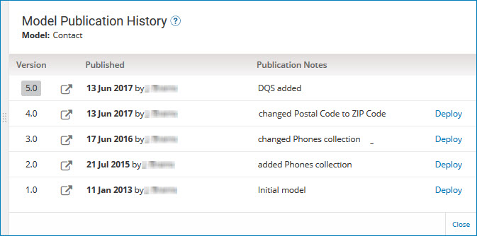

# Viewing a selected version of a model 

<head>
  <meta name="guidename" content="DataHub"/>
  <meta name="context" content="GUID-7be6d4fe-95d5-4fe3-bbc2-25ea18fffb62"/>
</head>

You can view any version of a model, current or previous, as a means of seeing when and how the model changed or determining which version to deploy.

## Procedure

1.  Do one of the following:

    -   Navigate to a page for any repository to which the model is deployed, and in the domains summary list, click the domain model’s version number.

        

    -   In the **Models** page, in the gear icon  menu for the model, select **View Publication History**.

    -   In the **Models** page, click the number of the most recently published version.

    In each case, the Model Publication History view opens.

    

2.  In the versions summary list entry for the version you want to view, click ** View this version of the model**.

    The model page opens, read-only, in a separate browser tab or window.