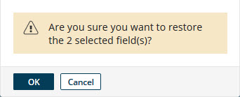
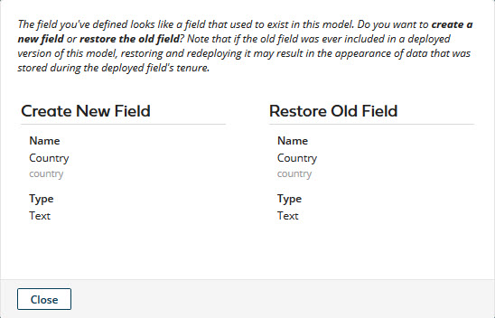
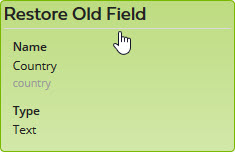
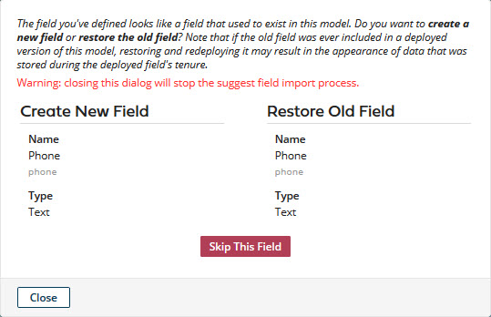

# Viewing and restoring deleted fields 

<head>
  <meta name="guidename" content="DataHub"/>
  <meta name="context" content="GUID-e644c019-edce-4c4d-b2d4-b3001d71b93d"/>
</head>

If you delete a field from a model, you can view the field and, optionally, restore it as an active field.

## About this task

As an alternative to these steps, you can restore a field by requesting to add a field having the same name — see the note following these steps.

## Procedure

1.  In the **Fields** tab, click **Deleted**.

    Deleted fields are listed.

2.  Select the check box for each field to be restored.

3.  Click **Restore Deleted Fields**.

4.  In the confirmation dialog, click **OK**.

    

    The dialog closes, and the selected fields are restored to the golden record structure. The fields summary list automatically switches to the Active fields view. The fields are restored below the last existing active field regardless of their relative positions at time of deletion. You can then change their relative positions if you like.

    :::note
    
    If you request to add a field having the same name as that of a deleted field, you are given the option to restore the deleted field.

    -   If you are adding a single field, this dialog appears:

        

        Click **Restore Old Field** to proceed with that option.

        

    -   If you are using the Import Fields wizard or the Boomi Suggest wizard to add fields, this dialog appears in succession for each field you selected to add having the same name as a deleted field:

        

        Click **Restore Old Field** to designate a given field for restoration. Restoration occurs after you determine the disposition of the last such field.

    :::