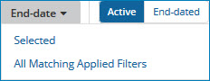

# End-dating golden records 

<head>
  <meta name="guidename" content="DataHub"/>
  <meta name="context" content="GUID-4f7d300d-11f4-4068-96b1-a8bb6a43beb1"/>
</head>

In the Golden Records page, you can manually end-date selected golden records in a domain to designate them as inactive. End-dating is “soft” deletion.

## About this task

Manually end-dating golden records is most often necessary during the implementation phase of a Boomi DataHub project while you are fine-tuning your source system-Boomi DataHub repository integration processes.

## Procedure

1.  Select **Stewardship** \> **Golden Records**.

2.  In the repository/domain list, select the domain.

3.  Do one of the following:

    -   In the data grid, select the check boxes of the golden records you are end-dating.

    -   Filter the data grid to load only the golden records you are end-dating.

4.  Click the **End-date** button located immediately above the data grid and make a selection from the button’s drop-down menu as follows:

    

    -   If, in step 3, you selected the golden records you are end-dating, select **Selected**.

    -   If, in step 3, you filtered the data grid to load only the golden records you are end-dating, select **All Matching Applied Filters**.

    A confirmation dialog appears.

5.  To confirm your request, click **End-date**.

    -   If in step 4, you selected **Selected**, the golden records you selected are end-dated.

    -   If in step 4, you selected **All Matching Applied Filters**, a bulk processing request of type End-date is created, and a status box appears.

    In either case, when a golden record is end-dated, a source record update request specifying a Delete operation is propagated to the applicable source for each source entity to which the golden record is linked.

    :::note
    
    You can also end-date a golden record by selecting **End-date this record** in the ** Actions** menu in the golden record’s detail view. This method requires confirmation as well. A bulk processing request is not created.

    :::

6.  If in step 4, you selected **All Matching Applied Filters**, click the **Close** button when it appears in the status box upon conclusion of the processing of the bulk processing request.