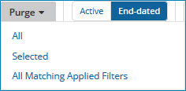

# Purging end-dated golden records 

<head>
  <meta name="guidename" content="DataHub"/>
  <meta name="context" content="GUID-5076fa51-e045-4557-a7b3-894c3b274fb4"/>
</head>

In the Golden Records page, you can manually purge \(permanently delete\) selected end-dated golden records in a domain.

## About this task

:::caution

When you purge an end-dated golden record, Boomi DataHub does not propagate source record update requests specifying Delete operations to attached sources.

:::

:::note

The quarantine entries counts in the Repositories page and the repository **Summary** tab can take more than a minute to update to reflect the purge.

:::

## Procedure

1.  Select **Stewardship** \> **Golden Records**.

2.  In the repository/domain list, select the domain.

3.  Click **End-dated**.

4.  **Optional:** If you are purging all end-dated golden records, skip to step 5. Otherwise, do one of the following:

    -   In the data grid, select the check boxes of the golden records you are purging.

    -   Filter the data grid to load only the golden records you are purging.

5.  Click the **Purge** button located immediately above the data grid and make a selection from the button’s drop-down menu as follows:

    

    -   To purge all end-dated golden records, select **All**.

    -   If, in step 4, you selected the golden records you are purging, select **Selected**.

    -   If, in step 4, you filtered the data grid to load only the golden records you are purging, select **All Matching Applied Filters**.

    A confirmation dialog appears.

6.  To confirm your request, click **Purge**.

    -   If in step 5, you selected **Selected**, the golden records you selected are purged.

    -   If in step 5, you selected **All** or **All Matching Applied Filters**, a bulk processing request of type Purge is created, and a status box appears.

    :::note
    
    You can also purge an end-dated golden record by selecting **Purge this record** in the ** Actions** menu in the golden record’s detail view. This method requires confirmation as well. A bulk processing request is not created.

    :::

7.  If in step 5, you selected **All** or **All Matching Applied Filters**, click the **Close** button when it appears in the status box upon conclusion of the processing of the bulk processing request.