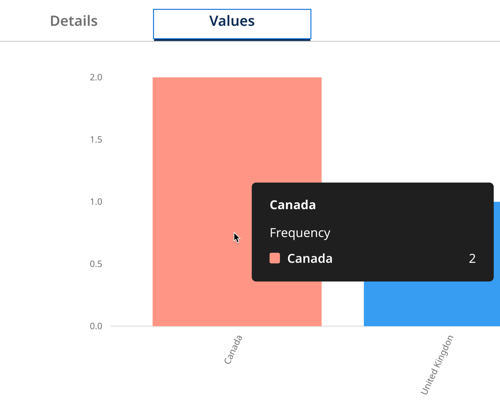

# Viewing golden record field statistics (Tech Preview)

<head>
  <meta name="guidename" content="DataHub"/>
  <meta name="context" content="GUID-fe872ee1-c0df-40d5-b856-40c0893ed8aa"/>
</head>

You can view golden record field value statistics for a deployed Boomi DataHub model in Repositories.  Analyzing characteristics and attributes of field values helps your organization:

- Gain a deeper understanding of golden record fields

- Accelerate business decisions about models

- Assess data quality and troubleshoot issues

## Before you begin

To view golden record metadata statistics, you must have the following privileges: **MDM - View Data** and **MDM - View Repositories**. Read [Setting up user accounts and access](/docs/Atomsphere/Master%20Data%20Hub/Getting%20started/r-mdm-User_Management_5f47b2da-d5cc-4c88-bdfd-0a255d69323a.md) to learn more about setting user permissions.

A team member in your organization with the **MDM - Repository Management** privilege must run statistics to generate information about golden record field values. You can see the user name, date, and time of the last completed statistics job to identify the age of the profiled data. Read [Running statistics](/docs/Atomsphere/Master%20Data%20Hub/Stewardship/hub-running_statistics.md) to learn about generating statistics for a domain.

## Viewing statistics

1. Navigate to **Repositories** and select the repository. 
2. Select the domain. 
3. Select the **Statistics** tab. 
4. Next to the **Run Statistics** button, you can view information about the sample data used to generate golden record field value statistics. 
    - **Sample Row Count** - the number of golden records in the sample 
    - **Row Count** - the total number of golden records in the domain
    - **Average Row Width** - the average size in bytes of a golden record in the sample
    - **Column Count** - the number of golden record fields, including the source entity ID
    - **Distinct Column Data Types** - the number of unique data types in the model. Models can have the following data types:
        - **Text** — maximum length is 255 characters
        - **Integer** — positive or negative whole number
        - **Float** - double-precision binary floating-point. Values exceeding storage capacity are rounded.
        - **Date/Time** — format is yyyy-MM-dd'T'HH:mm:ss'Z' — for example, 2013-03-01T15:32:00Z
        - **Date** — format is yyyy-MM-dd — for example, 2013-03-01
        - **Time** — format is HH:mm:ss — for example, 15:32:00
        - **Boolean** — allowable values true and false (case-sensitive)
        - **Reference** — read [Reference Fields](/docs/Atomsphere/Master%20Data%20Hub/Modeling/c-mdm-Fields_overview_8b21b042-786a-4069-909c-acb93a62f354.md#reference-fields) to learn more.
        - **Enumeration** — specified allowable values of maximum length 255 characters (case-sensitive)
        - **Long Text** — maximum length 5,000 characters. Long Text fields cannot be selected for matching in match rules.
    - **Repeatable Fields Count** - the number of collection fields in the model.
    - **Reference Fields Count** - the number of fields with a Reference field type. 
    - **Last profiled by** - lists the user that ran the latest statistics and the date/time the statistics job was completed. The date and time also help you decide when to run statistics again to generate the latest data.
5. The **Available** column shows all the fields (excluding Reference fields and field collections in Tech Preview) in the deployed Hub model. Select each field name to view the sample’s field value statistics.
6. Click the **Details** tab to view the following field value information from the sample:
    - **Mean** - the total sum of all the values in a sample divided by the number of values in the sample. Available for numeric values only
    - **Median** - the middle field value. If there is an even amount, it is the average of the two middle values. Available for numeric values only
    - **Maximum Value** - the highest value. Available for numeric values only
    - **Minimum Value** - the lowest value. Available for numeric values only
    - **Count** - the number of values in the sample
    - **Distinct Count** - the number of unique values
    - **Distinct Ratio** - the percentage of the number of unique values divided by the total number of values
    - **Null Count** - the number of null values
    - **Null Ratio** - the percentage of the number of null values divided by the total number of values
    - **Minimum Text Length** - the lower number of characters in a value. Available for non-numeric values only
    - **Maximum Text Length** - the highest number of characters in a value. Available for non-numeric values only
    - **Median Text Length** - the middle number of characters in a value. If there is an even amount, it is the average of the two middle values. Available for non-numeric values only
    - **Zeros Count** - the number of zero values. Available for numeric values only
    - **Zeros Ratio** - the percentage of the number of zero values divided by the total number of values. Available for numeric values only
    - **Mode** - the most frequently occurring value. Available for numeric values only
    - **Average Column Width** - the average character length of the field values. Available for non-numeric values only
    - **Resolved References Count** - the total resolved reference fields in the golden record.
    - **Distinct Resolved References Count** - the number of unique resolved reference fields in the golden record.
    - **Unresolved References Count** - the total unresolved reference fields in the golden record
    - **Most Resolved Source** - the source with the most records that correctly match entities in the referenced golden record. This could indicate that the source has a high level of data integrity.
    - **Least Resolved Source** - the source with the fewest resolved foreign key references. This could indicate data quality issues, such as missing or incorrect reference values in that source.
    - **Most Unresolved Source** - the source that contributes the most entities with foreign keys that don't match the golden record. This could indicate potential data integrity issues with the contributing source.
    - **Least Unresolved Source** - the source with the fewest unresolved foreign key references. This could indicate that the source has high quality data and adheres to referential constraints.
    - **Reference Model** - the name and universe ID of the deployed model that provides the field's referenced values.

    You can also view reference field statistics for source entities grouped by source.
    - **Resolved References Count** - total resolved reference field values for the specified source
    - **Distinct Resolved References Count** - the number of unique resolved reference field values for the specified source
    - **Unresolved References Count** - the total unresolved reference field values for the specified source
    - **Distinct Unresolved Reference Count** - the number of unique unresolved reference field values for the specified source
7. Click the **Values** tab to view a histogram of the top 20 most frequent field values in the sample. If frequency cannot be calculated, Boomi DataHub displays a random selection of 20 values.  Histograms are graphs that display the distribution of values. They are particularly useful when you want to visualize the distribution of numerical values. A graph displays when field values are not null. The Values tab shows an empty histogram for masked fields if the user does not have permissions to view masked data.  Hover your cursor over the graph sections to see the frequency of each value.

