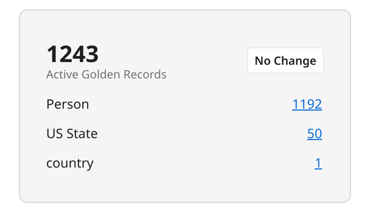
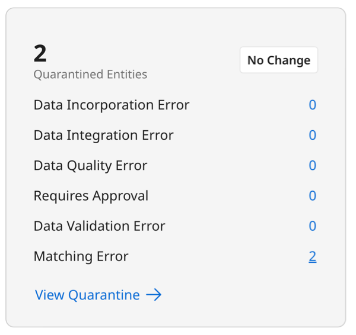
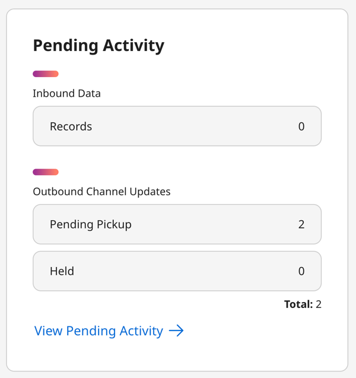
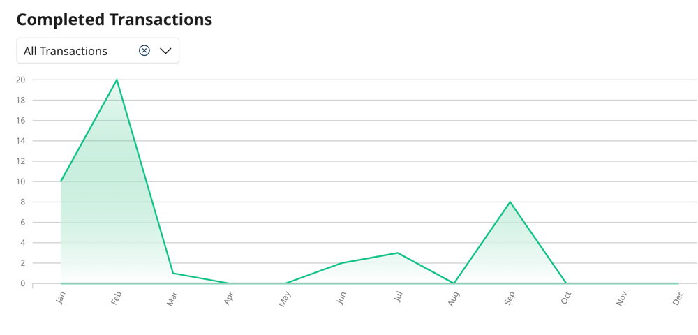
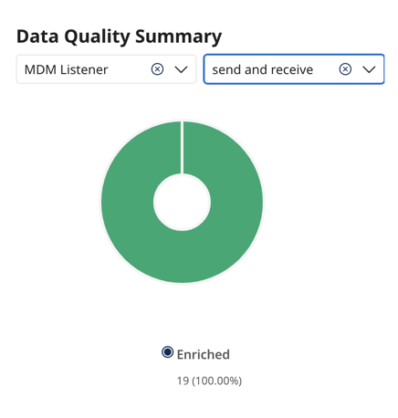

# Viewing the Hub dashboard

<head>
  <meta name="guidename" content="DataHub"/>
  <meta name="context" content="GUID-bed65226-a88c-453b-8083-fa6c28eb2977"/>
</head>

The Dashboard page gives you a high-level view of activity in Hub according to your chosen filter. It provides statistics about entity transactions and golden records to help you make better decisions and spot errors or data quality issues. You can view details for all repositories, all deployed models in a repository, or a specific deployed model.

## Before you begin

You must have the following privileges to view the dashboard: 

- MDM - Dashboard
- MDM - View Data
- MDM - Historical Reporting

## Viewing the dashboard

1. In Boomi DataHub, navigate to **Dashboard**.
2. In the **Current View** drop-down in the top-right, filter information by repository and deployed model. Selecting a repository displays information about all deployed models within it. 

    By default, the dashboard displays information for all repositories and deployed models unless you’ve saved a filter view. Select the **Save as Default View** icon (Save icon) to set your filter as the default when you open the dashboard.

    You can specify the following time frames for data:
    - **Day** - filters events that occurred in the last 24 hours plus the current hour in progress.
    - **Week** - filters events that occurred in the last seven completed days plus the current day in progress. 
    - **Month** - filters events that occurred within the last 28-21 completed days plus the current day in progress. 
    - **Year** - filters events that occurred in the last 12 completed calendar months plus the current month in progress.

3. The **Golden Records** tile displays the count of active golden records. Based on your filter setting, the tile shows a maximum of four repositories (if showing all repositories) or a maximum of four deployed models (if filtering by a specific repository). If there is an increase or decrease in active golden records, Hub displays the percentage of increase for the time period specified. No change means there is no increase or decrease. Click the record count to open the [Golden Records](docs/Atomsphere/Master%20Data%20Hub/Stewardship/t-mdm-Viewing_domain_data_22c95cb1-6039-4e79-b1bf-6dc99268fd6b.md) page in Stewardship.

 

4. The **Quarantine** tile displays the count of quarantined entities based on your filter setting. The counts do not show entities that the user does not have access to, which is possible when using tags in [Hub entitlements](/docs/Atomsphere/Master%20Data%20Hub/Getting%20started/t-hub-Creating_Hub_Role_Entitlements_06d21275-b0c6-4854-abef-5782326aa85b.md) with Advanced security. If there is an increase or decrease in quarantined entities, Hub displays the percentage of increase for the time period specified. No change means there is no increase or decrease. If you filter by deployed model, counts display based on the following quarantine causes:
    - **Data Incorporation Error** - This error occurs when there are issues with record receiving the update, such as an unknown reference value or when trying to update a record that is marked as end-dated.
    - **Data Integration Error** - This error happens while sending record data to the Hub, often due to issues with data format or missing information.
    - **Data Quality Error** - This error arises during the enrichment process when the data does not meet your specified quality standards.
    - **Requires Approval** - This error occurs when the source entity needs approval before being added to the golden record. This requirement is set at the source level in the model.
    - **Data Validation Error** - This error is caused by data not following the required data type rules.
    - **Matching Error** - This error arises when data conflicts with the matching rules, such as when there is a duplicate record.

    Click the entity count to open the [Quarantine page](docs/Atomsphere/Master%20Data%20Hub/Stewardship/t-mdm-Viewing_a_domains_quarantine_entries_37940051-7810-4291-9044-3401866e98d8.md) in Stewardship.

    

5. The **Pending Activity** tile displays the following counts:
    - **Records** - the count of incoming source entities that have not completed processing.
    - **Pending Pickup** - the count of outgoing source record updates that still need to receive acknowledgment of delivery to the source system. The integration process handles acknowledgment and checks the source channels for record updates waiting to be delivered.
    - **Held** - the count of held source record update requests. Held update requests are undeliverable. Hub holds an update request if it is for a golden record that references a golden record that is not linked to a record in the source and then only if the underlying domain model enforces referential integrity for update requests.

    Click **View Pending Activity** to open the [Activity tab](/docs/Atomsphere/Master%20Data%20Hub/Governance/t-mdm-Viewing_pending_activity_for_a_repository_8d83f96b-8396-4332-bb44-684ec053896c.md) for the repository.

    

6. The **Completed Transactions** tile displays the count of entity transactions that eventually resulted in incorporation, record deletion, or no change to a record.  The counts display for a specified time frame (day, week, month, or year) based on the following filters:
    - **All Transactions** - displays all transaction types. 
    - **Record Created** - filters transactions that lead to the creation of golden records.
    - **Record Updates** - filters transactions that lead to golden record updates.
    - **Record Deletes** - filters transactions that lead to the deletion of golden records.
    - **Record Links** - filters transactions that lead to the establishment of links between golden records and source entities. 
    - **No changes** - filters transactions that did not result in changes to golden records.

    Hover your cursor over a data point to view the month and number of records.

  

7. The **Data Quality Summary** tile displays only when your Current View is filtering by a specific deployed model. It shows the count of incoming source entities that Hub sent to data quality steps in the selected deployed model and itemizes the count by the following processing outcomes:
    - **No change** (gray pie slice) - displays the count and percentage of entities that did not result in changes. Pausing the pointer shows the count and the corresponding percentage.
    - **Enrichments** (green pie slice) - displays the count and percentage of entities that resulted in enrichment. Pausing the pointer shows the count and the corresponding percentage.
    - **Quarantined** (red pie slice) - displays the count and percentage of entities that resulted in quarantining. Pausing the pointer shows the count and the corresponding percentage.

    If there is an increase or decrease in source entities, Hub displays the percentage of increase for the time period specified. No change means there is no increase or decrease.

    