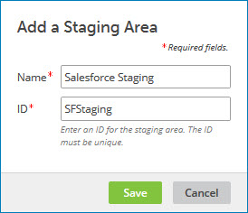

# Adding a staging area for a source 

<head>
  <meta name="guidename" content="DataHub"/>
  <meta name="context" content="GUID-a4e18da6-9b8d-4257-a28e-dc1725b587ae"/>
</head>

Adding a staging area for a source from which you want to stage batches is the first step in the workflow for staging.

## Procedure

1.  In the repository page, click the domain to which the source is attached and select the **Sources** tab.

2.  In the source’s gear icon  menu, select **Add a Staging Area**.

    The Add a Staging Area dialog appears and takes focus.

    

3.  In the **Name** field, type the staging area name.

4.  In the **ID** field, type a unique ID for the staging area. You are allowed to use uppercase and lowercase letters, numbers, underscore (_), and hyphen (-) with a maximum length of 50 characters.

5.  Click **Save**.

    The dialog closes, and the staging area is added. The staging area is listed by name below the source for which it is added. The listing is indented.

    The colored dot icon next to a staging area indicates the staging status:

    -  － Staging Area is ready to receive staged entities.

    -  － Staging Area is disabled due to deployment of new version of the domain model. Deleting all the entities in the staging area will change its status to ready.
 
