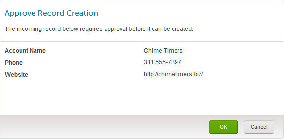
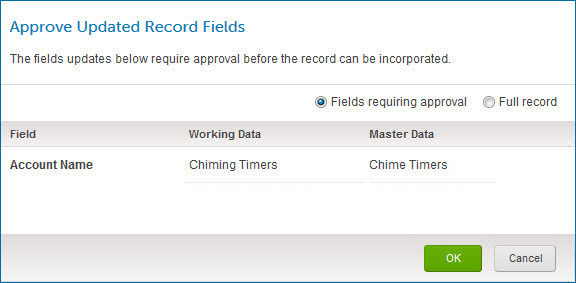
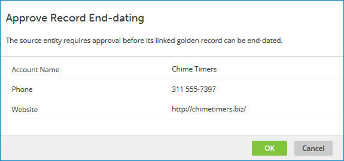
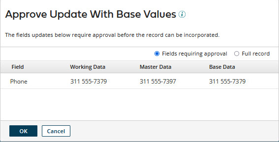

# Approving a quarantined entity 

<head>
  <meta name="guidename" content="DataHub"/>
  <meta name="context" content="GUID-6bd44ae8-b27c-453d-bba2-406a41b7e709"/>
</head>

A source can be configured so that its entity contributions may be subject to manual approval to be incorporated into the domain. Entity contributions subject to manual approval are quarantined.

## Before you begin

Masked values are visible if you have one of the following user permissions:

- **MDM - Privileged Data Steward** role
- **MDM - Administrator** role
- **MDM - Reveal Masked Data** privilege
- **MDM - Data Steward** role (or **MDM - Stewardship** privilege) and the **Reveal Masked Data** Hub entitlement (available with the Advanced Security feature)

## About this task

There are four source configuration options for requiring manual approval:

-   Unconditionally or conditionally require approval for new entities from the source.

    These entities are listed in the Quarantine page with the following reason for quarantining: “The source which submitted this entity requires approval to create a golden record”.

-   Unconditionally or conditionally require approval for entities from the source that would update any field or selected fields of matching golden records.

   
    These entities are listed in the Quarantine page with the following reason for quarantining: “The source which submitted this entity requires approval to update the following fields: \{field name\(s\)\}”.

-   Unconditionally require approval for entities for which there is a pending link from the matching golden record to the source and in which a field has a base value.

    :::note
    
    A field’s base value for a source is the value of the field in the matching golden record’s base version for the source. While there is a pending link from a golden record to a source, the base version of the golden record for that source is the golden record version when the pending link was created.  

    :::

    These entities are listed in the Quarantine page with the following reason for quarantining: “The source which submitted this entity requires approval to update since the entity contains a base value in field\(s\) \{field name\(s\)\}”.

-   Unconditionally require approval for entities that would end-date matching golden records.

    These entities are listed in the Quarantine page with the following reason for quarantining: “The source which submitted this entity requires approval to end-date a golden record”.

:::note
    
To effectively reject an entity requiring approval, simply delete its quarantine entry. See the Related task for deleting a domain’s quarantine entries.

:::

## Procedure

1.  Select **Stewardship** \> **Quarantine**.

2.  In the repository/domain list, select the domain.

    The quarantine entry list appears.

3.  In the list, click the Quarantined Date for the quarantined entity requiring approval.

    The quarantine entry detail view appears.

4.  In the ** Actions** menu for the quarantined entity, select **Approve**, **Approve Update Without Base Values**, or **Approve Update With Base Values**.

    -   If the entity is new and you selected the **Approve** action, the Approve Record Creation dialog opens.

        

    -   If the entity would update a matching golden record and you selected the **Approve** action, the Approve Updated Record Fields dialog opens. This dialog lists fields for which approval is required and for each such field, its value in the entity \(Working Data\), and, for comparison purposes, in the golden record \(Master Data\). Working Data values reflect the results of the application of data quality steps, if any, in the domain model.

        

    -   If the entity would end-date a matching golden record and you selected the **Approve** action, the Approve Record End-dating dialog opens. This dialog shows the values of fields in the golden record, enabling you to verify it is the record you intend to end-date.

        

    -   If you selected the **Approve Update Without Base Values** action, a confirmation dialog opens.

    -   If you selected the **Approve Update With Base Values** action, the Approve Update With Base Values dialog opens. By default, this dialog lists only the fields with base values for the contributing sourcc \(Base Data\), and for comparison purposes, the corresponding current field values in the golden record \(Master Data\).

        

5.  To approve the entity and initiate the attempt to incorporate it, click **OK**.

    The repository attempts to incorporate the entity. If the entity is successfully incorporated, the quarantine entry is deleted. However, if matching errors have arisen due to recent activity, or if approval is no longer required, an error message is displayed — you can resubmit the entity for incorporation.

    :::note
    
    The quarantine entry remains in the list, even if the entity is successfully incorporated, until you close the detail view by clicking Close or clicking elsewhere in the Quarantine page. The list is then updated. If the entity was not incorporated, there will be a new quarantine entry for it. 

    :::

     Before you close the detail view, though, you can click  **Previous** and **Next**  to navigate to detail for other entries and individually resolve them.