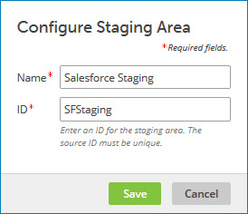

# Changing the configuration of a staging area for a source 

<head>
  <meta name="guidename" content="DataHub"/>
  <meta name="context" content="GUID-3cea5d6d-7dac-4242-bc4f-62d40947d0a1"/>
</head>

You can change the name or ID of an existing staging area for a source.

## Procedure

1.  In the repository page, click the domain to which the source is attached and select the **Sources** tab.

2.  In the staging area’s gear icon  menu, select **Configuration**.

    The Configure Staging Area dialog appears and takes focus.

    

3.  Do either or both of the following:

    1.  In the **Name** field, type a new name for the staging area.

    2.  In the **ID** field, type a new ID for the staging area.

4.  Click **Save**.

    The dialog closes, and the staging area’s configuration is updated.

## Next steps

:::note

If you change the staging area’s **ID** \(step 3b\), you need to update any integrations with the staging area to refer to it by its new ID.

:::