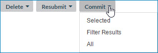

# Committing a domain’s staged entities 

<head>
  <meta name="guidename" content="DataHub"/>
  <meta name="context" content="GUID-5dc4966c-4b7b-4939-bede-c83f94c1541d"/>
</head>

When entity staging results are satisfactory, consider committing all of the staged entities to the target domain for transaction processing. You also have the option to commit selected entities or entities in the filter results.

## Procedure

1.  Select **Stewardship** \> **Staged Entities**.

2.  In the repository/domain list, select the domain.

3.  If the staging area that contains the entities you want to commit is not selected, select the staging area:

    1.  Click ** Select Staging Area**

        A dialog appears.

        

    2.  In the **Source** list, select the source for which was desired staging area was added.

    3.  In the **Staging Area** list, select the staging area.

    4.  Click **Apply**.

    The list of entities in the selected staging area appears.

4.  Filter the entities list. See steps 4–6 in the Related task for viewing a domain’s staged entities.

5.  Do one of the following:

    

    -   To commit selected entities, select their check boxes, click **Commit** and in the drop-down menu, select **Selected**.

    -   To commit only entities in the filter results — click **Commit** and in the drop-down menu, select **Filter Results**.

    -   To commit all of the entities in the staging area, including those not listed due to filtering, click **Commit** and in the drop-down menu, select **All**.

    A confirmation dialog appears.

6.  Click **OK**.

    The entities selected in step 5 are committed for transaction processing. If the number of selected entities exceeds the maximum batch size of 200, multiple batches are committed; otherwise, a single batch is committed.

7.  **Optional:** To confirm the removal of the committed entities from the staged entities list, click ** Refresh**.

8.  For each additional staging area that contains entities you want to commit, repeat steps 3–7.

    :::note
    
    Another way to commit a single staged entity is to select **Commit** in the ** Actions** menu in its detail view. This too requires confirmation.

    :::