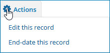
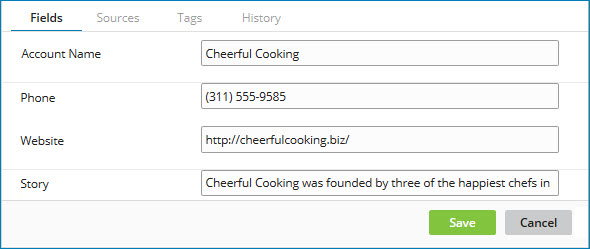

# Editing a golden record 

<head>
  <meta name="guidename" content="DataHub"/>
  <meta name="context" content="GUID-48dfe07c-f7a9-4c20-8b6b-15c5e1a92f73"/>
</head>

While it is possible to directly update a golden record in Boomi DataHub, doing so is *not recommended*:

## About this task

:::caution

Directly updating golden records in Boomi DataHub effectively circumvents all source system auditing and validation mechanisms, including source rankings and default source designation.

:::

If you have configured model fields to mask sensitive data, field values in golden records, quarantine entries, and staged entities are masked accordingly. If you can edit a golden record field or quarantined entry, you can edit a masked value. After you submit the new value, that value is masked according to the model’s field settings. You must have one of the following user permissions to view masked data:

- **MDM - Privileged Data Steward** role
- **MDM - Administrator** role
- **MDM - Reveal Masked Data** privilege
- **MDM - Data Steward** role (or **MDM - Stewardship** privilege) and the **Reveal Masked Data** Hub entitlement (available with the Advanced Security feature)

## Procedure

1.  Select **Stewardship** \> **Golden Records**.

2.  In the repository/domain list, select the domain.

3.  In the data grid, click the Updated Date of the golden record.

    The detail view opens.

4.  In the ** Actions** menu, select **Edit this record**.

    

    The **Fields** tab is automatically selected and transforms into a dialog.

    

5.  For each non-reference field whose value you want to change, type the desired value \(replace the existing value, if any\) in the corresponding dialog field.

    For each reference field whose value you want to change, click the corresponding dialog field, type a value to search for, press **Enter**, and select the desired matching value from the list. If a golden record title format is specified in the referenced domain’s model, you can search for either a title format field value \(in part or in its entirety\) or an actual value \(golden record ID in its entirety\). Otherwise, you can search only for an actual value.

    You cannot use this dialog to add collection items. To delete a collection item, clear all of the item’s fields.

6.  Click **Save**.

    A status message appears in the dialog. Upon successful completion of the update, the tab transforms back to its default state, and the status message “The golden record was successfully updated” appears.

    :::note
    
    Normal updates to manually edited golden record fields for which source rankings are configured occur only where contributed by a field’s highest ranked source.

    :::