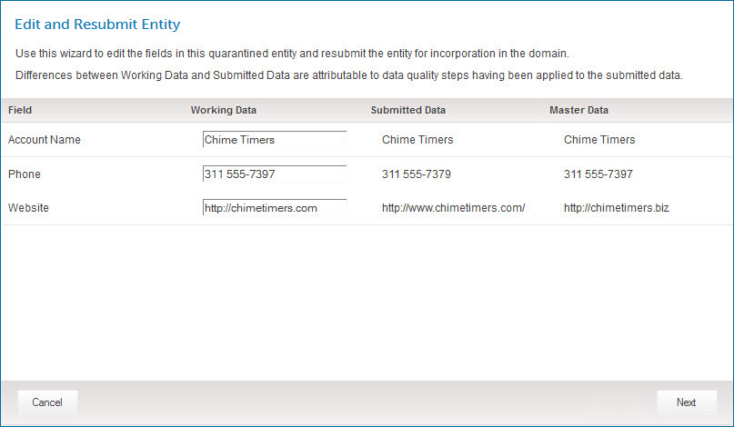
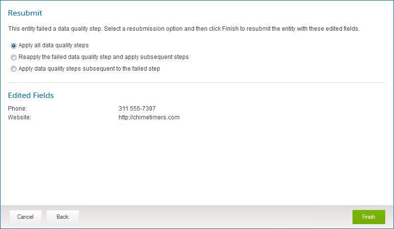

# Editing and resubmitting a quarantined entity 

<head>
  <meta name="guidename" content="DataHub"/>
  <meta name="context" content="GUID-fdc81500-1797-487c-bd66-b78cec069ef5"/>
</head>

It is possible to edit and resubmit a quarantined entity only if the currently deployed version of the domain model is the same as the version deployed at the time the entity was quarantined.

## Before you begin

If you have configured model fields to mask sensitive data, field values in quarantine entries are masked accordingly. If you can edit a quarantined entry, you can edit a masked value. After you submit the edited value, that value is masked according to the model’s field settings. Masked values are visible if you have one of the following user permissions: 
- **MDM - Privileged Data Steward** role
- **MDM - Administrator** role
- **MDM - Reveal Masked Data** privilege
- **MDM - Data Steward** role (or **MDM - Stewardship** privilege) and the **Reveal Masked Data** Hub entitlement (available with the Advanced Security feature)

## Procedure

1.  Select **Stewardship** \> **Quarantine**.

2.  In the repository/domain list, select the domain.

    The quarantine entry list appears.

3.  In the list, click the Quarantined Date for the quarantined entity.

    The quarantine entry details appear.

4.  In the ** Actions** menu, select **Edit and Resubmit**.

    The Edit and Resubmit Entity wizard opens.

    

    The Working Data column fields are pre-populated with the entity field data values. These values reflect the results of data quality steps applied before the entity was quarantined, if any. The other two columns are for reference:

    -   The Submitted Data column shows the entity field data as it was originally submitted by the process that routed the batch to the repository.

    -   The Master Data column shows the field data in the unambiguously matching golden record, if applicable.

5.  In one or more fields in the Working Data column, enter a new value.

    -   For each non-reference field whose value you want to change, type the desired value \(replace the existing value, if any\).

    -   For each reference field whose value you want to change, click the field, type a value to search for, press **Enter**, and select the desired matching value from the list. If a golden record title format is specified in the referenced domain’s model, you can search for either a title format field value \(in part or in its entirety\), a source entity ID, or an actual reference field value \(golden record ID in its entirety\). Otherwise, you can search only for a source entity ID or actual value.

    To delete a collection item, clear all of the item’s fields.

6.  Click **Next**.

    The wizard advances to the Resubmit screen. The new values are listed there.

    

7.  Do one of the following:

    -   If the entity was quarantined because it failed a data quality step, select one of these resubmission options:

        -   To apply all data quality steps, regardless of whether they were previously applied, to the entity, select **Apply all data quality steps** \(the default\).

        -   To reapply the failed data quality step and all subsequent steps to the entity, select **Reapply the failed data quality step and apply subsequent steps**.

        -   To apply all data quality steps subsequent to the failed step to the entity, select **Apply data quality steps subsequent to the failed step**.

    -   If the entity was quarantined for another reason, continue with step 8.

8.  Click **Finish**.

    The entity, with the listed edits, is resubmitted for incorporation in the repository.

    :::note
    
    The quarantine entry remains in the list, even if the entity is successfully incorporated, until you close the detail view by clicking Close or clicking elsewhere in the Quarantine page. The list is then updated. If the entity was not incorporated, there will be a new quarantine entry for it. 

    Before you close the detail view, though, you can click  **Previous** and **Next**  to navigate to detail for other entries and individually resolve them.

    :::