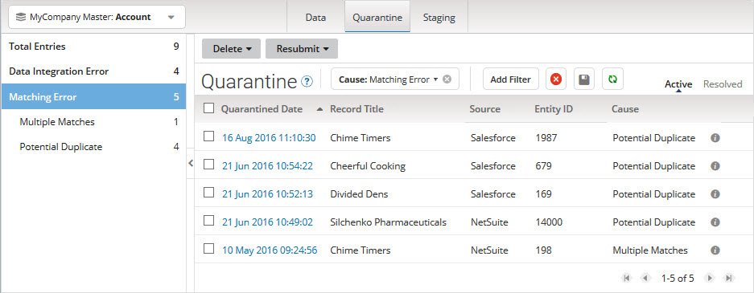
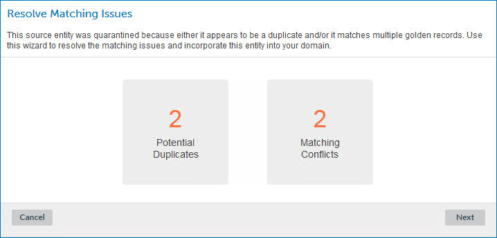
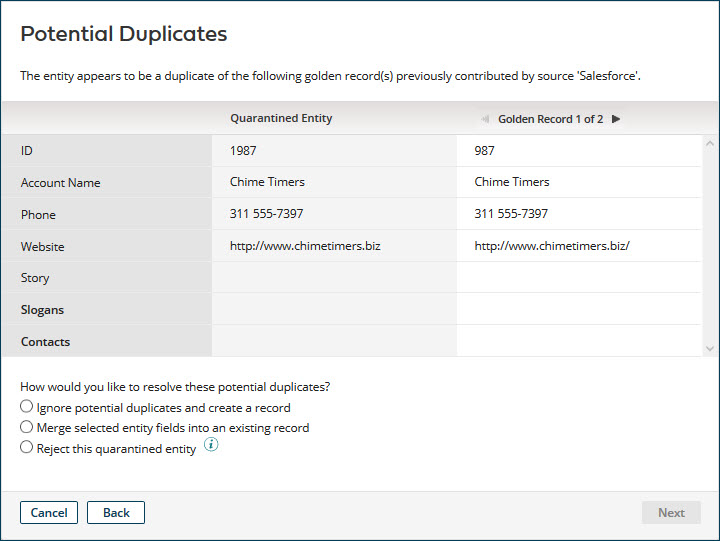
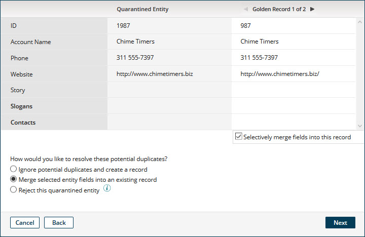
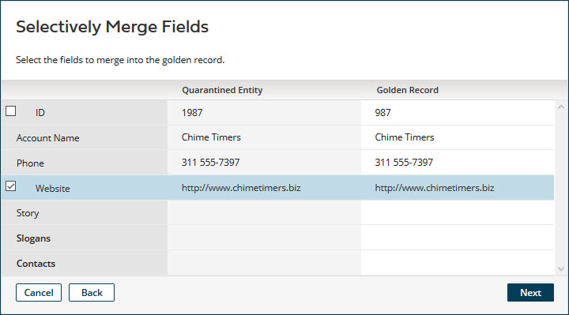
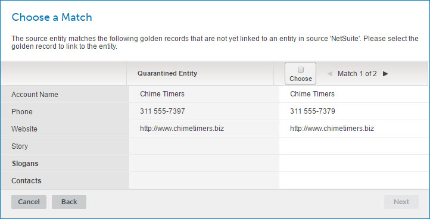
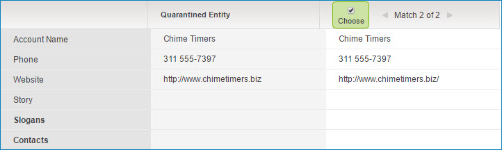
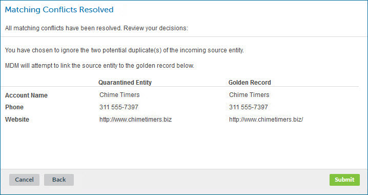

# Resolving matching issues for a quarantined entity 

<head>
  <meta name="guidename" content="DataHub"/>
  <meta name="context" content="GUID-49051dad-e48f-4bcc-b6a6-8ce90c45d578"/>
</head>

During the maintenance phase of a Boomi DataHub, a common quarantine management task is resolving matching errors arising from the application of match rules.

## Before you begin

Masked values are visible if you have one of the following user permissions: 

- **MDM - Privileged Data Steward** role
- **MDM - Administrator** role
- **MDM - Reveal Masked Data** privilege
- **MDM - Data Steward** role or (**MDM - Stewardship** privilege) and the **Reveal Masked Data** Hub entitlement (available with the Advanced Security feature)

## Procedure

1.  Select **Stewardship** \> **Quarantine**.

2.  In the repository/domain list, select the domain.

    The quarantine entry list appears.

    

3.  In the list, click the **Quarantined Date** for the quarantined entity.

    The quarantine entry details appears.

    

4.  In the ** Actions** menu, select **Match**.

    The Resolve Matching Issues wizard opens.

    

5.  Click **Next**.

    -   If the quarantined entity is a potential duplicate of existing golden records, the wizard advances to the Potential Duplicates screen — continue with step 6.

    -   Otherwise, multiple golden records are eligible matches for the quarantined entity so the wizard advances to the Choose a Match screen — skip to step 11.

6.  In the Potential Duplicates screen, click the arrow icons to navigate between golden records for which the quarantined entity is a potential duplicate and for each presented golden record, compare the golden record fields with the entity’s fields.

    

7.  Do one of the following:

    -   To mark the entity as eligible for incorporation into the domain as a new golden record despite the entity being a potential duplicate, select **Ignore potential duplicates and create a record**.

    -   To indicate you want to selectively merge fields from the entity into a matching golden record, select **Merge selected entity fields into an existing record**, navigate to the golden record, and select **Selectively merge fields into this record**.

        

    -   To indicate you want to reject the entity, select **Reject this quarantined entity**.

8.  To advance to the next screen, click **Next**

    -   If you selected the option to selectively merge fields, the wizard advances to the Selectively Merge Fields screen— continue with step 9.

    -   If you selected the option to mark the entity as eligible for incorporation but multiple golden records are eligible matches for the entity, the wizard advances to the Choose a Match screen — skip to step 11.

    -   Otherwise, the wizard advances to the Matching Conflicts Resolved screen — skip to step 14.

9.  In the Selectively Merge Fields screen, select the check box for each entity field whose value you want to be merged into the golden record you selected in step 7.

    

10. To advance to the Matching Conflicts Resolved screen, click **Next** — skip to step 14.

11. In the Choose a Match screen, click the arrow icons to navigate between eligible matching golden records and for each eligible match, compare the golden record fields with the entity’s fields.

    

12. When the golden record you want to link with the source entity is presented, select **Choose**.

    

13. To advance to the Matching Conflicts Resolved screen, click **Next**.

14. In the Matching Conflicts Resolved screen, review the summary of the pending resolution of the quarantined entity.

    

15. To initiate the attempt to incorporate the entity, click **Submit**.

    -   If, in the Potential Duplicates screen, you marked the entity as eligible for incoporation into the domain as a new golden record despite the entity being a potential duplicate, the repository attempts to incorporate the entity.

    -   If, in the Selectively Merge Fields screen, you selected fields from the entity to merge into the golden record you selected in the Potential Duplicates screen, the repository attempts to update the golden record and propagates an update request specifying a Reject Contributed Entity operation on the channel of the contributing source.

    -   If, in the Potential Duplicates screen, you indicated you wanted to reject the entity, the repository propagates an update request specifying a Reject Contributed Entity operation on the channel of the contributing source.

    -   If, in the Choose a Match screen, you chose a golden record to link to the source entity, the repository attempts to create the link.

## Next steps

:::note
    
The quarantine entry remains in the list, even if the entity is successfully incorporated, until you close the detail view by clicking Close or clicking elsewhere in the Quarantine page. The list is then updated. If the entity was not incorporated, there will be a new quarantine entry for it. 

Before you close the detail view, though, you can click  **Previous** and **Next**  to navigate to detail for other entries and individually resolve them.

:::