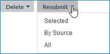

# Resubmitting a domain’s quarantined entities 

<head>
  <meta name="guidename" content="DataHub"/>
  <meta name="context" content="GUID-d2897df8-e88f-496b-af5b-11fed4b745c9"/>
</head>

When you resubmit a quarantined entity for incorporation in the domain, the repository processes the entity as if it were in a newly received incoming batch.

## About this task

The following are common resubmission scenarios:

-   After you make changes to the repository configuration, the domain configuration or the domain’s model for the purpose of resolving quarantine entries, you should resubmit the entities for incorporation in the domain.

-   If entities were quarantined as a result of a data quality service outage, when service resumes you should resubmit the entities.

:::note
    
When an entity quarantined with the cause “Update Approval Required” is resubmitted, if a golden record with the ID specified for linking does not exist, the repository performs normal matching, which in a normal case will result in creation of a golden record.

:::

## Procedure

1.  Select **Stewardship** \> **Quarantine**.

2.  In the repository/domain list, select the domain.

3.  Do one of the following:

    

    **Resubmit** menu actions

    -   To resubmit selected quarantined entities, select the check boxes for the corresponding quarantine entries, click **Resubmit** and in the drop-down menu, select **Selected**.

    -   To resubmit all quarantined entities originating from a particular source, including entities represented by quarantine entries not listed due to filtering, click **Resubmit** and in the drop-down menu, select **By Source**.

    -   To resubmit all quarantined entities, including entities represented by quarantine entries not listed due to filtering, click **Resubmit** and in the drop-down menu, select **All**.

    A confirmation dialog appears.

4.  If you are resubmitting all quarantined entities originating from a source, select the **Source**. Otherwise, skip to step 5.

5.  Click **OK**.

    :::note
    
    Another way to resubmit a single quarantined entity is to select **Resubmit** in the ** Actions** menu in its detail view. This too requires confirmation.

    :::