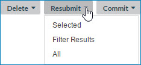

# Resubmitting a domain’s staged entities 

<head>
  <meta name="guidename" content="DataHub"/>
  <meta name="context" content="GUID-222bbf6a-ec79-47c6-a304-912fedbf1948"/>
</head>

You can resubmit a domain’s staged entities — either selected entities, entities in the filter results, or all.

## Procedure

1.  Select **Stewardship** \> **Staged Entities**.

2.  In the repository/domain list, select the domain.

3.  If the staging area that contains the entities you want to resubmit is not selected, select the staging area:

    1.  Click ** Select Staging Area**

        A dialog appears.

        

    2.  In the **Source** list, select the source for which was desired staging area was added.

    3.  In the **Staging Area** list, select the staging area.

    4.  Click **Apply**.

    The list of entities in the selected staging area appears.

4.  **Optional:** Filter the entities list. See steps 4–6 in the Related task for viewing a domain’s staged entities.

    :::note
    
    When an entity quarantined with the cause “Update Approval Required” is resubmitted, if a golden record with the ID specified for linking does not exist, the repository performs normal matching, which in a normal case will result in creation of a golden record.

    :::

5.  Do one of the following:

    

    -   To resubmit selected entities, select their check boxes, click **Resubmit** and in the drop-down menu, select **Selected**.

    -   To resubmit only entities in the filter results — click **Resubmit** and in the drop-down menu, select **Filter Results**.

    -   To resubmit all of the entities in the staging area, including those not listed due to filtering, click **Resubmit** and in the drop-down menu, select **All**.

    A confirmation dialog appears.

6.  Click **OK**.

    The entities selected in step 5 are resubmitted to the staging area. If the number of selected entities exceeds the maximum batch size of 200, multiple batches are submitted for restaging; otherwise, a single batch is submitted.

7.  **Optional:** To view the effect of the operation on the resubmitted entities, click ** Refresh**.

8.  For each additional staging area that contains entities you want to resubmit, repeat steps 3–7.

    :::note
    
    Another way to resubmit a single staged entity is to select **Resubmit** in the ** Actions** menu in its detail view. This too requires confirmation.

    :::