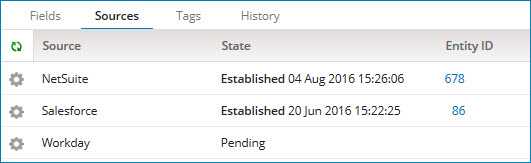

# Unlinking a golden record from a source entity 

<head>
  <meta name="guidename" content="DataHub"/>
  <meta name="context" content="GUID-977b3c32-d93d-4a1b-99cc-a390e33e1f84"/>
</head>

Sometimes a golden record is linked to the wrong source entity. You can remove the source entity link. 

## About this task

If you remove a source entity for a source that accepts channel updates, a Pending link indicates that the source could receive a channel update for the golden record but currently, it is not linked.  A Pending status does not indicate there is an action waiting to be performed.

You cannot unlink the source entity if it is the only contributing source linked to a golden record. Before removing the source entity, configure another source to contribute data. 

:::note

It is not possible to remove Pending links.

:::

## Procedure

1.  Select **Stewardship** \> **Golden Records**.

2.  In the repository/domain list, select the domain.

3.  In the data grid, click the **Updated Date** of the golden record whose link you want to remove.

    The detail view opens.

4.  Select the **Sources** tab.

    The tab shows a list of the golden record’s links to source entities.

    

5.  Click the gear icon and select **Unlink this Source**. This option is not available if it is the only contributing source linked to the golden record.

6.  To confirm, click **Unlink Source**. If the source does not accept channel updates, the link is removed. If the source accepts channel updates, the link status changes to Pending. 