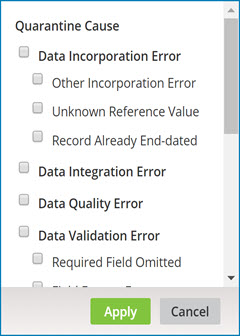
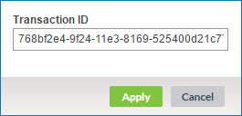
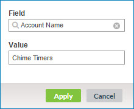

# Viewing a domain’s quarantine entries 

<head>
  <meta name="guidename" content="DataHub"/>
  <meta name="context" content="GUID-37940051-7810-4291-9044-3401866e98d8"/>
</head>

The first step in resolving a domain’s quarantine entries is to view the entries. This is done in the Quarantine page.

## Before you begin

If you have configured data to be masked in the model, masked field data is hidden in quarantined entities. Masked values are visible if you have one of the following user permissions: 
- **MDM - Privileged Data Steward** role
- **MDM - Administrator** role
- **MDM - Reveal Masked Data** privilege
- **MDM - Data Steward** role or (**MDM - Stewardship** privilege) and the **Reveal Masked Data** Hub entitlement (available with the Advanced Security feature)

## Procedure

1.  Select **Stewardship** \> **Quarantine**.

2.  In the repository/domain list, select the domain.

    The list of quarantine entries appears.

    

    For each active quarantine entry, the following information is shown:

    -   Quarantined Date

    -   Record Title — formatted title of the golden record that could potentially be created, updated, or end-dated as a result of resolving the entry.

    -   Source \(where this can be determined\)

    -   Entity ID — source record ID \(where this can be determined\)

    -   Cause — cause for quarantining — for example, Potential Duplicate

        Detail is viewable by clicking the information icon.

    For each resolved quarantine entry, Resolved Date and Resolution are also shown

    To switch between active and resolved quarantine entries, click **Active** or **Resolved**.

    To refresh the list, click ** Refresh**.

    :::note
    
    Steps 3–12 describe how to modify the filtering that is applied to the quarantine entries list. Each of these steps except step 12 relates to a particular filter type. The collapsible panel to the left of the quarantine entries list contains itemized entry counts that are shortcut links for filtering by category of reason for quarantining and specific causes. While a Transaction ID \(step 8\) filter is applied, it is not possible to apply any of the other types of filters — and vice-versa.

    While a filter is applied, a button for that filter appears to the left of the **Add Filter** button. The button’s label shows the specified criterion.

    -   To clear a filter, click  on the filter’s button.

    -   To clear all filters, click ** Clear All Filters**.

    -   To save the currently applied filters and **Filter Operator** as defaults for application to the quarantine entries list when the Quarantine page reloads, click **Save current filters as default view**. You can save filters separately per account for each of the repository’s hosted domains. For a given domain, you can save filters separately for **Active** and **Resolved** quarantine entries.

    :::

3.  **Optional:** To filter the quarantine entries list by source, do one of the following:

    -   If filtering by source is not currently applied, click **Add Filter** and select the Source filter type.

    -   Otherwise, click the **Source:** button for the currently applied filter.

    A dialog appears and takes focus.

    

    1.  In the **Source** list, select the source by which to filter.

    2.  Click **Apply**.

4.  **Optional:** To filter the quarantine entries list by source entity ID, do one of the following:

    -   If filtering by source entity ID is not currently applied, click **Add Filter** and select the Source Entity ID filter type.

    -   Otherwise, click the **Source Entity ID:** button for the currently applied filter.

    A dialog appears and takes focus.

    

    1.  In the **Source Entity ID** field, type the entity ID.

    2.  Click **Apply**.

5.  **Optional:** To filter the quarantine entries list by category of reason for quarantining or specific causes, do one of the following:

    -   If filtering by category of reason for quarantining or specific causes is not currently applied, click **Add Filter** and select the Quarantine Cause filter type.

    -   Otherwise, click the **Cause:** button for the currently applied filter.

    A dialog appears and takes focus.

    

    1. **Optional:** To filter by entities quarantined due to an error during incorporation into the domain, select **Data Incorporation Error**. As an alternative, you can select the **Unknown Reference Value** check box to filter by entities quarantined due to their containing unresolvable collection item references, the **Record Already End-dated** check box to filter by entities quarantined due to the existence of a link to the entity from an end-dated golden record, or the **Other Incorporation Error** check box to filter by entities quarantined due to other types of incorporation errors.

    2.  **Optional:** To filter by entities quarantined due to failure to structurally conform with the field layout specified in the domain’s model, select **Data Integration Error**.

    3.  **Optional:** To filter by entities quarantined due to data quality step failure, select **Data Quality Error**.

    4.  **Optional:** To filter by entities quarantined due to data not in conformance with their specified field type, the omission of required fields or collection key fields, or the presence of multiple collection items with the same key values, select **Data Validation Error**. As an alternative, you can select each specific cause as a filter criterion by turning on the check box for that cause — **Required Field Omitted**, **Field Format Error** or **Duplicate Collection Key**.

    5.  **Optional:** To filter by entities quarantined due to matching errors, including multiple matches, ambiguous matches, potential duplicates and unresolvable references, select **Matching Error**. As an alternative, you can select each specific cause as a filter criterion by turning on the check box for that cause — **Multiple Matches**, **Ambiguous Match**, **Potential Duplicate** or **Reference Matching Error**.

    6.  **Optional:** To filter by entities quarantined due to their satisfying conditions configured for their source requiring the manual approval of either new entity contributions, contributed entities updating matching golden records, contributed entities with base values updating matching golden records, or contributed entities that would end-date matching golden records, select **Requires Approval**. As an alternative, you can select each specific cause as a filter criterion by turning on the check box for that cause — **Create Approval Required**, **Update Approval Required**, **Update With Base Value Approval Required**, or **End-date Approval Required**.

    :::note

    A field’s base value for a source is the value of the field in the matching golden record’s base version for the source. While there is a pending link from a golden record to a source, the base version of the golden record for that source is the golden record version when the pending link was created.

    :::

    7.  Click **Apply**.

6.  **Optional:** To apply a Quarantined Date time span filter to the quarantine entries list, do one of the following:

    -   If filtering by Quarantined Date time span is not currently applied, click **Add Filter** and select the Quarantined Date filter type.

    -   Otherwise, click the **Quarantined:** button for the currently applied filter.

    A dialog appears and takes focus. Select one of the following from the dialog and then click **Apply**:

    

    -   **Past Hour**

    -   **Past 24 Hours**

    -   **Past Week**

    -   **Date Range**, then type **From** and **To** dates, or click the date fields and select dates from calendars. You can optionally type or select **From** and **To** times rather than accepting the 00:00 and 23:59 defaults.

7.  **Optional:** To filter the quarantine entries list by tag, do one of the following:

    -   If filtering by tag is not currently applied, click **Add Filter** and select the Record Tag filter type.

    -   Otherwise, click the **Tag:** button for the currently applied filter.

    A dialog appears and takes focus.

    

    1.  In the **Tag Name** list, select the tag by which to filter.

    2.  Click **Apply**.

8.  **Optional:** To filter the quarantine entries list by transaction ID, do one of the following:

    -   If filtering by transaction ID is not currently applied, click **Add Filter** and select the Transaction ID filter type.

    -   Otherwise, click the **Transaction ID:** button for the currently applied filter.

    A dialog appears and takes focus.

    

    1.  In the **Transaction ID** field, type the transaction ID.

    2.  Click **Apply**.

9.  **Optional:** To filter the quarantine entries list by an entity field value, do one of the following:

    -   If filtering by an entity field value is not currently applied, click **Add Filter** and select the Field Data filter type.

    -   Otherwise, click the button whose label identifies the field and value for the currently applied filter.

    A dialog appears and takes focus.

    

    1.  In the **Field** list, select the field.

    2.  In the **Value** field, type the value.

    3.  Click **Apply**.

    :::note
    
    You can repeat this step to apply additional filters of this type.

    The Starts With operator is used when applying this filter type. For example, specifying a **Value** for a given **Field** of “Chime Timers” would return quarantine entries for which the value of the entity field in question begins with “Chime Timers”, such as “Chime Timers, Inc.” and “Chime Timers”.

    :::

10. **Optional:** To apply a Resolved Date time span filter to resolved quarantine entries, do one of the following:

    -   If filtering by Resolved Date time span is not currently applied, click **Add Filter** and select the Resolved Date filter type.

    -   Otherwise, click the **Resolved:** button for the currently applied filter.

    The dialog mentioned in step 6 appears and takes focus. Set the time span and then click **Apply**.

11. **Optional:** To filter resolved quarantine entries by resolution, do one of the following:

    -   If filtering by resolution is not currently applied, click **Add Filter** and select the Resolution filter type.

    -   Otherwise, click the **Resolution:** button for the currently applied filter.

    A dialog appears and takes focus.

    

    1.  **Optional:** To filter by entries for which a user approved the quarantined entity, select **Approved for Incorporation**.

    2.  **Optional:** To filter by entries for which a user approved the quarantined entity for incorporation with base values, select **Approval for Update With Base Values**.

    3.  **Optional:** To filter by entries for which a user approved the quarantined entity for incorporation without base values, select **Approval for Update Without Base Values**.

    4.  **Optional:** To filter by entries for which a user requested deletion, select **Entity Deleted**.

    5.  **Optional:** To filter by entries for which a user rejected the quarantined entity, select **Entity Rejected**.

    6.  **Optional:** To filter by entries for which a user merged fields from the quarantined entity into a selected matching golden record and also rejected the quarantined entity, select **Fields Selectively Merged**.

    7.  **Optional:** To filter by entries for which a user manually deleted the golden record, select **Golden Record Deleted**.

    8.  **Optional:** To filter by entries for which a user restored an end-dated golden record from which there exists a link to the quarantined entity, select **Golden Record Restored**.

    9.  **Optional:** To filter by entries for which a user resolved the matching issue associated with the quarantined entity, select **Matching Issue Resolved**.

    10. **Optional:** To filter by entries for which a newer version of the quarantined entity was contributed in a batch, thereby making this quarantine entry obsolete, select **Newer Version Contributed**.

    11. **Optional:** To filter by entries automatically resolved as a result of the successful incorporation in the target domain of a replacement for the quarantined entity, select **Newer Version Incorporated**.

    12. **Optional:** To filter by entries for which a user resubmitted the quarantined entity, applying only data quality steps subsequent to the failed step, select **Resubmitted Ignoring Enrichment**.

    13. **Optional:** To filter by entries for which a user resubmitted the quarantined entity, reapplying the failed data quality step and all subsequent steps, select **Resubmitted Retrying Enrichment**.

    14. **Optional:** To filter by entries for which a user edited and resubmitted the quarantined entity using the Edit and Resubmit Entity wizard, select **Resubmitted With Edits**.

    15. **Optional:** To filter by entries for which a user resubmitted the quarantined entity without editing, select **Resubmitted Without Editing**.

    16. Click **Apply**.

12. If you have applied multiple filters and you want the filters to be “OR’ed”, in the **Filter Operator** list, select OR. Otherwise, the filters are “AND’ed”, which means only quarantine entries for entities meeting all of the specified filter criteria are selected.

13. **Optional:** To view details for a quarantine entry, click its Quarantined Date.

    

    In the detail view:

    -   The **Fields** tab in the shaded area shows the incoming source entity data. If the reason for quarantining is specific to particular fields, those fields are highlighted.

    -   To view the entity data in the native XML format of the incoming batch, select the **Original XML** tab.
    
        :::note

        You can view up to 100 repeatable fields or field groups. You can view additional fields by selecting **Original XML** or by querying the Repository API. If field values are masked, you can view additional fields in the History tab.
        
        :::

    -   To view events logged for the entity, beginning with its contribution in a batch, select the **Activity** tab.

    -   To view the entity’s tags, select the **Tags** tab.

    -   To view information about matching errors, where applicable, select the **Match Detail** tab. The tab shows the most current match rule causing the quarantine. It does not show any previous match rules after you change the entity or the match rules in the model. To return historical data on all match rules that caused quarantines, you can use the [Query Quarantine Entries](/docs/Atomsphere/Master%20Data%20Hub/REST%20APIs/r-mdm-Query_Quarantine_Entries_1ba99cc5-8cd1-4d9c-ac3c-ae95db3aa4cd.md) endpoint.

    You can link from the detail view to the record in the source system, provided

    -   the source and the source record ID can be determined.

    -   the source entity URL format is correctly specified in the **Entity ID URL** field for the source attachment in the **Sources** tab, or if not there, for the source definition in the Sources page.

    The link opens in a separate browser tab or window.

14. **Optional:** When you are done reviewing the quarantine entry details, do one of the following:

    -   Close the detail view — either press **Esc**, click **Close** or click elsewhere in the Quarantine page.

    -   Navigate to detail for the previous entry in the quarantine entries list — click ** Previous** \(or press the **Up arrow** key\).

    -   Navigate to detail for the next entry in the quarantine entries list — click **Next ** \(or press the **Down arrow** key\).