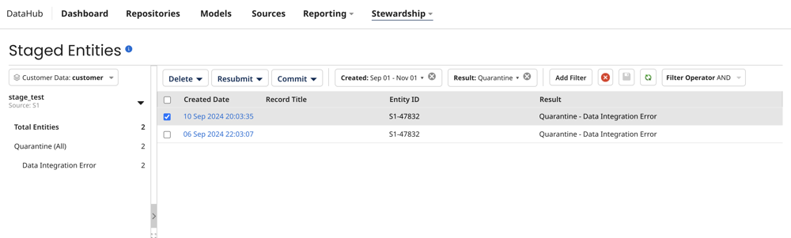

# Viewing a domain’s staged entities 

<head>
  <meta name="guidename" content="DataHub"/>
  <meta name="context" content="GUID-0fdcb1a0-9f4d-4d2e-9752-e6ec0c8c29f4"/>
</head>

View staged entities in the Staged Entities page. Staging entities is helpful when you want to test how entities from a specific source will affect golden records in the domain before committing them to the repository. You can set up a staging area for a specific source in the deployed model's Sources tab. Refer to [Adding a staging area for a source](/docs/Atomsphere/Master%20Data%20Hub/Stewardship/t-mdm-Adding_a_staging_area_for_a_source_a4e18da6-9b8d-4257-a28e-dc1725b587ae.md) to learn more. 

## Before you begin

If you have configured data to be masked in the model, masked field data is hidden in staged entities. Masked values are visible if you have one of the following user permissions: 
- **MDM - Privileged Data Steward** role
- **MDM - Administrator** role
- **MDM - Reveal Masked Data** privilege
- **MDM - Data Steward** role or (**MDM - Stewardship** privilege) and the **Reveal Masked Data** Hub entitlement (available with the Advanced Security feature)

## Procedure

1. Select **Stewardship** > **Staged Entities**.
2. Select the repository and deployed model in the drop-down.
3. If the staging area you want to view is not selected, select the source and staging area.
4. Click **Apply**.
5. For each entity in the selected staging area, the following information is shown:

    - **Created Date** — date of the staging of the entity. This is also a link to entity details.
    - **Record Title** — formatted title of the golden record that could potentially be created, updated, or end-dated as a result of committing the entity.
    - **Entity ID** — source record ID.
    - **Result** — the result of staging the entity — in other words, the entity processing result that would have occurred had the entity actually been contributed when it was staged:
        - **Create Record** — creation of a golden record.
        - **Update Record** — updating of a golden record.
        - **End-date Record** — end-dating of a golden record.
        - **Link Record** — linking of a golden record to the source entity.
        - **Link and Update Record** — linking of a golden record to the source entity and updating of that golden record.
        - **No Change to Record** — no impact on a golden record.
        - **Quarantine** — quarantining of the entity. The cause is shown.

6. Click **Add Filter** to add one of the following filters:
    - Created Date
    - Source Entity ID
    - Entity Result - 
        - **Create Record** — entities which, if actually contributed when staged, would have resulted in the creation of a golden record.
        - **Update Record** — entities which, if actually contributed when staged, would have resulted in the updating of a golden record.
        - **End-date Record** — entities which, if actually contributed when staged, would have resulted in the end-dating of a golden record.
        - **Link Record** — entities which, if actually contributed when staged, would have resulted in the linking of a golden record to the source entity.
        - **Link and Update Record** — entities which, if actually contributed when staged, would have resulted in the linking of a golden record to the source entity and the updating of that golden record.
        - **No Change to Record** — entities which, if actually contributed when staged, would not have resulted in the creation, updating, end-dating, or linking of a golden record.
        - **Quarantine** — entities which, if actually contributed when staged, would have been quarantined. Select a quarantine   cause:
            - **Ambiguous Match** — entities that would have been quarantined due to their matching 10 or more golden records, regardless of links to source records (1,000 or more in the case of an exact matching expression grouped with a fuzzy matching expression).
            - **Create Approval Required** — entities that would have been quarantined due to their satisfying conditions configured for their source requiring the manual approval of new entity contributions.
            - **Data Integration Error** — entities that would have been quarantined due to failure to structurally conform with the field layout specified in the domain model.
            - **Data Quality Error** — entities that would have been quarantined due to data quality step failure.
            - **Duplicate Collection Key** — entities that would have been quarantined because they contain multiple collection items with the same key values.
            - **End-date Approval Required** — entities that would have been quarantined due to their source being configured to require manual approval of entity contributions that would end-date linked golden records.
            - **Field Format Error** — entities that would have been quarantined because they contain data not in conformance with either their field type, validation options for that field type specified in the domain model, or with the system 255-character limit for text and Enumeration field values.
            - **Multiple Matches** — entities that would have been quarantined due to matching multiple golden records not yet linked to a record in the source.
            - **Other Incorporation Error** — entities that would have been quarantined due to their causing errors other than unresolvable collection item reference during the staging of incorporation.
            - **Potential Duplicate** — entities that would have been quarantined due to matching golden records that have already been linked to a record in the source.
            - **Record Already End-dated** — entities that would have been quarantined due to the existence of a link from an end-dated golden record.
            - **Reference Matching Error** — entities that would have been quarantined due to their having reference field values that do not resolve to golden records.
            - **Required Field Omitted** — entities that would have been quarantined due to their omission of fields specified as required or as collection keys in the domain model.
            - **Unknown Reference Value** — entities that would have been quarantined due to unresolvable collection item references during the staging of incorporation.
            - **Update Approval Required** — entities that would have been quarantined due to their satisfying conditions configured for their source requiring the manual approval of contributed entities updating matching golden records.
            - **Update With Base Value Approval Required** — entities that would have been quarantined due to their source being configured to require manual approval of contributed entities for which a pending link exists from the matching golden record to the source and in which a field has a base value.
7. Click **Filter Operator** to select AND or OR as the operator. The default is AND. 
8. **Optional**: Click **Add Filter** to add additional filters.
9. **Optional**: Click **Save** to save the current filter as the default view.
10. Click the **Created Date** to view details about a staged entity. In the detail view, the Entity Fields tab shows the staged source entity data. To view the resulting full golden record had the entity actually been contributed when it was staged, select the **Full Record** tab. To view the entity data in the native XML format of the staged batch, select the **Original XML** tab.

    :::note

    You can view up to 100 repeatable fields or field groups. You can view additional fields by selecting Original XML or by querying the Repository API. If field values are masked, you can view additional fields in the History tab.

    :::

11. **Optional**: Select **Delete** to delete staged entities by selecting one of the following options:
    - Selected - deletes the selected entities.
    - Filter Results - deletes entities that match the filter results.
    - Delete all staged entities.
12. **Optional**: Select **Resubmit** to resubmit an entity to the staging area after you’ve made changes to the model and re-deployed it.
    - Selected - resubmits the selected entities.
    - Filter Results - resubmits entities that match the filter results.
    - Resubmit all staged entities.
13. **Optional**: Select **Commit** to commit an entity to the repository to create or update a golden record.
    - Selected - resubmits the selected entities.
    - Filter Results - resubmits entities that match the filter results.
    - Commit all staged entities.