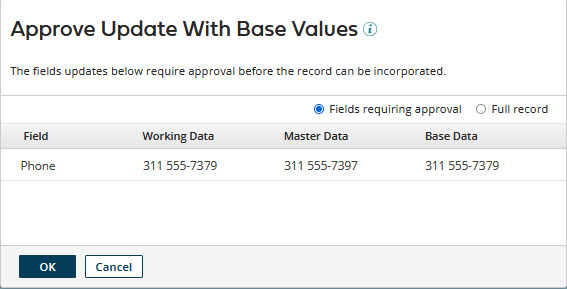
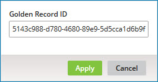
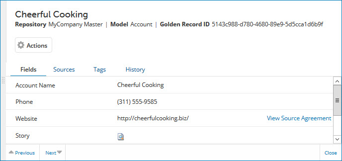
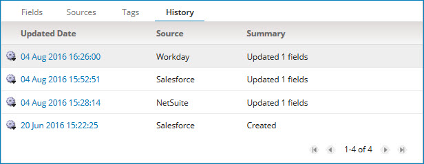

# Viewing domain data 

<head>
  <meta name="guidename" content="DataHub"/>
  <meta name="context" content="GUID-22c95cb1-6039-4e79-b1bf-6dc99268fd6b"/>
</head>

View the data in a master data domain in the Golden Records page.

## Before you begin

If you have configured data to be masked in the model, masked field data is hidden in golden records. Masked values are only visible if you have one of the following user permissions: 
- **MDM - Privileged Data Steward** role
- **MDM - Administrator** role
- **MDM - Reveal Masked Data** privilege
- **MDM - Data Steward** role (or **MDM - Stewardship** privilege) and the **Reveal Masked Data** Hub entitlement (available with the Advanced Security feature)

:::note

You can activate Accelerated Query when you have 100,000 or more golden records in a deployed model (universe). This feature improves query performance. Read [Activating Accelerated Query](/docs/Atomsphere/Master%20Data%20Hub/Stewardship/hub-accelerated_query.md) to learn more.

:::

## Procedure

1.  Select **Stewardship** \> **Golden Records**.

2.  In the repository/domain list, select the domain.

    A data grid is displayed in which each row represents a golden record. The first column, Updated Date, is the timestamp of the last update of the golden record. If a golden record title format is specified in the domain model, the next column, Record Title, is the golden record title. The right-most column, Created Date, is the timestamp of the creation of the golden record. The remaining columns correspond to the fields in the domain model. Collections are omitted; collection data for an individual golden record is viewable in its detail view — see step 14.

    To view a Long Text field value, click the ** View value** icon representing that value in the grid.

    

    Filtering by date of last update is applied by default unless other filters have been explicitly saved as defaults; initially only active golden records updated in the past 24 hours load into the grid. To switch between active and end-dated golden records, click **Active** or **End-dated**.

    Initially a maximum of 100 golden records load into the grid.

    To refresh the grid, click ** Refresh**.

    :::note
    
    Steps 3–13 describe how to modify the filtering applied to the data in the grid. Each of these steps except step 13 relates to a particular filter type. While a Golden Record ID \(step 11\) filter is applied, it is not possible to apply any of the other types of filters — and vice-versa.

    While a filter is applied, a button for that filter appears to the left of the **Add Filter** button. The button’s label shows the specified criterion — for example, **Updated:** Past 24 Hours.

    -   To clear a filter, click  on the filter’s button.

    -   To clear all filters, click ** Clear All Filters**.

    -   To save the currently applied filters and **Filter Operator** as defaults for application to the data grid when the Golden Records page reloads, click ** Save current filters as default view**. You can save filters separately for each of the repository’s hosted domains. For a given domain, you can save filters separately per account for **Active** and **End-dated** golden records.

    :::

3. **Optional:** To filter active golden records by created date, do one of the following:

    -   If active golden records are not currently filtered by created date, click **Add Filter** and select the Created Date filter type.

    -   Otherwise, click the **Created:** button for the currently applied filter.

    A dialog appears and takes focus.

    

    Select one of the following from the dialog and then click **Apply**

    -   **Past Hour**

    -   **Past 24 Hours**

    -   **Past Week**

    -   **Date Range**, then type **From** and **To** dates, or click the date fields and select dates from calendars. You can optionally type or select **From** and **To** times rather than accepting the 00:00 and 23:59 defaults.

4.  **Optional:** To filter active golden records by date of last update, do one of the following:

    -   If active golden records are not currently filtered by date of last update, click **Add Filter** and select the Updated Date filter type.

    -   Otherwise, click the **Updated:** button for the currently applied filter.

    The dialog mentioned in step 3 appears and takes focus. Set the time span and then click **Apply**.

5.  **Optional:** To filter the data by a field value, do one of the following:

    -   If the data is not currently filtered by a field value, click **Add Filter** and select the Field Data filter type.

    -   Otherwise, click the button whose label identifies the field and value for the currently applied filter.

    A dialog appears and takes focus.

    

    1.  In the **Field** list, select the field.

    2.  In the next list, select the operator.

        :::note
        
        The operators available for selection and the default selection are dependent upon the type of field you selected, and the remaining substeps are dependent upon the operator you select. For the specifics, see the Related reference for the **Golden Records** page. For most field type and operator combinations, continue with substep c as written here.

        :::

    3.  In the **Value** field, type the value.

    4.  Click **Apply**.

    :::note
    
    You can repeat this step to apply additional filters of this type.

    :::

6.  **Optional:** To filter active golden records by tag, do one of the following:

    -   If active golden records are not currently filtered by a tag, click **Add Filter** and select the Record Tag filter type.

    -   Otherwise, click the **Tag:** button for the currently applied filter.

    A dialog appears and takes focus.

    

    1.  In the **Tag Name** list, select the tag by which to filter.

    2.  Click **Apply**.

7.  **Optional:** To filter active golden records by creating source, do one of the following:

    -   If active golden records are not currently filtered by a creating source, click **Add Filter** and select the Creating Source filter type.

    -   Otherwise, click the **Creating Source:** button for the currently applied filter.

    A dialog appears and takes focus.

    

    1.  In the **Source** list, select the source by which to filter.

    2.  Click **Apply**.

8.  **Optional:** To filter the data by source entity ID, do one of the following:

    -   If the data is not currently filtered by a source entity ID, click **Add Filter** and select the Source Entity ID filter type.

    -   Otherwise, click the **Source Entity ID:** button for the currently applied filter.

    A dialog appears and takes focus.

    

    1.  In the **Source** list, select the source.

    2.  In the **Entity ID** field, type the entity ID.

    3.  Click **Apply**.

    :::note
    
    The Starts With operator is used when applying this filter type. For example, setting **Entity ID** to “12” would return each golden record whose entity ID for the selected **Source** begins with “12”, such as "123" and "1234321".

    :::

9.  **Optional:** To filter active golden records by source links, do one of the following:

    -   If active golden records are not currently filtered by source links, click **Add Filter** and select the Source Links filter type.

    -   Otherwise, click the **Linked to:** or **Not Linked to:** button for the currently applied filter.

    A dialog appears and takes focus.

    

    1.  In the first list:

        -   To filter by the presence of links to a source, selected Linked.

        -   To filter by the absence of links to a source, selected Not Linked.

    2.  In the **To Source** list, select the source.

    3.  Click **Apply**.

10. **Optional:** To filter the data by the presence of unresolved reference field data, do one of the following:

    -   If the data is not currently filtered by the presence of unresolved reference field data, click **Add Filter** and select the Unresolved References filter type.

    -   Otherwise, click the **Unresolved:** button for the currently applied filter.

    A dialog appears and takes focus.

    

    1.  In the **Reference Field** list, select the reference field to evaluate for the presence of unresolved data.

    2.  In the **Source** field, select an individual source by which to filter or All Sources \(default\), which limits results to records for which all source contributions are unresolved.

    3.  Click **Apply**.

11. **Optional:** To filter the data by golden record ID, do one of the following:

    -   If the data is not currently filtered, click **Add Filter** and select the Golden Record ID filter type.

    -   If the data is currently filtered by a golden record ID, click the **Golden Record ID:** button for the currently applied filter.

    A dialog appears and takes focus.

    

    1.  In the **Golden Record ID** field, type the golden record ID.

    2.  Click **Apply**.

12. **Optional:** To filter end-dated golden records by end date, do one of the following:

    -   If end-dated golden records are not currently filtered by end date, click **Add Filter** and select the End Date filter type.

    -   Otherwise, click the **End-dated:** button for the currently applied filter.

    The dialog mentioned in step 3 appears and takes focus. Set the time span and then click **Apply**.

13. **Optional:** If you have applied multiple filters and you want the filters to be “OR’ed”, in the **Filter Operator** list, select OR. Otherwise, the filters are “AND’ed”, which means only golden records meeting all of the specified filter criteria are selected.

14. **Optional:** To view details for a golden record, click its Updated Date.

    The detail view opens.

    

    Do any or all of the following:

    -   To view the field data, select the **Fields** tab — this tab is selected by default.

        :::note

        You can view up to 100 repeatable fields or field groups. You can view additional fields by selecting **Original XML** or by querying the Repository API. If field values are masked, you can view additional fields in the History tab.
        
        :::

        :::note
        
        To view details for a referenced golden record, click the corresponding reference field value.

        :::

    -   To view source agreement for a field for which sources are ranked, select the **Fields** tab, and click **View Source Agreement** in the field’s list entry. Sources are listed in their ranked order, and those in agreement are indicated by the  icon and bold type.

        

        To hide source agreement for a field, click **Hide Source Agreement**.

    -   To view the source entity IDs contributed as reference field values in entities by individual sources and the respective states of the references, select the **Fields** tab, and in the field’s list entry click ** View contributed values by source**.

        

        When you are done viewing the Source Contributions view, close it — either press **Esc**, click **Close** or click elsewhere in the Golden Records page.

    -   To view the golden record’s sources and the states of the links from the golden record to source entities, select the **Sources** tab.

        

        :::note
        
        You can link from the sources list to entities in source systems, provided the source entity URL formats are correctly specified in the **Entity ID URL** field for the source attachments in the domain **Sources** tab, or if not there, for the source definitions in the Sources page. The links open in separate browser tabs or windows.

        :::

    -   To view the golden record’s tags, select the **Tags** tab.

        

    -   To view the golden record’s version history, select the **History** tab.

        

        To view a version’s details, click its Updated Date.

        

        In the version detail view, to view the values of all fields for the version, select the **Record** tab. To view events that occurred leading to the creation of the version, select the **Activity** tab. To view the previous and new values of created and updated fields for the version, select the **Changes** tab.

        When you are done reviewing the version details, do one of the following:

        -   Close the version detail view — either press **Esc**, click **Close** or click elsewhere in the Golden Records page.

        -   Navigate to detail for the next version \(previous entry in the **History** list\) — click ** Previous** \(or press the **Up arrow** key\).

        -   Navigate to detail for the previous version \(next entry in the **History** list\) — click **Next ** \(or press the **Down arrow** key\).

15. **Optional:** When you are done reviewing the golden record details, do one of the following:

    -   Close the detail view — either press **Esc**, click **Close** or click elsewhere in the Golden Records page.

    -   Navigate to detail for the previous golden record in the data grid — click ** Previous** \(or press the **Up arrow** key\).

    -   Navigate to detail for the next golden record in the data grid — click **Next ** \(or press the **Down arrow** key\).