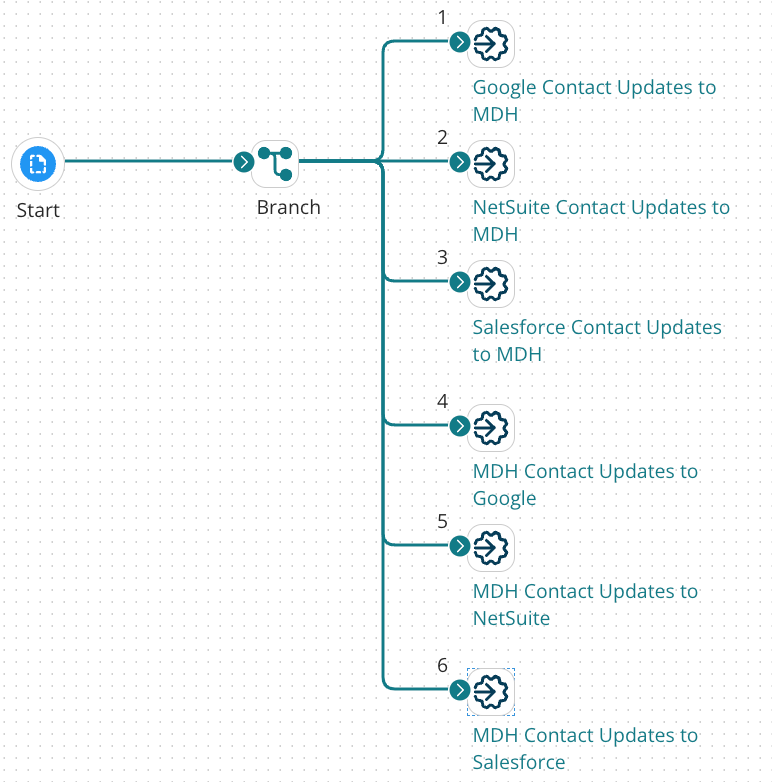

# Building a Integration master synchronization process

<head>
  <meta name="guidename" content="DataHub"/>
  <meta name="context" content="GUID-35cb83e5-f515-424b-9684-e978647108d7"/>
</head>

An example of a master synchronization process built with Integration is illustrated by this capture of the Integration process canvas.

## About this task

:::info

The following integration examples use operations from the Master Data Hub legacy connector.

This Master Data Hub legacy connector is available only for existing integrations. For new integrations, use the [Boomi DataHub connector](docs/Atomsphere/Integration/Connectors/int-Boomi_Data_Hub_connector.md), which offers more operations and an improved experience.

:::

In this example the domain’s sources are [Google Contacts](http://www.google.com/contacts), [NetSuite](http://www.netsuite.com) and [Salesforce](http://www.salesforce.com), and the source of record across all domain fields is Salesforce.

You can install a similar sample process built for this purpose in your account from the process library in Integration. The process name is [ Hub: Master Synchronization](https://platform.boomi.com/#build;processLibrary=4195924d-7d8a-4b94-ba77-b2d0b56f2824).

:::note

The following steps omit certain details that should be evident to users having experience using Integration to [build integration processes](/docs/Atomsphere/Integration/Process%20building/c-atm-Process_building_b422a00a-b17b-4ea8-ae01-d04adaf97e16.md).

:::

## Procedure

1. In Integration, create a Process component and name it — for example, Master Contacts Sync.

    The Start step is automatically placed in the Process canvas.

2.  Drag a **Branch** step from the **Logic** palette to the canvas.

3.  Configure the step to have one branch for each source plus one branch for each source for which an update channel is configured. For example, if a given model has three sources with two having update channels, configure the step with five branches.

4.  Drag a **Process Call** step from the **Execution** palette to the canvas.

5.  Configure the step to execute the process to check for record updates from a source.

    Set the options as follows:

    -   **Wait for process to complete** — on

    -   **Abort if process fails** — on

6.  Repeat steps 4–5 for each additional source.

7.  Drag a **Process Call** step from the **Execution** palette to the canvas.

8.  Configure the step to execute the process to check for source record update requests targeting a source.

    Set the same options as for the Process Call steps configured in previous steps.

9.  Repeat steps 7–8 for each additional source.

10. Connect the Branch step paths to the Process Call steps such that the path numbers correspond to the order in which you added the Process Call steps. For example, connect path \#1 to the Process Call you added first.

    :::note
    
    The order of Branch step paths is of greatest importance if source rankings are not configured for the domain *and* there is a source of record across all domain fields. In that case arrange the paths based on the relative trustworthiness of the sources, beginning with the least trusted and ending with the most trusted.

    The order of the Branch step paths of little importance if source rankings are configured for the domain.

    :::

11. **Save** the Process.