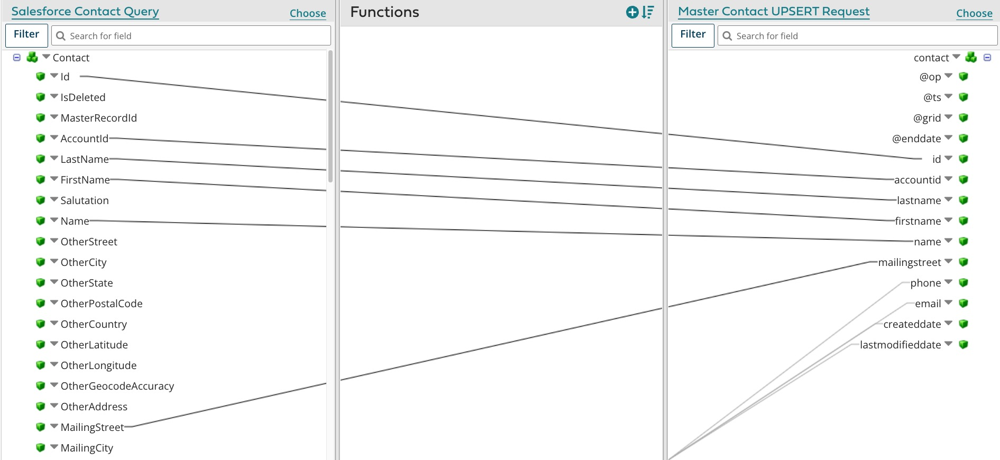

# Building a Integration process for an initial load

<head>
  <meta name="guidename" content="DataHub"/>
  <meta name="context" content="GUID-f03675d2-de6f-4406-a387-534bad3f4b64"/>
</head>

An example of a Integration process built for an initial load of source system data into a Boomi DataHub domain is illustrated by this capture of the Integration process canvas.

## About this task

:::info

The following integration examples use operations from the Master Data Hub legacy connector.

This Master Data Hub legacy connector is available only for existing integrations. For new integrations, use the [Boomi DataHub connector](docs/Atomsphere/Integration/Connectors/int-Boomi_Data_Hub_connector.md), which offers more operations and an improved experience.

:::

In this example the source system is [Salesforce](http://www.salesforce.com/). However, the data does not originate directly from Salesforce but rather from a CSV file residing on a local disk that was created by exporting the data from Salesforce.

:::note

The following steps omit certain details that should be evident to users having experience using Integration to [build integration processes](/docs/Atomsphere/Integration/Process%20building/c-atm-Process_building_b422a00a-b17b-4ea8-ae01-d04adaf97e16.md).

:::

## Procedure

1.  In Integration, create a **Process** component and name it — for example, Load Salesforce Contacts to MyCompany Master Data.

    The Start step is automatically placed in the Process canvas.

2.  Configure the Start step as a Disk Connector to the local disk and directory in which the CSV file resides, with a Get **Action** and an **Operation** specifying the name of the CSV file as the **File Filter**.

3.  Drag a **Connector** step from the **Execution** palette to the canvas.

4.  Configure the new step as a [ Boomi Master Data Hub connector](/docs/Atomsphere/Integration/Connectors/r-atm-MDM_connector_ff690a6f-288d-44b3-96fb-e81afb046703.md) with an UPSERT **Action**.

    This connector step configuration is demonstrated by example 1 in the sample process [ Hub: Update Golden Records](https://platform.boomi.com/#build;processLibrary=4195924d-7d8a-4b94-ba77-b2d0b56f2824), which you can install in your account from the process library in Integration.

    1.  Create an Operation component, and click **Import** to prepare to import the field structure of the deployed version of the domain model.

    2.  In the Boomi DataHub Import Wizard, create a Connection component for the repository to which the model is deployed:

        -   URL — URL of the Hub Cloud hosting the repository. maintains [regional Hub Clouds worldwide](/docs/Atomsphere/Platform/r-boo-Hostnames_and_IP_addresses_for_Atom_Clouds__0d150522-9457-4c37-b5a9-a8ad664490bd.md). Copy and paste the URL from the Sources tab in Boomi DataHub for any domain hosted in the repository. Copy only the portion of the URL ending with “/mdm” — for example, `“https://c01-usa-east.hub.boomi.com/mdm”.`

        -   Username — user name for the account’s interaction with the repository. Copy this from the repository Configure tab in Boomi DataHub.

        -   Token — authentication token for the account’s interaction with repository. Copy this from the repository Configure tab in Boomi DataHub.

    3.  In the Import Wizard, in the **Source** field, type the unique ID of the source as it appears when you pause the pointer on the name of the source in the Sources tab in Boomi DataHub.

        :::note
        
        If you are building the process for *staging* the initial load, in the **Staging Area ID** field, type the unique ID of the staging area. This connector step configuration is demonstrated by example 2 in the sample process [ Hub: Update Golden Records](https://platform.boomi.com/#build;processLibrary=4195924d-7d8a-4b94-ba77-b2d0b56f2824). Otherwise, leave that field blank.

        :::

    4.  Click **Next**.

    5.  In the **Object Type** list, select the domain.

    6.  Click **Next**.

    7.  In the summary screen, click **Finish**.

        An XML Profile component named “Boomi Master Data Hub “ `domain` UPSERT Request” for the outbound data is automatically created.

5.  Drag a **Map** step from the **Execution** palette to the canvas and create a Map component

6.  For the source profile, create a Flat File Profile component, name it something appropriate — for example, Salesforce Contact CSV — and configure the Profile as follows. When you are done, **Save and Close** the Profile.

    1.  The following changes to the default **Options** will typically be necessary to accommodate data exported from Salesforce.

        -   **Use Column Headers** — on

        -   **File Delimiter** — Comma Delimited

        -   **Text Qualifier** — Double Quote

    2.  In the **Data Elements** tab, select the **Record** node and **Import** the structure of the CSV file.

7.  For the destination profile, select the XML Profile component used in the Boomi Master Data Hub connector for the outbound data.

8.  Important: Map the source ID field to the domain id field.

    :::note
    
    Any process that loads source records into needs to map the source record ID to the id field in the domain to enable the creation of linkages between golden records and source records. Internally the repository maintains a cross-reference table for each domain in which source record IDs are mapped to golden record IDs.

    :::

9.  Map other source record fields to fields in the domain. Exclude from mapping only fields whose data you neither want to have loaded from the source into the domain nor used by Boomi DataHub to match source records to the domain’s existing golden records.

    

    :::note
    
    To make this step easier, consider using **Boomi Suggest**, a wizard that offers mapping suggestions based on thousands of mappings logged by the community. Boomi Suggest is enabled per account on the  Integration [Account Information page](/docs/Atomsphere/Platform/r-atm-Account_information_management_ae14e3ab-37ae-4162-ad6c-9810a81329a4.md).

    :::

10. Optionally add map functions to enable data transformations or define default values.

11. Drag a **Stop** step from the **Logic** palette to the canvas.

12. Connect the source Connector to the Map.

13. Connect the Map to the Boomi Master Data Hub Connector.

14. Connect the Boomi Master Data Hub Connector to the Stop step.

15. **Save** the Process.