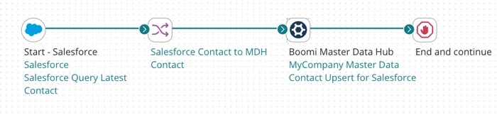
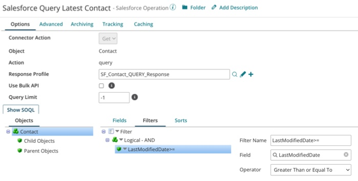
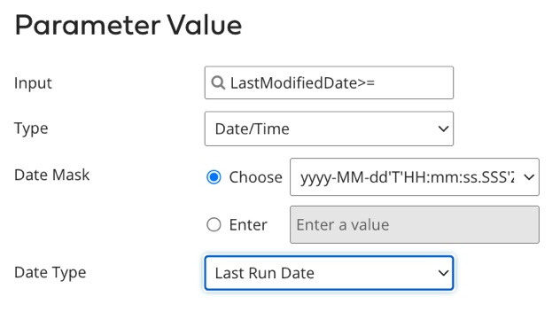
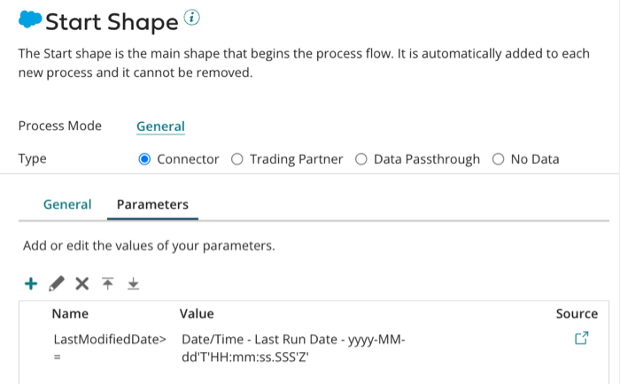
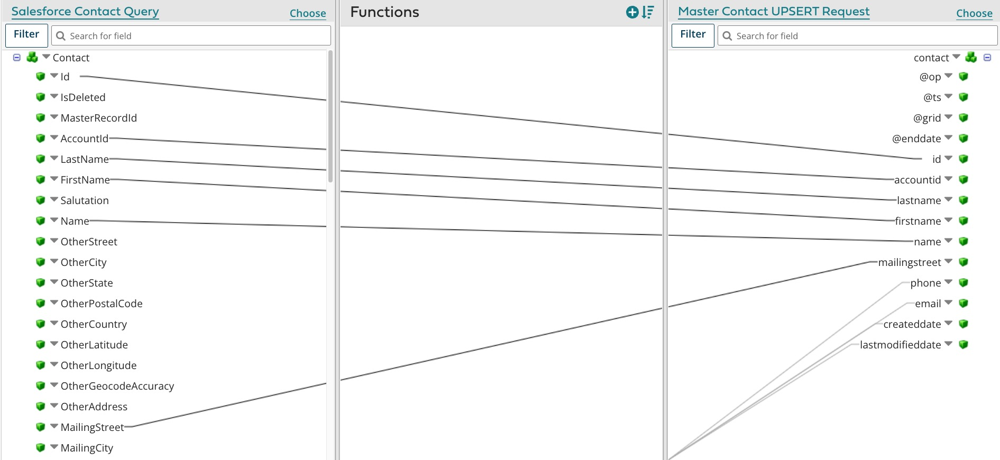

# Building a Integration process to batch and route incoming updates

<head>
  <meta name="guidename" content="DataHub"/>
  <meta name="context" content="GUID-0d930e58-3a0e-4816-b0a7-d6c8981ae7d2"/>
</head>

The Boomi DataHub transactional workflow, as it relates to a given contributing source of a domain, relies on the execution of a regularly scheduled process.

:::info

The following integration examples use operations from the Master Data Hub legacy connector.

This Master Data Hub legacy connector is available only for existing integrations. For new integrations, use the [Boomi DataHub connector](docs/Atomsphere/Integration/Connectors/int-Boomi_Data_Hub_connector.md), which offers more operations and an improved experience.

:::

## About this task

When the process executes, it

1.  Checks for source record updates

2.  Maps the source records’ fields to fields defined in the model to create a batch of source entities

3.  Routes the batch to the repository for processing

An example of a process built for this purpose is illustrated by this capture of the process canvas. In this example the source is [Salesforce](http://www.salesforce.com).

:::note

The following steps omit certain details that should be evident to users having experience using Integration to [build integration processes](/docs/Atomsphere/Integration/Process%20building/c-atm-Process_building_b422a00a-b17b-4ea8-ae01-d04adaf97e16.md).

:::

## Procedure

1.  In ntegration, create a **Process** component and name it — for example, Salesforce Contact Updates to MyCompany Master Data.

    The Start step is automatically placed in the Process canvas.

2.  Configure the Start step as a Connector to the source with a Get **Action** and a QUERY **Operation**.

    1.  **Import** the structure of the source object whose records will be contributed to the master data.

        A Profile component for the inbound data is automatically created.

    2.  Configure a filter for the Operation on the Last Modified Date field in the source \(the actual field name varies from source to source\) and specify a parameter to select only records that have been modified since the most recent execution of the process. For example, for a Salesforce QUERY connector:

        -   Filter \(specify in the **Options** \> **Objects** \> **Filters** tab for the Operator\)

            -   **Filter Name** — LastModifiedDate\>=

            -   **Field** — LastModifiedDate

            -   **Operator** — Greater Than or Equal To

                

        -   Parameter \(specify in the Parameter Value dialog, accessible through the **Parameters** tab for the Connector\)

            -   **Input** — LastModifiedDate\>=

            -   **Type** — Date/Time

            -   **Date Mask** — yyyy-MM-dd'T'HH:mm:ss:SSS'Z'

            -   **Date Type** — Last Run Date

                 

                :::note
                
                A more sophisticated version of this process would capture and persist the LastModifiedDate from the most recently modified selected record as a process property and use that process property as the Last Run Date in the subsequent execution. For more information about persisted Integration process properties, see the [ Integration Process Properties persistence](/docs/Atomsphere/Integration/Process%20building/c-atm-Process_Properties_persistence_b1bee14e-607f-4b80-94db-481a0b04f69d.md) topic.

                :::

3.  Drag a **Connector** step from the **Execution** palette to the canvas.

4.  Configure the new step as a [ Boomi Master Data Hub connector](/docs/Atomsphere/Integration/Connectors/r-atm-MDM_connector_ff690a6f-288d-44b3-96fb-e81afb046703.md) with an UPSERT **Action**.

    This connector step configuration is demonstrated by example 1 in the sample process [Hub: Update Golden Records](https://platform.boomi.com/#build;processLibrary=4195924d-7d8a-4b94-ba77-b2d0b56f2824), which you can install in your account from the process library in Integration.

    1.  Select the Connection component you created for the repository when you built the process that loaded the source’s records.

    2.  Select the Operation component you created for the model when you built the process that loaded the source’s records.

        :::note
        
        If you are building the process for the purpose of *staging* incoming updates, modify the Operation component as follows: In the **Options** tab, in the **Staging Area ID** field, type the unique ID of the staging area. This connector step configuration is demonstrated by example 2 in the sample process [Hub: Update Golden Records.](https://platform.boomi.com/#build;processLibrary=4195924d-7d8a-4b94-ba77-b2d0b56f2824). Otherwise, leave that field blank.

        :::

5.  Drag a **Map** step from the **Execution** palette to the canvas and create a Map component.

6.  Configure the Map component:

    1.  For the source profile select the Profile component used in the source Connector for the inbound data.

    2.  For the destination profile select the XML Profile component that was automatically created for the model when you built the process that loaded the source’s records.

    3.  Important: Map the source ID field to the domain id field.

        :::note
        
        Any process that loads source records into Boomi DataHub needs to map the source record ID to the id field in the domain to enable the creation of linkages between golden records and source records. Internally the repository maintains a cross-reference table for each domain in which source record IDs are mapped to golden record IDs.

        :::

    4.  Map other source record fields to fields in the domain. Exclude from mapping only fields whose data you neither want to have contributed from the source to the domain nor used by Boomi DataHub to match incoming source records to the domain’s golden records.

        

    5.  Optionally add functions to enable data transformations or define default values. To enable update operations on individual items in a collection, set UPSERT as the default value for the op attribute in the corresponding collection wrapper element in the destination profile.

7.  Drag a **Stop** step from the **Logic** palette to the canvas.

8.  Connect the source Connector to the Map.

9. Connect the Map to the Boomi Master Data Hub Connector.
    
10. Connect the Boomi Master Data Hub Connector to the Stop step.

11. **Save** the Process.