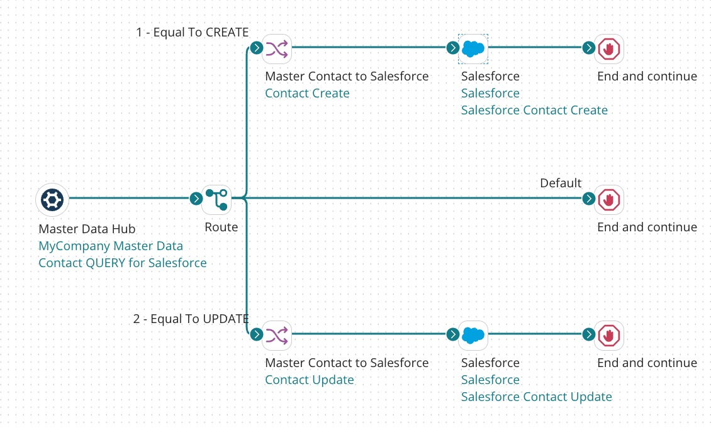
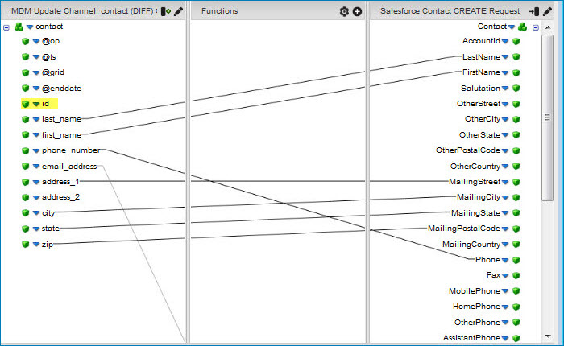
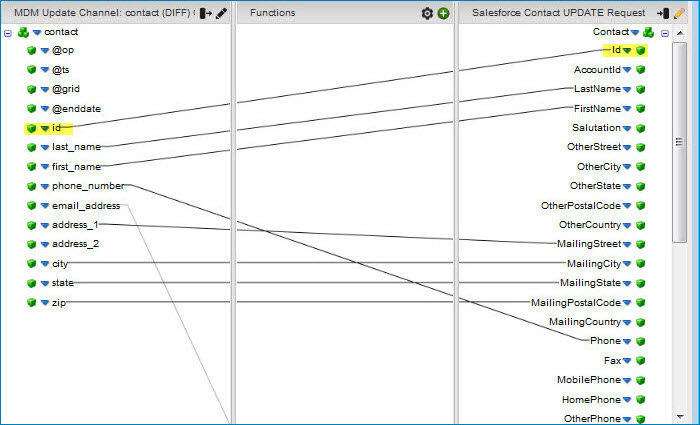

# Building a Integration process to route outgoing update requests

<head>
  <meta name="guidename" content="DataHub"/>
  <meta name="context" content="GUID-aea6dd5d-cc45-4928-945e-ded11861d56e"/>
</head>

The Boomi DataHub transactional workflow, as it relates to a given source of a domain, relies on the execution of a regularly scheduled process.

## About this task

:::info

The following integration examples use operations from the Master Data Hub legacy connector.

This Master Data Hub legacy connector is available only for existing integrations. For new integrations, use the [Boomi DataHub connector](docs/Atomsphere/Integration/Connectors/int-Boomi_Data_Hub_connector.md), which offers more operations and an improved experience.

:::

When the process executes, it

1.  Requests delivery in batches of source record update requests issued by the repository on a channel configured for that source

2.  Maps the fields in the entities in the update requests to source record fields

3.  Routes the update requests to the source system for processing

The maximum batch size is 200 update requests. Each batch delivery has a unique numeric ID assigned by the repository. By default the [ Boomi Master Data Hub connecto](/docs/Atomsphere/Integration/Connectors/r-atm-MDM_connector_ff690a6f-288d-44b3-96fb-e81afb046703.md) automatically requests delivery of the next batch while acknowledging the previous delivery by specifying its ID. Acknowledgment does not signify a batch’s update requests have been successfully routed to the source system.

:::note

If you need to ensure each delivered batch is successfully routed to the source system before requesting delivery of the next batch, consider using the Boomi Master Data Hub connector’s manual acknowledgment option. If manual acknowledgment is enabled, the connector sets the dynamic process property mdm-current-delivery-id to the delivery ID of the most recently delivered batch. If you need to ensure no more than one update request is delivered per request, consider using the Hub connector’s option to fetch single update requests.

:::

An example of a process built for this purpose \(where manual acknowledgment is not a requirement\) is illustrated by this capture of the process canvas. In this example the source is [Salesforce](http://www.salesforce.com).

A process built for this purpose should enforce unique constraints in the source system and therefore reject updates that would violate constraints. You can install a similar sample process built for this purpose in your account from the process library in . The process name is [ Hub: Fetch Channel Updates - Auto](https://platform.boomi.com/#build;processLibrary=4195924d-7d8a-4b94-ba77-b2d0b56f2824). Use of the manual acknowledgment option is demonstrated by the sample process [Hub: Fetch Channel Updates - Manual](https://platform.boomi.com/#build;processLibrary=4195924d-7d8a-4b94-ba77-b2d0b56f2824).

:::note

While it is necessary to propagate source record update requests specifying delete operations to synchronize source data with master data, neither the illustration above nor the steps below discuss the propagation of these requests for the following reasons:

-   The policy in some organizations is to forbid the deletion of source data.

-   Other organizations have special processing requirements associated with the deletion of source data, but the specific requirements vary between organizations. In many cases those requirements can be addressed in the context of the type of process discussed here.

To augment this process to propagate update requests specifying delete operations, simply create an additional path from the Route step \(step 8\).

:::

:::note

Handling of source record update requests specifying Reject Contributed Entity operations is not provided for in the steps below. Reject requests can occur in implementations in which data stewards are enabled to reject quarantined entities. Handling of reject requests in a to source integration typically takes one or more of the following forms:

-   Sending a delete request to the source system to remove the record or an update request to flag the record.

-   Sending a notification email to the source system administrator.

-   Logging an entry in an auditing system.

To augment this process to handle update requests specifying Reject Contributed Entity operations, simply create an additional path from the Route step \(step 8\).

:::

:::note

The following steps omit certain details that should be evident to users having experience using Integration to [build integration processes](/docs/Atomsphere/Integration/Process%20building/c-atm-Process_building_b422a00a-b17b-4ea8-ae01-d04adaf97e16.md).

:::

## Procedure

1.  In Integration, create a Process component and name it something appropriate — for example, MyCompany Master Contact Updates to Salesforce.

    The Start step is automatically placed.

2.  Configure the Start step as a [ Boomi Master Data Hub connector](/docs/Atomsphere/Integration/Connectors/r-atm-MDM_connector_ff690a6f-288d-44b3-96fb-e81afb046703.md) with a QUERY action.

    1.  Click **Import** to prepare to import the field structure of the domain from which source record update requests will originate.

    2. In the Boomi Master Data Hub Import Wizard, select the connection component you created for the repository when you built the Initial Load process.

    3.  In the **Source** field, type the unique ID of the source as it appears when you pause the pointer on the name of the source in the Sources tab in Boomi DataHub..

    4.  Confirm **Manually Acknowledge** is cleared.

    5.  Confirm **Fetch Single Update Request** is cleared.

    6.  Click **Next**.

    7.  In the **Object Type** list, select the domain.

    8.  Click **Next**.

    9.  In the summary screen, click **Finish**.

    An XML Profile component named “Boomi Master Data Hub “ `domain` QUERY Response” for the inbound data is automatically created.

    :::note
    
    Do not set filters — they are ignored because all requests must be fetched in order to synchronize the source system.

    :::

3.  Drag a **Connector** step from the **Execution** palette to the canvas.

4.  Configure the new step as a connector to the source with a SEND action and an Update operation. Import the structure of the source object whose records will be synchronized with the master data.

    A Profile component for the outbound data is automatically created.

5.  Drag a **Connector** step from the **Execution** palette to the canvas.

6.  Configure the new step as a connector to the source with a SEND action and a Create operation. Select the Profile component you just created for the outbound data.

    A Profile component for the outbound data is automatically created.

7.  Drag a **Route** step from the **Logic** palette to the canvas.

8.  Configure the Route step to check the value of the @op field in the inbound data. The value will be CREATE or UPDATE.

9.  Drag a **Map** step from the **Execution** palette to the canvas and create a Map component.

10. For the source profile, choose the profile component for the inbound data.

11. For the destination profile, choose the profile component for the outbound data.

12. Map fields in the domain whose data you want to include in update requests specifying create operations for this source to source record fields. However, do not map the id in the outbound profile as it will be assigned by the source.

    Optionally add functions to enable data transformations or define default values.

    

    :::note
    
    To make this step easier, consider using **Boomi Suggest**, a wizard that offers mapping suggestions based on thousands of mappings logged by the community. Boomi Suggest is enabled per account on the Integration [Account Information page](/docs/Atomsphere/Platform/r-atm-Account_information_management_ae14e3ab-37ae-4162-ad6c-9810a81329a4.md).

    :::

13. Connect the CREATE path from the Route step to the Map.

14. Connect the Map to the Connector step for the Create operation.

15. Drag a **Stop** step from the **Logic** palette to the canvas. Select **Continue processing other execution paths?**.

16. Connect the Connector step for the Create operation to the Stop step.

17. Drag a **Map** step from the **Execution** palette to the canvas and create a Map component.

18. For the source profile, choose the profile component for the inbound data.

19. For the destination profile, choose the profile component for the outbound data.

20. Important: Map the id field in the inbound profile to the corresponding field in the outbound profile.

21. Map other fields in the domain whose data you want to include in update requests specifying update operations for this source to source record fields.

    Optionally add functions to enable data transformations or define default values.

    

    :::note
    
    To make this step easier, consider using **Boomi Suggest**.

    :::

22. Connect the UPDATE path from the Route step to the Map.

23. Drag a **Stop** step from the **Logic** palette to the canvas. Select **Continue processing other execution paths?**.

24. Connect the Map to the Connector step for the Update operation.

25. Connect the Connector step for the Update operation to the new Stop step.

26. Drag a **Stop** step from the **Logic** palette to the canvas. Select **Continue processing other execution paths?**.

27. Drag the Default path from the Route step to the new Stop step.

28. **Optional:** Add a Business Rules step \(not illustrated\) to filter out records in the inbound data that contain unpopulated field values required by the source.

29. **Optional:** Add Notify steps \(not illustrated\).

30. **Save** the Process.