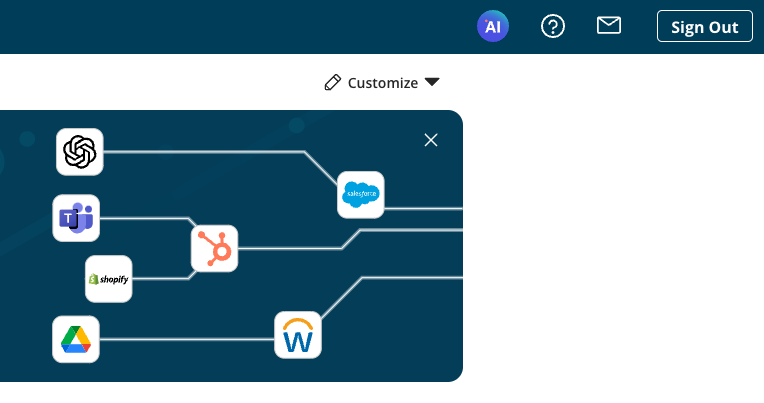

# Boomi AI 

<head>
  <meta name="guidename" content="Platform"/>
  <meta name="context" content="GUID-d3bd0d92-4185-44a5-925f-0cb392fa1978"/>
</head>

Boomi AI provides recommendations, guidance, and design using artificial intelligence (AI) to simplify the creation and management of integrations and automation for your business. It uses AI agents to increase productivity, provide insights, and connect applications, data, processes, people, and devices.

## AI Agents

The Boomi AI Starter pack includes seven Boomi AI Agents. The pack is included with the following editions of the Boomi Enterprise Platform:

- Personal Edition (30 day free trial)
- Base Edition
- Professional Edition
- Professional Plus Edition
- Enterprise Edition
- Enterprise Plus Edition

Read [Integration editions](/docs/Atomsphere/Integration/Getting%20started/c-atm-AtomSphere_Editions_bde0b272-5d32-46ec-82ea-6f9ffe98bd63.md) for more information.

Eight agents are pre-installed and ready to use right away. Boomi DataDetective is in early access and can be installed by contacting your account representative.

## Access 

To access Boomi AI, click the AI icon on the platform Home screen. 

Before you can access the Boomi AI agents you must have the following:

- Agreement to the Boomi AI terms and conditions. Administrators must select the **AI icon** > **Get Started** on the Boomi platform home page and accept terms and conditions on behalf of all account users. 
- Integration Build Read Write access. Read [User roles and privileges](c-atm-User_roles_and_privileges_5a1c8a1a-4d58-4e7d-a6b6-b684a0c6d672.md) to learn more about default Boomi Enterprise Platform roles and permissions.
-   Create Component API feature enabled on your account. 
-   Connectors enabled on your account. Many connectors are enabled by default. However, certain connectors may not be available due to licensing or your subscription. Read [Connector licenses and classes](../Integration/Connectors/c-atm-Connectors_bb305b35-0f13-4937-a918-f85dbbe1b27b.md) to learn more about connection licenses and your subscription.

## Documentation

Read about Boomi's AI agents and the AI Agent Garden to learn more.

- [AI Agent Garden](/docs/Atomsphere/Platform/atm-BoomiAI_Agent_Garden.md)
- [Boomi GPT](/docs/Atomsphere/Platform/atm-BoomiAI_BoomiGPT.md)
- [DesignGen](/docs/Atomsphere/Platform/atm-BoomiAI_Boomi_DesignGen.md)
- [Scribe](/docs/Atomsphere/Platform/atm-BoomiAI_Boomi_Scribe.md)
- [Answers](/docs/Atomsphere/Platform/atm-BoomiAI_Boomi_Answers.md)
- [Pathfinder](/docs/Atomsphere/Platform/atm-BoomiAI_Boomi_Pathfinder.md)
- [DataDetective](/docs/Atomsphere/Platform/atm-BoomiAI_PII_Insights.md)
- [HubGen](/docs/Atomsphere/Platform/atm-BoomiAI_Boomi_HubGen.md)
- [Resolve](/docs/Atomsphere/Integration/Integration%20management/c-atm-Boomi_Resolve_161e2c65-2c4d-45b8-a0ae-b107ddddac89.md)

We're continuously improving Boomi AI features. In the future, the Boomi Enterprise Platform will provide additional AI agents, including Partner AI agents and User-created AI agents.

We encourage you to check out the [release notes](https://help.boomi.com/docs/category/release-notes) for the latest updates as Boomi AI evolves with exciting new agents and improvements.
