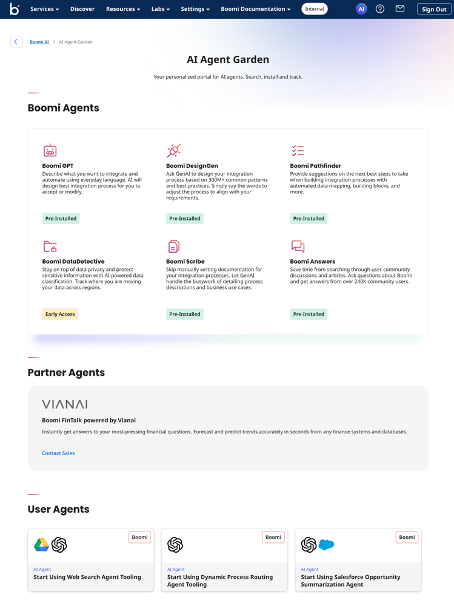
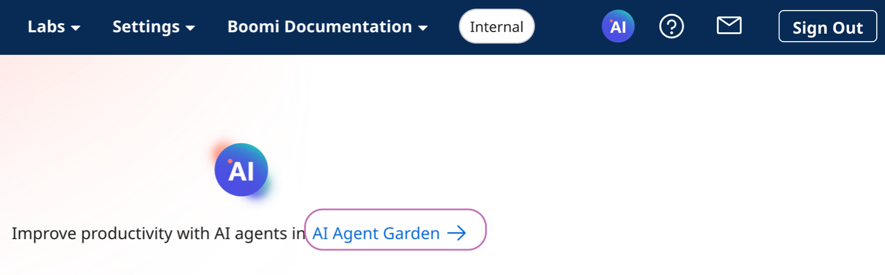
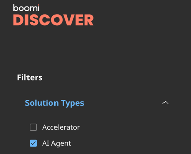

# AI Agent Garden

<head>
  <meta name="guidename" content="Platform"/>
  <meta name="context" content="GUID-22f68162-3f4a-429c-9d84-6b0e0b450a8d"/>
</head>

The new AI Agent Garden gives you a high-level view of all the AI agents available in the Boomi Enterprise Platform to meet your integration and automation needs. In the future, you will be able to manage, create, and install AI agents on your account.

To view the AI Agent Garden, click the AI icon on the platform's Home screen and then click the **AI Agent Garden** link.

### What are AI agents?

AI agents are software components that have a defined purpose and personality. They provide automation and perform specific tasks with or without human intervention. They use AI-based reasoning to independently decide how to accomplish a task and take action. Some AI agents can work together to complete complex processes seamlessly.

For example, a travel booking agent could receive a user’s request and independently orchestrate other AI agents to book the requested travel experience. Different AI agents work together to obtain information and then take action by reserving a hotel, car rentals, and flights.

Several AI agents are currently available on the platform. We encourage you to revisit the documentation regularly as Boomi AI continues to evolve with exciting new agents and improvements.

## Boomi AI Agents

You can use eight pre-installed Boomi AI agents in the Boomi Enterprise Platform to boost productivity, create automation, and streamline business outcomes. They are available to use right away.

 
[Boomi GPT](/docs/Atomsphere/Platform/atm-BoomiAI_BoomiGPT.md) - Enter your prompts in a conversational user interface and Boomi GPT orchestrates Boomi DesignGen, Boomi Answers, and Boomi Scribe to help you achieve your business goals.

 
[DesignGen](/docs/Atomsphere/Platform/atm-BoomiAI_Boomi_DesignGen.md) - Design integration processes with generative AI based on 300M+ patterns and best practices and refine them to fit your requirements.

 
[Answers](/docs/Atomsphere/Platform/atm-BoomiAI_Boomi_Answers.md) - Get quick answers to your questions about the Boomi Enterprise Platform using knowledge from Help.Boomi.com and the Boomi Community.

 
[Scribe](/docs/Atomsphere/Platform/atm-BoomiAI_Boomi_Scribe.md) - Let generative AI write documentation for your existing and new integration processes.

 
[Boomi DataDetective](/docs/Atomsphere/Platform/atm-BoomiAI_PII_Insights.md) (Early Access) - Protect sensitive information with AI-powered data classification and track data movement across regions.

 
[Pathfinder](/docs/Atomsphere/Platform/atm-BoomiAI_Boomi_Pathfinder.md) - Get suggestions on the next best steps to take when building integration processes with automated data mapping, building blocks, and more.

 
[HubGen](/docs/Atomsphere/Platform/atm-BoomiAI_Boomi_HubGen.md) - Let generative AI build model drafts in Hub based on your data synchronization goals.

 
[Resolve](/docs/Atomsphere/Integration/Integration%20management/c-atm-Boomi_Resolve_161e2c65-2c4d-45b8-a0ae-b107ddddac89.md) - Get quick solutions to your integration process errors using knowledge from Help.Boomi.com and the Boomi Community.

  

## Partner AI Agents

Partner AI agents are pluggable components that allow Boomi Enterprise Platform users to install and use best-of-breed AI functions from Boomi’s network of partners. These agents can be utilized in the same way as Boomi AI Agents, and allow rich capabilities to be incorporated from across the digital ecosystem.

### Boomi FinTalk powered by Vianai

[Boomi FinTalk powered by Vianai](https://discover.boomi.com/solutions/boomi-fintalk) is an AI agent that lets you receive detailed responses on financial information. It provides in-depth financial insights, utilizing the various data sources and systems connected to your platform account. Contact your Boomi account representative to learn more.  

## User-created AI Agents

User-created AI agents are developed using the Boomi Enterprise Platform, which provides all the necessary building blocks.

- Boomi’s connectivity and orchestration capabilities enable users to interact with selected models via API, access proprietary data sources, and automate actions through various applications. 
- The Boomi platform’s process canvas allows the creation of sophisticated workflows to retrieve, combine, filter, and contextualize data, facilitating model prompting and techniques like RAG and fine-tuning. 
- DataHub serves as an access point and repository for the agents’ knowledge base.
- Flow and API Management offer human or machine interfaces to package these components into standalone AI agents.

Explore the User-created AI agents we have available on [Boomi Discover](https://discover.boomi.com/browse-solutions). Browse by selecting AI Agent as the Solution Type.

