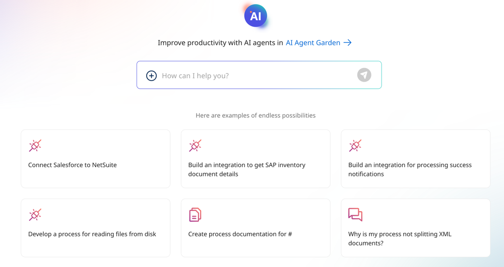
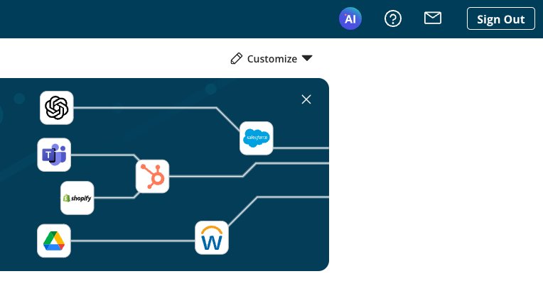
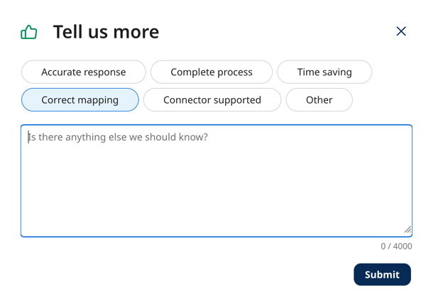

# Boomi GPT 

<head>
  <meta name="guidename" content="Platform"/>
  <meta name="context" content="GUID-5836ede1-84a7-4c32-840b-4a3c4455795b"/>
</head>

Boomi GPT is a powerful conversational user interface (CUI) that harnesses the power of generative AI. You can give it instructions in everyday language and it orchestrates [Boomi AI agents](/docs/Atomsphere/Platform/atm-BoomiAI_Agent_Garden.md) to help you streamline business processes and achieve your goals with the Boomi Enterprise Platform. 

Currently, Boomi GPT can orchestrate the following Boomi AI Agents:
- [Boomi Scribe](/docs/Atomsphere/Platform/atm-BoomiAI_Boomi_Scribe.md) - Let generative AI write documentation for your existing and new integration processes.
- [Boomi DesignGen](/docs/Atomsphere/Platform/atm-BoomiAI_Boomi_DesignGen.md) - Design integration processes with generative AI based on 300M+ patterns and best practices and refine them to fit your requirements.
- [Boomi Answers](/docs/Atomsphere/Platform/atm-BoomiAI_Boomi_Answers.md) - Get quick answers to your questions about the Boomi Enterprise Platform using knowledge from Help.Boomi.com and the Boomi Community.
- [Boomi Pathfinder](/docs/Atomsphere/Platform/atm-BoomiAI_Boomi_Pathfinder.md) - Get suggestions on the next best steps to take when building integration processes with automated data mapping, building blocks, and more.
- [Boomi HubGen](/docs/Atomsphere/Platform/atm-BoomiAI_Boomi_HubGen.md) - Let generative AI build model drafts in Hub based on your data synchronization goals.

These agents are pre-installed and available for all Boomi Enterprise Platform accounts. Read the [Boomi AI FAQ](/docs/Atomsphere/Platform/atm-BoomiAI_FAQ_8a8705a8-4773-44bd-92ed-41105186781c.md) to learn more about AI agent installation. Boomi GPT displays tags indicating which Boomi AI agent provided the response.

## Benefits

Boomi GPT benefits your business by:

- Orchestrating and streamlining complex tasks in an easy-to-use conversational interface
- Accelerating the work of creating integrations, automating workflows, documenting processes, and more.

## Accessing Boomi GPT

To access Boomi GPT, click the AI icon on the platform Home screen. Enter your prompt in the chat window and click the Send icon to start your conversation. Click **New Conversation** to clear the history of your previous conversation and make a new request.

## Prerequisites

To use Boomi GPT, you must have the following: 

-   Integration Build Read Write access. Read [User roles and privileges](c-atm-User_roles_and_privileges_5a1c8a1a-4d58-4e7d-a6b6-b684a0c6d672.md) to learn more about default Boomi Enterprise Platform roles and permissions.
-   Create Component API feature enabled on your account.
-   Agreement to the Boomi AI terms and conditions. Administrators can select the AI icon > Get Started to view and accept terms and conditions.  
-   Connectors enabled on your account. Many connectors are enabled by default. However, certain connectors may not be available due to licensing or your subscription. Read [Connector licenses and classes](../Integration/Connectors/c-atm-Connectors_bb305b35-0f13-4937-a918-f85dbbe1b27b.md) to learn more about connection licenses and your subscription.

## Important considerations 

-   The Boomi GPT conversational experience currently supports the English language.
-   The Component Create API is used to generate integrations. These API calls count towards your API usage. Read [API usage](c-atm-API_Usage_tab_49e6a2e4-90c8-44ae-8a2b-d151913367b9.md) to learn more.
-   The Boomi AI large language model's responses are dependent upon the input it receives by the user, and different inputs may return different results.
- The model is continuously learning, and responses will continue to improve as the model improves.
- Boomi GPT is only focused on responding to prompts related to Boomi DesignGen, Boomi HubGen, Boomi Scribe, and Boomi Answers.
- If you mention an unsupported connector in your Boomi GPT prompt, Boomi DesignGen replaces it with the HTTP connector step. Read [Boomi GPT Supported Connectors](/docs/Atomsphere/Platform/atm-BoomiAI_Connectors_9f8a52e4-5ef2-49ec-bb15-bba51d58fb59.md) for more information.

## Using prompts

In a conversational chat experience, you can give Boomi GPT prompts to orchestrate a Boomi AI agent and generate an output. Prompts are phrases or questions given to generative AI to guide its response. For example, "Create a process that connects Salesforce to NetSuite" is a prompt. Since certain prompts may not be precise enough to achieve your desired outcome, we provide prompt examples for each type of request.

We provide a list of prompt examples in the documentation for [Boomi Scribe](/docs/Atomsphere/Platform/atm-BoomiAI_Boomi_Scribe.md), [Boomi DesignGen](/docs/Atomsphere/Platform/atm-BoomiAI_Boomi_DesignGen.md), [Boomi HubGen](/docs/Atomsphere/Platform/atm-BoomiAI_Boomi_HubGen.md) and [Boomi Answers](/docs/Atomsphere/Platform/atm-BoomiAI_Boomi_Answers.md) use cases.

Prompt examples:

-   Demonstrate how to interact with Boomi GPT to get effective and useful responses.
-   Provide a template to help you create your own prompts. 
-   Help you quickly get your desired response and outcome.

You have the option to click a prompt example tile on the Boomi GPT landing page, use a prompt example from the documentation, or enter your own prompt.

As you enter a prompt, Boomi GPT displays suggested prompts to help you. You can select a prompt suggestion or continue entering your prompt. Prompts have a 750 character limit.

<iframe width="700px" height="400px" src="https://embed.app.guidde.com/playbooks/gyAXf58mCRhgKAGkndXyCW" title="Using Boomi GPT prompt suggestions" frameborder="0" referrerpolicy="unsafe-url" allowfullscreen="true" allow="clipboard-write" sandbox="allow-popups allow-popups-to-escape-sandbox allow-scripts allow-forms allow-same-origin allow-presentation"></iframe>

## Giving feedback

We'd love to receive feedback from you about Boomi AI agent responses. Click the thumbs up or thumbs down button next to a response to open the feedback window. You have the option to submit detailed feedback.

## Light and Dark theme

Boomi GPT supports the platform's Light Theme and Dark Theme. To set your background theme, navigate to **Settings** > **Account Information and Setup** > **My User Settings** > **Preferences** > **Select your theme**. 

## Supported connectors

We're continuously adding new connectors to the Boomi GPT experience. Read [Boomi GPT Supported Connectors](atm-BoomiAI_Connectors_9f8a52e4-5ef2-49ec-bb15-bba51d58fb59.md) to learn more.

