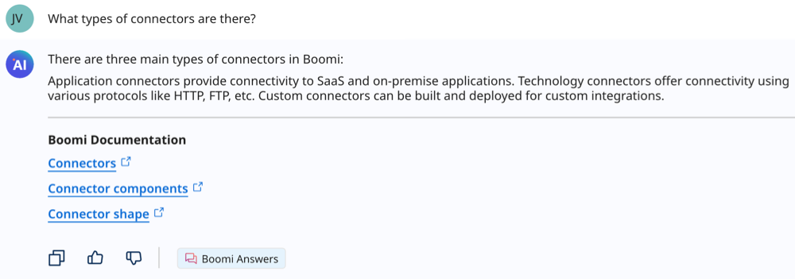
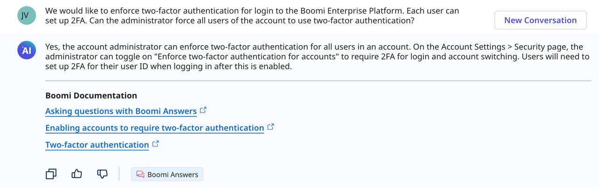
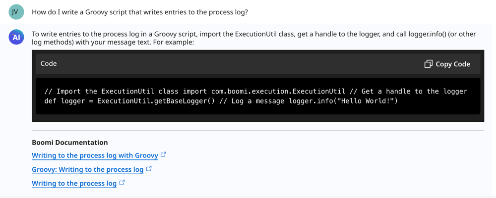

# Boomi Answers

<head>
  <meta name="guidename" content="Platform"/>
  <meta name="context" content="GUID-a3946083-4712-48dd-ba30-0f56c3655974"/>
</head>

Boomi Answers responds to your natural language questions about the Boomi Enterprise Platform so you can quickly get the information you need. It uses Retrieval-Augmented Generation (RAG) to deliver precise and relevant answers and article suggestions using information from Boomi Community, Help.Boomi.com, and Developer.Boomi.com. You can access Boomi Answers by entering prompts on the Boomi GPT landing page.

  

<iframe width="700px" height="400px" src="https://embed.app.guidde.com/playbooks/8VXgyhhmFMEXt7qCcW9CJ7" title="Boomi Answers" frameborder="0" referrerpolicy="unsafe-url" allowfullscreen="true" allow="clipboard-write" sandbox="allow-popups allow-popups-to-escape-sandbox allow-scripts allow-forms allow-same-origin allow-presentation"></iframe>

## Benefits

Boomi Answers benefits your business by:

- Answering your questions while you build integrations and automation
- Helping new users understand the Boomi Enterprise Platform

## Use cases

With Boomi Answers, you can:

- [Ask questions about the platform](#ask-questions-about-the-platform)
- [Ask questions about general troubleshooting scenarios](#ask-questions-about-general-troubleshooting-scenarios)
- [Get guidance for writing Groovy scripts](#get-guidance-for-writing-groovy-scripts)

Boomi GPT orchestrates Boomi Answers to respond to your questions and provide relevant articles to explore for more information. Explore the following use cases. Read [Asking questions with Boomi Answers](/docs/Atomsphere/Platform/atm-BoomiAI_Asking_Questions.md) for prompt examples and prompt engineering tips.

### Ask questions about the platform

You can ask questions to learn more about the Boomi Enterprise Platform, Boomi terminology, and creating integrations. For example, you can enter the following prompt in Boomi GPT:

`What types of connectors are there?`

<!-- #### Prompt examples

|Prompt Example|
|--------------|
|"What is a Molecule and how is it different from an Atom?" |
|"What types of connectors are there?"|
|"What is included in Boomi Pay-As-You-Go?"|
|"How do I contact support?"|
|"How do I deploy a process?"|
|"Where can I find my scheduled process?"| -->

### Ask questions about general troubleshooting scenarios

You can ask Boomi Answers troubleshooting questions not specific to your account. You can describe your scenario and ask questions to help complete a task. For example, you can enter the following prompt in Boomi GPT: 

`We would like to enforce two-factor authentication for login to the Boomi Enterprise Platform. Each user can set up 2FA. Can the administrator force all users of the account to use two-factor authentication?`

<!-- #### Prompt examples

|Prompt Example|
|--------------|
|"We would like to enforce two-factor authentication for login to the Boomi Enterprise Platform. Each user can set up 2FA. Can the administrator force all users of the account to use two-factor authentication?"|
|"How do I run statistics for a deployed model in Master Data Hub?"|
|"What happens to golden records after I change a source configuration on a model? For example, if I change a source to only accept data instead of contributing data."|
|"Why is my process not splitting XML documents?"|
|"Http Server Code 400: Bad Request"| -->

### Get guidance for writing Groovy scripts

You can get basic groovy script guidance based on content in Boomi community articles and help articles. For example, you can enter the following prompt in Boomi GPT: 

`How do I write a Groovy script that writes entries to the process log?`

<!-- ## Important considerations

- Boomi Answers cannot respond to questions:

  - About your specific Boomi account and data
  - Unrelated to the Boomi Enterprise Platform
  - About troubleshooting specific issues with your account
  - Asking for code samples

- Boomi Answers does not have context about previous responses to questions and integration design requests. Questions must contain at least three words.

- The Boomi Answers large language model's responses are dependent upon the input it receives by the user, and different inputs may return different results. 

- The model is continuously learning and responses will continue to improve as the model improves.

- The model's responses are based on the latest information the model is trained on. -->