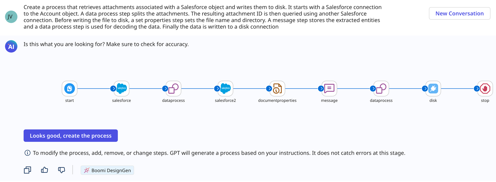
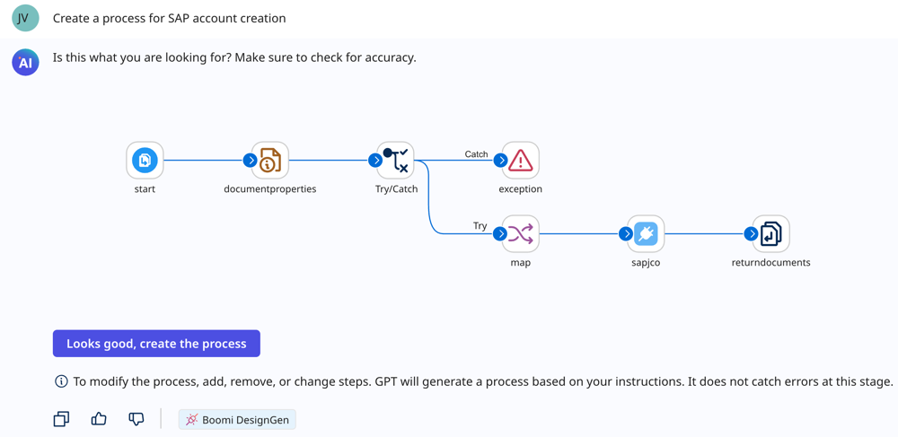
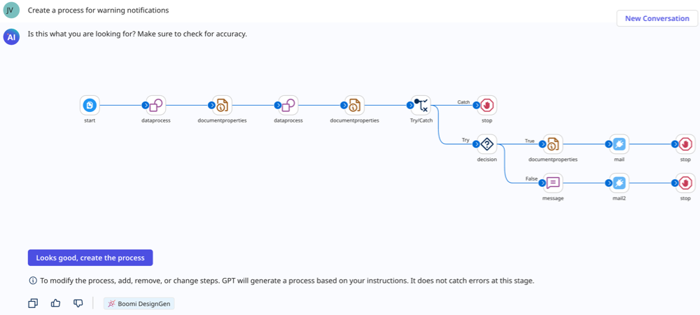

# Boomi DesignGen

<head>
  <meta name="guidename" content="Platform"/>
  <meta name="context" content="GUID-1a121a5c-afd7-4a73-a80c-d6e8d33a99b1"/>
</head>

Boomi DesignGen reduces the time it takes to build integrations and automation. It learns from the de-identified metadata of over 300 million integrations from approximately 20,000 customers. The model is built on the data collected as described in [Data Collection](ci-Community_Intelligence_19c17ab6-b3fe-4e69-95f2-bcb438f3fa47.md). 

Boomi DesignGen takes your requests, creates a diagram to help you visualize the process, and edits it based on your feedback. After you approve the design, it generates an integration you can open directly in the Integration process canvas. You can access Boomi DesignGen by entering prompts on the Boomi GPT landing page.

  

<iframe width="700px" height="400px" src="https://embed.app.guidde.com/playbooks/hQSZ8R8PREN3N24Wreiozz" title="Boomi DesignGen" frameborder="0" referrerpolicy="unsafe-url" allowfullscreen="true" allow="clipboard-write" sandbox="allow-popups allow-popups-to-escape-sandbox allow-scripts allow-forms allow-same-origin allow-presentation"></iframe>

## Benefits

Boomi DesignGen benefits your business by:

- Accelerating your integration and automation development and deployment
- Optimizing business processes using best practices and common patterns
- Increasing productivity and freeing up time for innovation and strategic tasks

## Use cases

With Boomi DesignGen, you can create integrations from several types of prompts.

- [Detailed prompt describing an integration](#creating-an-integration-with-a-detailed-prompt)
- [Connecting two systems](#creating-an-integration-connecting-two-systems)
- [Describing a process or sub-process](#creating-a-process-or-sub-process)

Explore the following examples.

### Creating an integration with a detailed prompt

You may have a specific integration design in mind and want to save time building it. You can describe your integration in detail, explaining the business goal, the connectors you want to use, and how data flows from one connector to another. For example, you can enter the following prompt in Boomi GPT:

`"Create a process that retrieves attachments associated with a Salesforce object and writes them to disk. It starts with a Salesforce connection to the Account object. A data process step splits the attachments. The resulting attachment ID is then queried using another Salesforce connection. Before writing the file to disk, a set properties step sets the file name and directory. A message step stores the extracted entities and a data process step is used for decoding the data. Finally the data is written to a disk connection"`

You can suggest edits to the process to fit your needs. Read [Creating an Integration using a Detailed Prompt](/docs/Atomsphere/Platform/atm-BoomiAI_Create_Integration_using_a_Detailed_Prompt.md) for a detailed walkthrough and guidance on creating detailed prompts.

<!-- You can create your own prompts. Use these prompt examples to help you get started.

|Prompt Examples|
|--------------|
|"Create an integration to handle customer orders in Shopify. Start with a connection to Shopify followed by a message step that holds the incoming order data for evaluation. Use a data process step to split the data into rows. Next, add a business rules step to assess each record against a criteria. If the rule is accepted, create a confirmation notification. If the rule is rejected, create a message step that holds the error information. Next, process the rejected payload by splitting the error and storing it in another message. Finally, generate a notification to inform the rejection."|
|"I want to create a process to handle payments for Shopify orders. The process should begin by querying the Order ID from the Shopify application and then branch into two paths.In branch path 1, store the generated authorization ID in Doc cache. In branch path 2, use the mapped payment details to make a payment with Shopify. Add a decision point for successful and unsuccessful transactions. Then, map the individual decision responses separately and return the payload."|
|"Start with a message step that contains the test data. Use a data process step to split the payload into rows. Next, add a business rules step. If the rule is accepted, create a notification. If the rule is rejected, create a message step that holds the rejected payload. Proceed to process the rejected payload by splitting the error message and storing it in another message. Finally, create a notification with the error message"|
|"Create a process for flat file to JSON transformation. The process begins with a start step that proceeds into a message step that contains the document payload. A map is used to do the transformation and then end the process."| -->

### Creating an integration connecting two systems

You may want to connect customer data between two applications but you’re unsure of the best design approach. To get an integration design up and running with minimal effort, tell Boomi DesignGen to connect one application to another. It auto-suggests common patterns that map data between systems.

For example, you can use the prompt `"Connect Salesforce to NetSuite”`. As you type the prompt, it auto-completes to indicate that it is a common design pattern. When you use these common patterns, Boomi DesignGen shows you multiple data objects you can connect, such as account records to customer records.

You can also prompt Boomi DesignGen with the system type's name. For example, enter `"Connect ERP to CRM"` in Boomi GPT. Read [Creating an Integration Connecting Systems](/docs/Atomsphere/Platform/atm-BoomiAI_Create_Integration_Connecting_Systems_f8ae5b2d-d514-4d4a-8f22-90e18412c0bb.md) and [Creating an Integration Connecting System Types](/docs/Atomsphere/Platform/atm-BoomiAI_Create_Integrations_Connecting_System_Types_d851212c-a9e5-451a-99bc-c49988763ba8.md) for detailed walkthroughs.

<iframe width="700px" height="400px" src="https://embed.app.guidde.com/playbooks/4ivRn4w3skcHNKR2hGhTZv" title="Creating an integration connecting two systems" frameborder="0" referrerpolicy="unsafe-url" allowfullscreen="true" allow="clipboard-write" sandbox="allow-popups allow-popups-to-escape-sandbox allow-scripts allow-forms allow-same-origin allow-presentation"></iframe>

<!-- You can explore design patterns by entering connector or system types and selecting prompt suggestions. Here are a few prompts to get you started.

|Prompt Example|Design Prompt Example|
|--------------|---------------------|
|"Connect Salesforce to NetSuite"|Account to Customer|
|"Connect Shopify to NetSuite"|Customer to Customer|
|"Connect Shopify to NetSuite"|Order to Cash Sale|
|"Create a process to connect Autotask to Salesforce"|Project to Opportunity|
|"Create a process to connect Workday to Salesforce"|Submit Customer to Account|

| Prompt Example         | Connector Example                                                                                     | Design Prompt Example  |
|------------------------|------------------------------------------------------------------------------------------------------|------------------------|
| "Connect HRM to CRM"   | • HRM (Human Resource Management) connector - NetSuite • CRM (Customer Relationship Management) connector - Shopify | Cash Sale to Order     |
| "Connect ERP to CRM"   | • ERP (Enterprise Resource Planning) connector - NetSuite • CRM connector - Salesforce Account                            | Customer to Account    | -->

### Creating a process or sub-process

You may want to streamline repetitive tasks in your organization so you can focus more on strategic goals. You can describe a business process or sub-process and Boomi DesignGen will create it based on common patterns and best practices. It lets you provide feedback until you’re ready to finalize the integration.

For example, you can enter the following prompt in Boomi GPT: `“Create a process for SAP account creation”`. As you type the prompt, it auto-completes to indicate that it is a common design pattern.

You can also describe a sub-process, such as for error handling or creating email notifications. For example, you can enter the following prompt in Boomi GPT: `"Create a process for warning notifications"`.

Read [Creating a process or sub-process](/docs/Atomsphere/Platform/atm-BoomiAI_Create_Integration_Based_on_a_Business_Process_4f594693-91b9-4885-9fe0-d052d114465c.md) for detailed walkthroughs.

## Prerequisites

To use Boomi DesignGen, you must have the following:

-   Integration Build Read Write access. Read [User roles and privileges](c-atm-User_roles_and_privileges_5a1c8a1a-4d58-4e7d-a6b6-b684a0c6d672.md) to learn more about default Boomi Enterprise Platform roles and permissions.
-   Create Component API feature enabled on your account.
-   Agreement to the Boomi AI terms and conditions. Administrators can select the AI icon > Get Started to view and accept terms and conditions.  
-   Connectors enabled on your account. Many connectors are enabled by default. However, certain connectors may not be available due to licensing or your subscription. Read [Connector licenses and classes](../Integration/Connectors/c-atm-Connectors_bb305b35-0f13-4937-a918-f85dbbe1b27b.md) to learn more about connection licenses and your subscription.

<!-- ## Important considerations

-   Boomi DesignGen currently supports the English language.
-   The Component Create API is used to generate integrations. These API calls count towards your API usage. Read [API usage](c-atm-API_Usage_tab_49e6a2e4-90c8-44ae-8a2b-d151913367b9.md) to learn more.
-   The Boomi AI large language model's responses are dependent upon the input it receives by the user, and different inputs may return different results.
- The model is continuously learning and responses will continue to improve as the model improves.
- Boomi DesignGen is only focused on responding to prompts related to generating integration designs.
- It has no knowledge of previous integration conversations and designs. You cannot refer to a previous prompt or response. To make adjustments to your prompt, copy and paste the previous prompt with your edits in the chat window.  
- If you mention an unsupported connector in your Boomi GPT prompt, Boomi DesignGen replaces it with the HTTP connector step. Read [Boomi GPT Supported Connectors](/docs/Atomsphere/Platform/atm-BoomiAI_Connectors_9f8a52e4-5ef2-49ec-bb15-bba51d58fb59.md) for more information. -->