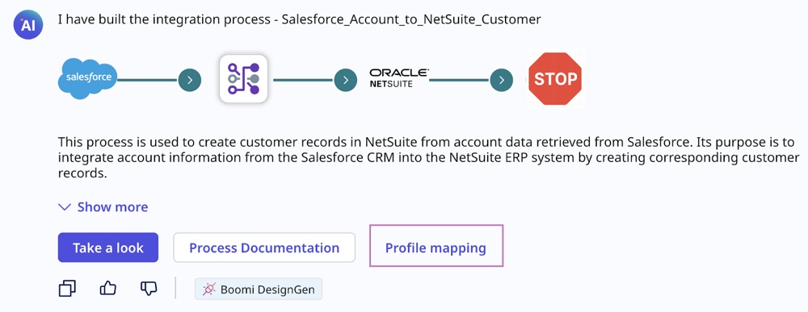
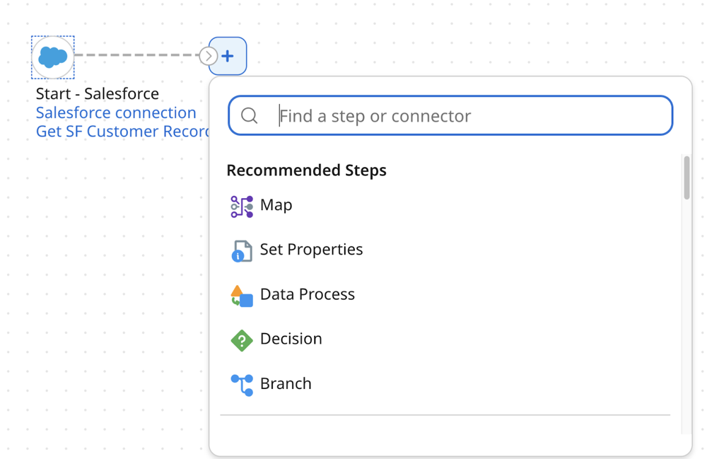
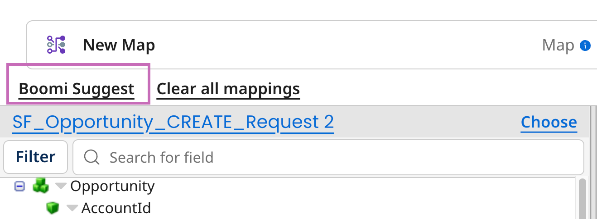

# Boomi Pathfinder

<head>
  <meta name="guidename" content="Platform"/>
  <meta name="context" content="GUID-37e479c9-fcb9-41ef-a9de-34d35ab19113"/>
</head>

Boomi Pathfinder assists you with integration and automation tasks on the Boomi Enterprise Platform. It offers actionable next steps, building blocks, and data mapping. Boomi Pathfinder provides suggestions based on best practices and de-identified metadata of integrations.

<iframe width="700px" height="400px" src="https://embed.app.guidde.com/playbooks/nzVbf3rQUTwPJkDnM84MoM" title="Boomi Pathfinder" frameborder="0" referrerpolicy="unsafe-url" allowfullscreen="true" allow="clipboard-write" sandbox="allow-popups allow-popups-to-escape-sandbox allow-scripts allow-forms allow-same-origin allow-presentation"></iframe>

<!-- You can access Boomi Pathfinder in: 
- [Boomi DesignGen](/docs/Atomsphere/Platform/atm-BoomiAI_Boomi_DesignGen.md): Select **Profile Mapping** when Boomi DesignGen creates an integration on the Boomi GPT landing page.
- [Step palette](/docs/Atomsphere/Integration/Process%20building/c-atm-Process_building_b422a00a-b17b-4ea8-ae01-d04adaf97e16.md): Choose the next step in the Integration build canvas.
- [Map components](/docs/Atomsphere/Integration/Process%20building/t-atm-Using_Boomi_Suggest_to_map_elements_9663a5a5-8b8b-441a-8923-905fd7e01234.md): Click **Boomi Suggest** to enhance the data transformation process by providing data mapping suggestions between source and target data fields. -->

## Benefits

Boomi Pathfinder helps you:

- Improve efficiency by implementing high-quality integrations with minimal effort
- Reduce integration and data management errors by utilizing best practices
- Save on resources by simplifying integration development tasks

## Use cases

Explore the following ways you can use Boomi Pathfinder:

- [Accelerate data mapping within Boomi DesignGen](#accelerate-data-mapping-within-boomi-designgen)
- [Get guidance for the next steps in Integration](#get-guidance-for-the-next-steps-in-integration)
- [Get suggestions for data mapping in Integration](#get-suggestions-for-data-mapping-in-integration)

### Accelerate data mapping within Boomi DesignGen

After generating an integration with Boomi DesignGen, Boomi Pathfinder can map profiles for you. It suggests mappings based on over 300 million common integration patterns. To see these suggested mappings in Integration, click **Profile Mapping**. In a future release, a tag will show in Boomi GPT next to a response indicating when Boomi Pathfinder maps profiles. Read [Boomi DesignGen](/docs/Atomsphere/Platform/atm-BoomiAI_Boomi_DesignGen.md) to learn more. 

### Get guidance for the next steps in Integration

As you build your processes in Integration, Boomi Pathfinder recommends the next steps to take. Read [Adding steps to a process](/docs/Atomsphere/Integration/Process%20building/t-atm-Adding_shapes_to_a_process_e3e49675-225a-4591-b5c9-a559aa4c045a.md) to learn more.

### Get suggestions for data mapping in Integration

When using the Map step in your integration, Boomi Pathfinder recommends common data mappings to help you quickly convert data from a source system to a target system when you click Boomi Suggest. Read [Using Boomi Suggest to map elements](/docs/Atomsphere/Integration/Process%20building/t-atm-Using_Boomi_Suggest_to_map_elements_9663a5a5-8b8b-441a-8923-905fd7e01234.md) to learn more.

