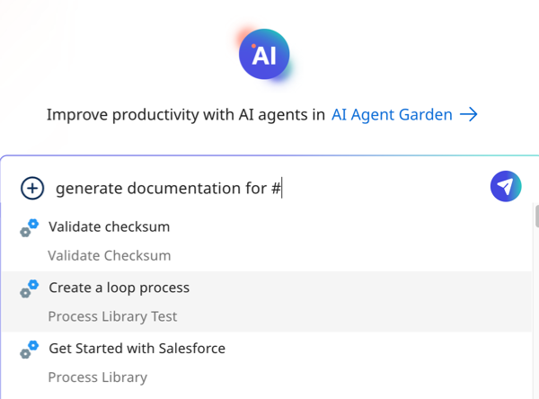

# Boomi Scribe

<head>
  <meta name="guidename" content="Platform"/>
  <meta name="context" content="GUID-eddf0efa-b2a9-445b-a160-7829b85d0fd1"/>
</head>

Boomi Scribe boosts your productivity by generating summaries, descriptions, and documentation for AI-generated and existing integrations. Boomi Scribe’s process documentation describes the integration, its subprocesses, its components, operations, metadata, process schedules, and how data flows through each step and connector. It also includes visually engaging process diagrams generated by Boomi DesignGen. 

Boomi Scribe's comparison documentation details the additions, modifications, and deletions between two versions of an integration component or process.

With Boomi Scribe, you can:

- Generate process documentation and paste it into your content management system.
- Export documentation as a .docx file and open it in a .docx-supported editor like Google Docs.
- Generate process summaries to help your team understand business processes.
- Create process diagrams
- Document comparisons between process or component versions

  

<iframe width="700px" height="400px" src="https://embed.app.guidde.com/playbooks/egUhDMZ5tfjiQVsDpYipdv" title="Boomi Scribe" frameborder="0" referrerpolicy="unsafe-url" allowfullscreen="true" allow="clipboard-write" sandbox="allow-popups allow-popups-to-escape-sandbox allow-scripts allow-forms allow-same-origin allow-presentation"></iframe>

  

## Benefits

Boomi Scribe benefits your business by:

- Reducing the time it takes to document integration processes and components
- Helping you maintain up-to-date process documentation details
- Reducing typos and grammatical errors

## Use cases

Boomi GPT orchestrates Boomi Scribe to create documentation for new integrations made with Boomi DesignGen and for your current integrations on the process canvas.

- [Document new Boomi DesignGen integrations in Boomi GPT](#document-new-boomi-designgen-integrations-in-boomi-gpt)
- [Document existing integrations in Boomi GPT](#document-existing-integrations-in-boomi-gpt)
- [Document the differences between component and process versions in Boomi GPT](#document-the-differences-between-component-and-process-versions-in-boomi-gpt)
- [Document existing integrations in the process canvas](#document-existing-integrations-in-the-process-canvas)

### Document new Boomi DesignGen integrations in Boomi GPT

You can use Boomi Scribe within Boomi GPT to generate summaries, long descriptions, and process documentation for an integration created by Boomi DesignGen. Read [Documenting new Boomi DesignGen integrations](/docs/Atomsphere/Platform/atm-BoomiAI_Create_Documentation_for_AIGenerated_Integrations.md) for a detailed walkthrough.

<iframe width="700px" height="400px" src="https://embed.app.guidde.com/playbooks/2z19JooVG3M3Tk6DyTK27m" title="Generating descriptions and documentation for integrations built by Boomi DesignGen" frameborder="0" referrerpolicy="unsafe-url" allowfullscreen="true" allow="clipboard-write" sandbox="allow-popups allow-popups-to-escape-sandbox allow-scripts allow-forms allow-same-origin allow-presentation"></iframe>

### Document existing integrations in Boomi GPT

Boomi Scribe can create descriptions and documentation for integrations that already exist on the process canvas. Read [Documenting existing integrations](/docs/Atomsphere/Platform/atm-BoomiAI_Create_Documentation_for_Existing_Process.md) for a detailed walkthrough.

### Document the differences between component and process versions in Boomi GPT

Boomi Scribe can create documentation explaining the differences between two versions of integration components or a process. It documents the additions, modifications, and deletions that occurred. Boomi Scribe also documents versions within different branches. Read [Documenting version differences](/docs/Atomsphere/Platform/atm-BoomiAI_Documenting_version_differences.md) for a detailed walkthrough.

<iframe width="700px" height="400px" src="https://embed.app.guidde.com/playbooks/gXYKd7K6S7fxZeW4iVBfAs" title="Generating documentation comparing version differences" frameborder="0" referrerpolicy="unsafe-url" allowfullscreen="true" allow="clipboard-write" sandbox="allow-popups allow-popups-to-escape-sandbox allow-scripts allow-forms allow-same-origin allow-presentation"></iframe>

### Document existing integrations in the process canvas

Boomi Scribe can document your integration directly in the process canvas in Integration. Read [Generating documentation in the process canvas](/docs/Atomsphere/Platform/atm-BoomiAI_Generating_documentation_in_the_canvas.md) for a detailed walkthrough.

## Prerequisites

To use Boomi Scribe, you must have the following: 

-   Integration Build Read Write access. Read [User roles and privileges](/docs/Atomsphere/Platform/c-atm-User_roles_and_privileges_5a1c8a1a-4d58-4e7d-a6b6-b684a0c6d672.md) to learn more about default Boomi Enterprise Platform roles and permissions.
-   Create Component API feature enabled on your account.
-   Agreement to the Boomi AI terms and conditions. Administrators can select the **AI icon** > **Get Started** to view and accept terms and conditions.

<!-- ## Important considerations

- Boomi Scribe currently supports the English language.
- It has no knowledge of previous documentation responses. You cannot refer to a previous prompt or response. To make adjustments to your prompt, copy and paste the previous prompt with your edits in the chat window.
- Boomi Scribe can only generate descriptions and documentation for one process within a single prompt in Boomi GPT. If you enter multiple processes, Boomi Scribe uses the most recently entered process for its response.
- Boomi Scribe does not support documentation for processes that include a cycle or loop.
- Boomi Scribe can document integrations with up to 100 steps. However, depending on the complexities of an integration, such as the number of configurations within each step, you may experience response errors while documenting integrations with less than 100 steps.
- Boomi Scribe only creates descriptions for process components. It does not support descriptions for other components, such as maps and connector actions.
- Steps that are disconnected from the process are not included in documentation.
- To successfully generate documentation for a process, you need permission to access all its associated components.
- If prompts do not contain sufficient details as outlined in the walkthroughs in [Generating Documentation for Existing Processes](/docs/Atomsphere/Platform/atm-BoomiAI_Create_Documentation_for_Existing_Process.md), GPT may redirect the request to the Boomi Answers agent to obtain the most relevant information related to the provided prompt. -->
