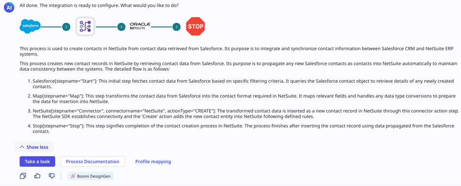

# Documenting Boomi DesignGen integrations in Boomi GPT

<head>
  <meta name="guidename" content="Platform"/>
  <meta name="context" content="GUID-cace0a7b-4df6-4d3a-996b-ba7ded5fde87"/>
</head>

[Boomi Scribe](/docs/Atomsphere/Platform/atm-BoomiAI_Boomi_Scribe.md) can generate summaries, long descriptions, and documentation for a new integration right after Boomi DesignGen creates it in Boomi GPT. Creating process documentation with Boomi Scribe saves time when you need to document the details for your organization.

Boomi Scribe's process documentation includes the following information:

- **Overview** - lists a detailed summary of the process, describing the flow of data and the results.
- **Process Diagram** - displays an illustration of the process as it appears in the process canvas.
- **Process Metadata** - lists metadata about the process, including name, version, component statistics, and more.
- **Business Context** - lists applications and the business value they provide.
- **Process steps and functions** - explains each step in the process and the actions associated with it. It also includes details for up to five subprocesses, with high-level details for any additional subprocesses.

After creating an integration, Boomi Scribe automatically generates a summary of the process. Additionally, Boomi Scribe lets you generate a process description and full documentation. You can copy documentation to paste into a content system or export it as a .docx file.

This feature is only accessible within Boomi GPT immediately after Boomi DesignGen creates a process. Read [Documenting existing integrations](/docs/Atomsphere/Platform/atm-BoomiAI_Create_Documentation_for_Existing_Process.md) to learn how to document other integrations that already exist in your process canvas.

<iframe width="700px" height="400px" src="https://embed.app.guidde.com/playbooks/2z19JooVG3M3Tk6DyTK27m" title="Generating descriptions and documentation for integrations built by Boomi DesignGen" frameborder="0" referrerpolicy="unsafe-url" allowfullscreen="true" allow="clipboard-write" sandbox="allow-popups allow-popups-to-escape-sandbox allow-scripts allow-forms allow-same-origin allow-presentation"></iframe>

## Prerequisites

To use Boomi Scribe, you must have the following: 

-   Integration Build Read Write access. Read [User roles and privileges](c-atm-User_roles_and_privileges_5a1c8a1a-4d58-4e7d-a6b6-b684a0c6d672.md) to learn more about default Boomi Enterprise Platform roles and permissions.
-   Create Component API feature enabled on your account.
-   Agreement to the Boomi AI terms and conditions. Administrators can select the **AI icon** > **Get Started** to view and accept terms and conditions.

## Important considerations

- Boomi Scribe currently supports the English language.
- It has no knowledge of previous documentation responses. You cannot refer to a previous prompt or response. To make adjustments to your prompt, copy and paste the previous prompt with your edits in the chat window.
- Boomi Scribe can only generate descriptions and documentation for one process within a single prompt in Boomi GPT. If you enter multiple processes, Boomi Scribe uses the most recently entered process for its response.
- Boomi Scribe does not support documentation for processes that include a cycle or loop.
- Boomi Scribe can document integrations with up to 100 steps. However, depending on the complexities of an integration, such as the number of configurations within each step, you may experience response errors while documenting integrations with less than 100 steps.
- Steps that are disconnected from the process are not included in documentation.
- You can access Boomi Scribe within the Boomi GPT landing page.

## Generate descriptions and documentation

1. In Boomi GPT, generate a new process with Boomi DesignGen. Read [Boomi DesignGen](/docs/Atomsphere/Platform/atm-BoomiAI_Boomi_DesignGen.md) to learn more about creating new processes with generative AI.
1. Boomi Scribe generates a high-level description of the process automatically. Click the **Copy** icon to copy and paste the high-level description into the process canvas or your content management system. The text is in [Markdown](https://en.wikipedia.org/wiki/Markdown).
5. **Optional**: Click **Show more**. Boomi Scribe generates a detailed process summary that includes information about each step and its operation. You can click the **Copy** icon to copy and paste the summary into your content management system. The text is in Markdown.

5. **Optional**: Click **Process Documentation**. Documentation includes a summary, process metadata, business context, process steps, profile names, and functions of each step. When this information is available, it describes object names and operation types for connectors. Connector steps also include information about the operation name, request profile, and response profile.

The documentation includes details about the source and target objects for mapping components with XML or JSON profile types. When documentation includes a Map components or subprocess, it contains a details and a link that opens the object in the Integration build canvas to provide more context.
Boomi Scribe also generates a process diagram.

<iframe width="700px" height="400px" src="https://embed.app.guidde.com/playbooks/nA8Hxk6xK3ry72qh3o9byj" title="Generating documentation for processes built by Boomi DesignGen" frameborder="0" referrerpolicy="unsafe-url" allowfullscreen="true" allow="clipboard-write" sandbox="allow-popups allow-popups-to-escape-sandbox allow-scripts allow-forms allow-same-origin allow-presentation"></iframe>

6. **Optional**: You can click the **Copy** icon to copy and paste the documentation into your content management system. The text is in Markdown.
7. **Optional**: Click the **Download** icon to export documentation as a .docx file. When opened in a .docx-supported editor, the content includes the process diagram and appears similar to how content appears in Boomi GPT. Layout and spacing may differ depending on the editor.

