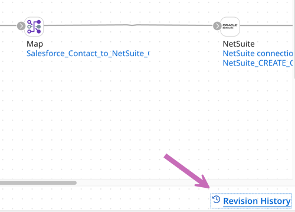

# Documenting existing integrations in Boomi GPT

<head>
  <meta name="guidename" content="Platform"/>
  <meta name="context" content="GUID-87184167-80d6-4417-9e54-a7660f9ebdef"/>
</head>

[Boomi Scribe](/docs/Atomsphere/Platform/atm-BoomiAI_Boomi_Scribe.md) can generate a summary, a detailed description, and documentation for a process already existing in Integration. You can copy and paste the text into your document management system or export it as a .docx file. Creating process documentation with Boomi Scribe saves time when you need to document the details for your organization.

Boomi Scribe's process documentation includes the following information:

- **Overview** - lists a detailed summary of the process, describing the flow of data and the results.
- **Process Diagram** - displays an illustration of the process as it appears in the process canvas.
- **Process Metadata** - lists metadata about the process, including name, version, component statistics, and more.
- **Business Context** - lists applications and the business value they provide.
- **Process steps and functions** - explains each step in the process and the actions associated with it. It also includes details for up to five subprocesses, with high-level details for any additional subprocesses.
- **Process Schedule** - when deployed integrations have a schedule, this section lists the Atom ID, the hour and minute the process runs, and the frequency.

There are three ways you can prompt it to generate descriptions and document a process:

- [Generate descriptions and documentation using a URL](#generate-descriptions-and-documentation-using-a-url)
- [Generate descriptions and documentation by searching](#generate-descriptions-and-documentation-by-searching)
- [Generate descriptions and documentation using the component ID](#generate-descriptions-and-documentation-using-the-component-id)

## Prerequisites

To use Boomi Scribe, you must have the following: 

-   Integration Build Read Write access. Read [User roles and privileges](c-atm-User_roles_and_privileges_5a1c8a1a-4d58-4e7d-a6b6-b684a0c6d672.md) to learn more about default Boomi Enterprise Platform roles and permissions.
-   Agreement to the Boomi AI terms and conditions. Administrators can select the **AI icon** > **Get Started** to view and accept terms and conditions.

## Important considerations

- Boomi Scribe currently supports the English language.
- It has no knowledge of previous documentation responses. You cannot refer to a previous prompt or response. To make adjustments to your prompt, copy and paste the previous prompt with your edits in the chat window.
- Boomi Scribe can only generate descriptions and documentation for one process within a single prompt in Boomi GPT. If you enter multiple processes, Boomi Scribe uses the most recently entered process for its response.
- Boomi Scribe does not support documentation for processes that include a cycle or loop.
- Boomi Scribe can document integrations with up to 100 steps. However, depending on the complexities of an integration, such as the number of configurations within each step, you may experience response errors while documenting integrations with less than 100 steps.
- Boomi Scribe only creates descriptions for process components. It does not support descriptions for other components, such as maps and connector actions.
- Steps that are disconnected from the process are not included in documentation.
- To successfully generate documentation for a process, you need permission to access all its associated components.
- If prompts do not contain sufficient details as outlined in the help documentation walkthroughs, GPT may redirect the request to the Boomi Answers agent to obtain the most relevant information related to the provided prompt.
- You can access Boomi Scribe within the Boomi GPT landing page.

## Generate descriptions and documentation using a URL

Each process in Integration has a unique URL.

1. In Integration, click into the process build tab for the process you want to document.
2. Copy the URL.
3. In Boomi GPT, click the plus icon in the chat window.
4. Paste the URL and click **Add**. A loading indicator appears as Boomi Scribe looks for a process name that matches your URL.

<iframe width="700px" height="400px" src="https://embed.app.guidde.com/playbooks/xtFj3jra3CMGfbKGVfDU9A" title="Generating documentation using an integration URL." frameborder="0" referrerpolicy="unsafe-url" allowfullscreen="true" allow="clipboard-write" sandbox="allow-popups allow-popups-to-escape-sandbox allow-scripts allow-forms allow-same-origin allow-presentation"></iframe>

5. Do one of the following:
   - Enter a prompt to generate a short description of the process. For example, "Create a brief summary for". Short descriptions contain one or two sentences that explain the business goal of the process. 
   - Enter a prompt to generate a detailed description of the process. For example, "Create long description for" . Detailed descriptions explains the goal, each step in the process, and the operation that occurs with each step.
   - Enter the prompt "Create documentation for" to generate process documentation. Read [Prompt examples](#prompt-examples) for assistance.
   
   Documentation includes a summary, process metadata, business context, process steps, profile names, and functions of each step. When this information is available, it describes object names and operation types for connectors. Connector steps also include information about the operation name, request profile, and response profile.
   
   The documentation includes details about the source and target objects for mapping components with XML or JSON profile types. When documentation includes a Map components or subprocess, it contains details and a link that opens the object in the Integration build canvas to provide more context. Boomi Scribe also generates a process diagram.
   
6. **Optional**: You can click the **Copy** icon to copy and paste the text into your content management system. The text is in [Markdown](https://en.wikipedia.org/wiki/Markdown). Steps that are disconnected from the process are not included in documentation.
7. **Optional**: Click the **Download** icon to export documentation as a .docx file. When opened in a .docx-supported editor, the content includes the process diagram and appears similar to how content appears in Boomi GPT. Layout and spacing may differ depending on the editor. This feature is available with Chrome, Edge, Firefox, and Safari browsers. 

## Generate descriptions and documentation by searching

You can search and select a process name from the chat window. If two processes have the same name you can use the URL or component ID method instead.

1. In the Boomi GPT chat window, do one of the following:
   - Enter a prompt to generate a brief summary of the process. For example, "Summarize #". 
   - Enter a prompt to generate a detailed description of the process. For example, "Create long description for #".
   - Enter a prompt to generate process documentation. For example, "Create documentation for #".
   Read [Prompt examples](#prompt-examples) for assistance.
2. Next to the # symbol, begin entering the name of the process. You don't need to enter the entire name. You can enter a portion of the name, such as a letter or a word. A loading indicator appears as Boomi Scribe looks for a process name that matches your search.
3. A menu displays your processes that match the keyword entered.
   
4. Scroll and select a process.
5. Click the Send icon to continue.
6. **Optional**: You can click the **Copy** icon to copy and paste the text into your content management system. The text is in Markdown. Steps that are disconnected from the process are not included in documentation.
7. **Optional**: Click the **Download** icon to export documentation as a .docx file. When opened in a .docx-supported editor, the content includes the process diagram and appears similar to how content appears in Boomi GPT. Layout and spacing may differ depending on the editor. This feature is available with Chrome, Edge, Firefox, and Safari browsers.

### Generate descriptions and documentation using the component ID

You can enter a component ID with your prompt to generate process descriptions and documentation. Boomi Scribe can only generate descriptions and documentation for one process within a single prompt. If you enter multiple processes, Boomi Scribe uses the most recently entered process for its response.

1. In Integration, click into the process canvas for the process you want to document. 
2. In the **Revision History** link in the bottom right, find the integration's component ID.
   
3. Copy the component ID.
4. In the Boomi GPT chat window, do one of the following: 
   - Enter a prompt to generate a brief summary of the process and the component ID. For example, "Summarize `<component ID>`".
   - Enter a prompt to generate a detailed description of the process. For example, "Create long description for `<component ID>`".
   - Enter a prompt to generate process documentation. For example, "Create documentation for `<component ID>`".
   
5. **Optional**: Click the **Copy** icon to copy and paste the text into your content management system. The text is in Markdown. Steps that are disconnected from the process are not included in documentation.
6. **Optional**: Click the **Download** icon to export documentation as a .docx file. When opened in a .docx-supported editor, the content includes the process diagram and appears similar to how content appears in Boomi GPT. Layout and spacing may differ depending on the editor. This feature is available with Chrome, Edge, Firefox, and Safari browsers.

## Prompt examples

You can create prompts to generate descriptions and documentation. Use these prompt examples to get started. Read [Boomi GPT](/docs/Atomsphere/Platform/atm-BoomiAI_BoomiGPT.md) to learn more about prompt examples and creating prompts.

|Prompt Example|Response type
|--------------|-------------|
|"Create a document for"| Process documentation|
|"Write a one pager for"| Process documentation|
|"Generate a guide for" | Process documentation|
|"Generate documentation for" | Process documentation|
|"Create a long description for"| Long description |
|"Write about key details of"| Long description |
|"Explain"| Long description |
|"Expand on"| Long description |
|"Create a brief summary for"|Short summary description| 
|"Summarize"|Short summary description|
