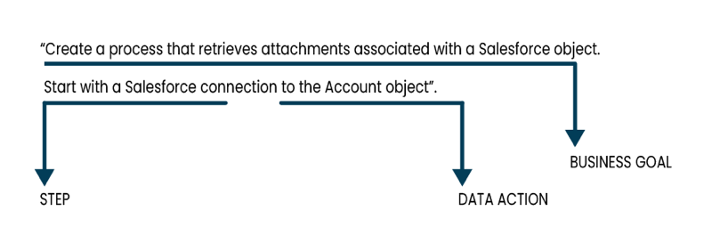

# Creating an integration using a detailed prompt 

<head>
  <meta name="guidename" content="Platform"/>
  <meta name="context" content="GUID-22b3e007-f481-496f-ad11-ffba423a0f57"/>
</head>

[Boomi DesignGen](/docs/Atomsphere/Platform/atm-BoomiAI_Boomi_DesignGen.md) can create an integration design based on a detailed prompt that includes your business goal and data flow. Using detailed prompts reduces the time you spend building integrations. Read [Creating effective and detailed prompts](/docs/Atomsphere/Platform/atm-BoomiAI_Create_Integration_using_a_Detailed_Prompt.md#creating-effective-and-detailed-prompts) to help you craft prompts that generate the best responses.

Boomi DesignGen lets you edit the integration design before it creates it in the process canvas. Additionally, you can ask [Boomi Scribe](/docs/Atomsphere/Platform/atm-BoomiAI_Boomi_Scribe.md) to generate process documentation.

<iframe width="700px" height="400px" src="https://embed.app.guidde.com/playbooks/qRppmR9rmRWmxfAzLSaRJd" title="Creating an integration using a detailed prompt" frameborder="0" referrerpolicy="unsafe-url" allowfullscreen="true" allow="clipboard-write" sandbox="allow-popups allow-popups-to-escape-sandbox allow-scripts allow-forms allow-same-origin allow-presentation"></iframe>

## Prerequisites

To use Boomi DesignGen, you must have the following:

-   Integration Build Read Write access. Read [User roles and privileges](c-atm-User_roles_and_privileges_5a1c8a1a-4d58-4e7d-a6b6-b684a0c6d672.md) to learn more about default Boomi Enterprise Platform roles and permissions.
-   Create Component API feature enabled on your account.
-   Agreement to the Boomi AI terms and conditions. Administrators can select the AI icon > Get Started to view and accept terms and conditions.  
-   Connectors enabled on your account. Many connectors are enabled by default. However, certain connectors may not be available due to licensing or your subscription. Read [Connector licenses and classes](../Integration/Connectors/c-atm-Connectors_bb305b35-0f13-4937-a918-f85dbbe1b27b.md) to learn more about connection licenses and your subscription.

## Important considerations

-   Boomi DesignGen currently supports the English language.
-   The Component Create API is used to generate integrations. These API calls count towards your API usage. Read [API usage](c-atm-API_Usage_tab_49e6a2e4-90c8-44ae-8a2b-d151913367b9.md) to learn more.
-   The Boomi AI large language model's responses are dependent upon the input it receives by the user, and different inputs may return different results.
- The model is continuously learning and responses will continue to improve as the model improves.
- Boomi DesignGen is only focused on responding to prompts related to generating integration designs.
- It has no knowledge of previous integration conversations and designs. You cannot refer to a previous prompt or response. To make adjustments to your prompt, copy and paste the previous prompt with your edits in the chat window.  
- If you mention an unsupported connector in your Boomi GPT prompt, Boomi DesignGen replaces it with the HTTP connector step. Read [Boomi GPT Supported Connectors](/docs/Atomsphere/Platform/atm-BoomiAI_Connectors_9f8a52e4-5ef2-49ec-bb15-bba51d58fb59.md) for more information.

## Walkthrough

1.  Enter a prompt in the Boomi GPT chat window. Prompts have a 750 character limit. Create your prompt using the following steps for a helpful response.
    1. Enter your business goal or objective in your first sentence.
    2. In the next sentence, enter an integration step and what happens to the data in that step. Review [Process steps](/docs/Atomsphere/Integration/Process%20building/r-atm-Process_shapes_79b3f010-5269-46cf-95d1-db2387afe0f4.md) documentation to understand what each step does.
    3. Repeat step b in the order you want the steps to occur for each step in your process.  

    Boomi DesignGen may take approximately up to one minute to respond. Boomi Scribe responds with a diagram of the integration design, outlining the flow and steps involved. It does not support diagrams for processes that include a cycle and complex processes that involve a large number of steps.
2. **Optional**: Edit the integration design by entering a prompt in the chat window. Describe the changes you want to make. For example, "Add a try/catch step before the Map step." Include the step name and the action to take in your prompt, such as add or remove.

    :::tip

    Before proceeding to step 3, you have the option to ask Boomi Answers a general question about the platform. For example, you can ask "What does the branch step do?" and Boomi Answers explains how a Branch step functions. However, Boomi Answers cannot provide specific answers about the generated integration. The **Looks good, create the process** button remains available while asking questions.
    
    :::

3. Click **Looks good, create the process** to tell Boomi GPT to generate the process in the Integration process canvas. Boomi Scribe generates a high-level description of the integration. You can click the **Copy** icon to copy and paste the high-level description into the process canvas or your content management system. The text is in [Markdown](https://en.wikipedia.org/wiki/Markdown).

  :::note 

  Boomi DesignGen uses the Component Create API to generate integrations. These API calls count towards your API usage. Read [API usage](c-atm-API_Usage_tab_49e6a2e4-90c8-44ae-8a2b-d151913367b9.md) to learn more.

  :::

4. If Boomi DesignGen finds that you have an existing connection for a connector in the design, you can:
    - Select **Create new connection** to generate a new connection configuration for the connector. 
    - Select **Choose existing connection** to use a current connection you've already configured in Integration.

  :::note

    Boomi DesignGen currently supports reusing existing connections if there are five or less connection component options. If more than five options exists, it creates a new connection.
    
  :::

5. **Optional**: Click **Show more**. Boomi Scribe generates a detailed process summary that includes information about each step and its operation. You can click the **Copy** icon to copy and paste the summary into your content management system. The text is in Markdown.
6. **Optional**: Click **Process Documentation**. Documentation includes a summary, process metadata, business context, process steps, profile names, and functions of each step. When this information is available, it describes object names and operation types for connectors. Connector steps also include information about the operation name, request profile, and response profile.
   
   The documentation includes details about the source and target objects for mapping components with XML or JSON profile types. When documentation includes a Map component or subprocess, it contains a link that opens the object in the Integration build canvas to provide more context. Boomi Scribe also generates a process diagram. 
7. **Optional**: Click the **Copy** icon to copy and paste the documentation into your content management system. The text is in Markdown.
8. **Optional**: Click the **Download** icon to export documentation as a .docx file. When opened in a .docx-supported editor, the content includes the process diagram and appears similar to how content appears in Boomi GPT. Layout and spacing may differ depending on the editor.
9. Select **Take a look**. Boomi GPT opens the integration canvas so you can review the design.
10. Configure, test, and deploy your integration. Read [Process Building](../Integration/Process%20building/c-atm-Process_building_b422a00a-b17b-4ea8-ae01-d04adaf97e16.md#GUID-AD96C1C0-CC92-45CD-BC9F-C3D2553A39CA) and [Deployment](../Integration/Deployment/c-atm-Deployment_4e723d20-3e2b-41b7-8d57-010dccb940b8.md) for assistance.

## Creating effective and detailed prompts

The following prompt recommendations can help you craft a prompt that generates an optimal response. 

- Start with an objective or business end goal for the integration. For example, "Create a process that retrieves attachments associated with a Salesforce object and writes them to disk."

- Describe the step in the integration process. For example, "Start with a Salesforce connection." Include wording that indicates the step type. For example, for the Notify step, you could use the word "notification" or "notify." For the Connector step, you could use "connection" or "connector." Refer to the [Process steps](/docs/Atomsphere/Integration/Process%20building/r-atm-Process_shapes_79b3f010-5269-46cf-95d1-db2387afe0f4.md) documentation for more information on available steps and on what each step does in an integration.

- In the same sentence where you describe the step, describe the data and what happens to the data. For example, "to the Account object" or "splits the attachments."

- Describe the integration steps in sequential order.

### Prompt examples 

You can use the following prompt examples as a template when crafting your integration prompt. Read [Boomi GPT](/docs/Atomsphere/Platform/atm-BoomiAI_BoomiGPT.md) to learn more about prompt examples and creating prompts.

|Prompt Examples|
|--------------|
|"Create a process that retrieves attachments associated with a Salesforce object and writes them to disk. It starts with a Salesforce connection to the Account object. A data process step splits the attachments. The resulting attachment ID is then queried using another Salesforce connection. Before writing the file to disk, a set properties step sets the file name and directory. A message step stores the extracted entities and a data process step is used for decoding the data. Finally the data is written to a disk connection."|
|"Create an integration to handle customer orders in Shopify. Start with a connection to Shopify followed by a message step that holds the incoming order data for evaluation. Use a data process step to split the data into rows. Next, add a business rules step to assess each record against a criteria. If the rule is accepted, create a confirmation notification. If the rule is rejected, create a message step that holds the error information. Next, process the rejected payload by splitting the error and storing it in another message. Finally, generate a notification to inform the rejection."|
|"I want to create a process to handle payments for Shopify orders. The process should begin by querying the Order ID from the Shopify application and then branch into two paths.In branch path 1, store the generated authorization ID in Doccache. In branch path 2, use the mapped payment details to make a payment with Shopify. Add a decision point for successful and unsuccessful transactions. Then, map the individual decision responses separately and return the payload."|
|"Start with a message step that contains the test data. Use a data process step to split the payload into rows. Next, add a business rules step. If the rule is accepted, create a notification. If the rule is rejected, create a message step that holds the rejected payload. Proceed to process the rejected payload by splitting the error message and storing it in another message. Finally, create a notification with the error message"|
|"Create a process for flat file to JSON transformation. The process begins with a start step that proceeds into a message step that contains the document payload. A map is used to do the transformation and then end the process."|

:::note

Read [Salesforce Integration Guide](https://community.boomi.com/s/article/Salesforce-Integration-Guide) for ways to expand upon the Salesforce example, such as uploading in bulk to Salesforce.

:::

