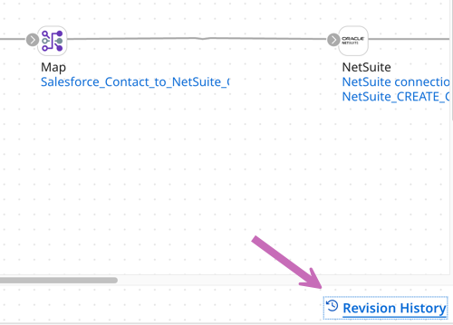
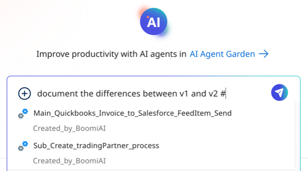

# Documenting version differences in Boomi GPT

<head>
  <meta name="guidename" content="Platform"/>
  <meta name="context" content="GUID-7580ad7a-19c9-4a38-8ab7-9683d1becc55"/>
</head>

[Boomi Scribe](/docs/Atomsphere/Platform/atm-BoomiAI_Boomi_Scribe.md) can generate documentation in Boomi GPT that compares the differences between two versions of an integration component or an entire process. Boomi Scribe can also document versions within different branches. It documents the additions, modifications, and deletions between the versions and generates a summary of the integration component or process.

## Important considerations

- Boomi Scribe can only document two versions within a single prompt.
- Version numbers do not need to be in consecutive order. For example, you can document the differences between version 2 and version 5.
- Boomi Scribe currently supports the English language.
- It has no knowledge of previous documentation responses. You cannot refer to a previous documentation prompt or response. To make adjustments to your prompt, copy and paste the previous prompt with your edits in the chat window.
- Boomi Scribe can document integrations with up to 100 steps. However, depending on the complexities of an integration, such as the number of configurations within each step, you may experience response errors while documenting integrations with less than 100 steps.
- Steps that are disconnected from the process are not included in documentation.
- You can access Boomi Scribe within the Boomi GPT landing page.

There are two ways you can prompt Boomi Scribe to generate version comparison documentation:

- [Document version comparison of a component or process using a component ID](#documenting-component-or-process-version-comparisons-using-a-component-id)
- [Document version comparison of a process by searching](#documenting-a-process-version-comparison-by-searching)

## Supported components

Boomi Scribe can document changes for the following types of components:

- Certificate
- Connection
- Connector Operation
- Cross Reference Table
- Custom Library
- Document Cache 
- Map
- Map Function
- Process
- Process Route
- Process Property
- Profile
- Queue
- Scripting
- XSLT Stylesheet

## Documenting component or process version comparisons using a component ID

1. In Integration, open the process or component you want to document. 
2. In the **Revision History** link in the bottom right, find the component ID. The versions for the process or component are listed in the Revision History as well.  
   
3. Copy the component ID.
4. In the Boomi GPT chat window, enter the following prompt: "Document the differences between v`<version number>` and v`<version number>` `<component ID>`". For example, "Document the differences between v2 and v4 	fcf1a5c7-ece5-4b13-836b-a2b623ec380a." This prompt instructs Boomi Scribe to document what was added,modified,and deleted in V4 compared to V2.
5. Click the Send icon to continue.
6. **Optional**: Click the **Copy** icon to copy and paste the text into your content management system. The text is in Markdown.
7. **Optional**: Click the **Download** icon to export documentation as a .docx file. When opened in a .docx-supported editor, layout and spacing may differ depending on the editor. This feature is available with Chrome, Edge, Firefox, and Safari browsers.

<iframe width="700px" height="400px" src="https://embed.app.guidde.com/playbooks/gXYKd7K6S7fxZeW4iVBfAs" title="Generating documentation comparing version differences" frameborder="0" referrerpolicy="unsafe-url" allowfullscreen="true" allow="clipboard-write" sandbox="allow-popups allow-popups-to-escape-sandbox allow-scripts allow-forms allow-same-origin allow-presentation"></iframe>

## Documenting a process version comparison by searching

You can search and select a process name from the chat window and document a version comparison.

1. In the Boomi GPT chat window, enter the following prompt: "Document the differences between v1 and v2 #". This prompt instructs Boomi Scribe to document what was added,modified,and deleted in V2 compared to V1. 
2. Next to the # symbol, begin entering the name of the process. You don't need to enter the entire name. You can enter a portion of the name, such as a letter or a word. A loading indicator appears as Boomi Scribe looks for a process name that matches your search.

3. A menu displays your processes that match the keyword entered.
4. Scroll and select a process.
5. Click the Send icon to continue.
6. **Optional**: You can click the **Copy** icon to copy and paste the text into your content management system. The text is in Markdown. Steps that are disconnected from the process are not included in documentation.
7. **Optional**: Click the **Download** icon to export documentation as a .docx file. When opened in a .docx-supported editor, the content includes the process diagram and appears similar to how content appears in Boomi GPT. Layout and spacing may differ depending on the editor. This feature is available with Chrome, Edge, Firefox, and Safari browsers.

## Prompt examples

Use the following prompts as a template to help you get started. Each prompt needs a # symbol or a component ID following it. Version numbers in the prompt do not need to be consecutive for you to receive a response from Boomi Scribe. For example you can ask it to document the difference between version 1 and version 4.

|Prompt Examples|
|--------------|
|"Document the differences between V1 and V2"|
|"Summarize the changes from version 2 to version 5 for"|
|"How is version 2 different from version 4 for"|
|"What improvements were made from version 1 to version 2 for"|
|"Describe the changes from version 3 to version 6 for"| 
|"Describe the transformations from v1 to v2 for"|
|"Outline the differences between version 3 and version 4"|