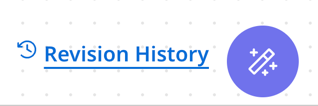

# Process canvas: Documenting integrations

<head>
  <meta name="guidename" content="Platform"/>
  <meta name="context" content="GUID-d9868968-693d-42f8-b7e5-33dc2ecfca75"/>
</head>

<head>
  <meta name="guidename" content="Integration"/>
  <meta name="context" content="GUID-d9868968-693d-42f8-b7e5-33dc2ecfca75"/>
</head>

[Boomi Scribe](/docs/Atomsphere/Platform/atm-BoomiAI_Boomi_Scribe.md) reduces the time it takes to document saved processes. It can generate documentation for any version or branch of an integration you currently have open in the process canvas. After making edits to your integration, you can generate documentation so it’s up to date. Process documentation includes the following sections:

- **Overview** - lists a detailed summary of the process, describing the flow of data and the results.
- **Process Diagram** - displays an illustration of the process as it appears in the process canvas.
- **Process Metadata** - lists metadata about the process, including name, version, component statistics, and more.
- **Business Context** - lists applications and the business value they provide.
- **Process steps and functions** - explains each step in the process and the actions associated with it. It also includes details for up to five subprocesses, with high-level details for any additional subprocesses.
- **Process Schedule** - when deployed integrations have a schedule, this section lists the Atom ID, the hour and minute the process runs, and the frequency.

<iframe width="700px" height="400px" src="https://embed.app.guidde.com/playbooks/sH5RUxQpKJ6sM2hjMmpNGV" title="Generating documentation in the process canvas" frameborder="0" referrerpolicy="unsafe-url" allowfullscreen="true" allow="clipboard-write" sandbox="allow-popups allow-popups-to-escape-sandbox allow-scripts allow-forms allow-same-origin allow-presentation"></iframe>

## Prerequisites

To use Boomi Scribe, you must have the following: 

-   Integration Build Read Write access. Read [User roles and privileges](c-atm-User_roles_and_privileges_5a1c8a1a-4d58-4e7d-a6b6-b684a0c6d672.md) to learn more about default Boomi Enterprise Platform roles and permissions.
-   Agreement to the Boomi AI terms and conditions. Administrators can select the **AI icon** > **Get Started** to view and accept terms and conditions.

## Important considerations

- Boomi Scribe currently supports the English language.
- Boomi Scribe does not support documentation for processes that include a cycle or loop.
- Boomi Scribe can document integrations with up to 100 steps. However, depending on the complexities of an integration, such as the number of configurations within each step, you may experience response errors while documenting integrations with less than 100 steps.
- Steps that are disconnected from the process are not included in documentation.
- To successfully generate documentation for a process, you need permission to access all its associated components.
- After editing and saving the process or closing the process tab, Integration deletes the previously generated documentation.
- Documentation generated by Boomi Scribe isn't saved in the platform.

## Walkthrough

1. In Integration, open a process. 
2. **Optional**: To document a different version of the process, click **Revision History** in the bottom right and open the version you want to document.
2. Click the AI button in the bottom right corner. 
  
3. In the Boomi Scribe menu, select **Create and download documentation for this process**.
4. **Optional**: After Boomi Scribe generates the documentation, click the **Download with process diagram** button to export documentation as a .docx file. When opened in a .docx-supported editor, the content includes the process diagram and appears similar to how content appears in the canvas. Layout and spacing may differ depending on the editor. This feature is available with Chrome, Edge, Firefox, and Safari browsers.
5. **Optional**: You can click the **Copy** icon to copy and paste the text into your content management system. Copying the diagram is not supported. The text is in [Markdown](https://en.wikipedia.org/wiki/Markdown).

:::note

Generated documentation will remain available if you close the Boomi Scribe document window. The documentation reappears when you open the Scribe window. However, documentation will be cleared when you do any of the following:

- Close the process tab
- Log out of the Boomi Platform
- Save new changes to the process

:::