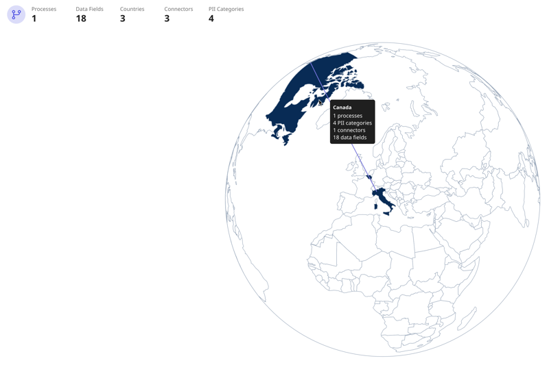
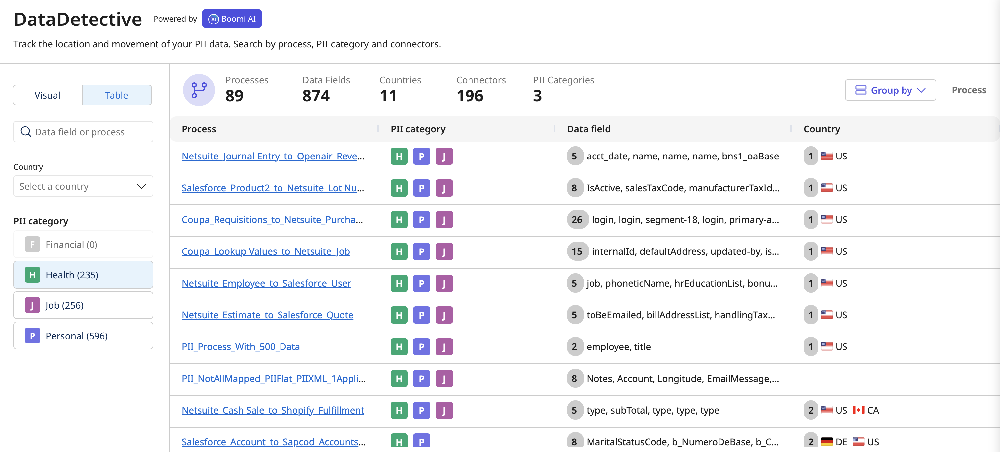

# Boomi DataDetective

<head>
  <meta name="guidename" content="Platform"/>
  <meta name="context" content="GUID-8bbbf644-6065-436d-b943-12170763dc5f"/>
</head>

Boomi DataDetective (Early Access) lets you visualize the movement of Personal Identifiable Information (PII) between integration connections. A summary details the data fields, connectors, processes, and countries involved. You can view PII details using the map visualization or table view. 

Boomi DataDetective data is refreshed weekly from your Integration account. It classifies data as PII by looking at field names and process step names. It does not use your processed data. Like our other AI Products, Boomi DataDetective solely uses the customer-agnostic de-identified metadata as outlined in the [Data Collection](/docs/Atomsphere/Platform/ci-Community_Intelligence_19c17ab6-b3fe-4e69-95f2-bcb438f3fa47.md). It utilizes Boomi internal SLMs to determine and classify the sensitivity of your data, including PII. If you have turned off Boomi data collection, you will not see data in Boomi DataDetective.

To get started with Boomi DataDetective contact your account representative. After it's enabled, you can access it from the main platform page.

<iframe width="700px" height="400px" src="https://embed.app.guidde.com/playbooks/agsR4eXNjVT5jrQ9B786cy" title="Boomi DataDetective" frameborder="0" referrerpolicy="unsafe-url" allowfullscreen="true" allow="clipboard-write" sandbox="allow-popups allow-popups-to-escape-sandbox allow-scripts allow-forms allow-same-origin allow-presentation"></iframe>

## Benefits

Viewing PII metadata statistics helps you:

- Make informed decisions about data and PII
- Gain insight into how sensitive data is integrated between sources
- Develop efficient processes for handling PII

## Use cases 

With Boomi DataDetective you can:

- [Explore PII data movement across countries using a global visualization](#visualize-pii-movement)
- [Analyze PII data statistics by integration, data object, PII category, and more](#analyze-pii-data-statistics)

### Visualize PII movement

You can view information about the location of PII using the map visualization. Enter fields and select filters to see specific PII information. You can click on the globe to turn it and view other continents. Pause your cursor on a connection near the country to see how many processes, data fields, connectors, and PII categories are associated with the country. Read [Visualizing PII statistics](/docs/Atomsphere/Platform/atm-BoomiAI_PII_Visual_View.md) for a detailed walkthrough.

<!-- 1. Select the **Visual** tab.
2. You can select one or all of the following filters to see specific information about PII. The global visualization shows processes, connector locations, and how data flows from different source connections to the target connections. The connections are color-coded and correspond with the following PII categories:
    - **Financial** - information related to financing, such as salary, account balances, and credit card numbers.
    - **Health** - information related to health care, such as medical records, biometric data, and lab test results.
    - **Job** - business information about a person or company, such as employee ID, business email, office phone number, and office address.
    - **Personal** - information about a person, such as name, age, address, and email.

    The top summary shows a summary of the processes, connectors, data fields, countries, and PII categories involved based on the filter.

3. **Optional**: Select a data field or an integration name from the list in the search box. You can also enter a data field or process and the search autocompletes.
4. **Optional**: Select a country from the drop-down. If PII flows through a connector, the country of the connector's IP address displays in the list.
5. **Optional**: Select a PII category to filter PII data movement related to the following 4 categories. Next to each category, the number indicates the amount of data fields that contain that PII category. -->

## Analyze PII data statistics

You can view statistics in a table to see which process and data fields contain PII. Select filters to see specific PII information. Read [Analyzing PII statistics](/docs/Atomsphere/Platform/atm-BoomiAI_PII_Table_View.md) for a detailed walkthrough.

<!-- 1. Select the **Table** tab.
2. **Optional**: Select a data field or an integration name from the list in the search box. You can also enter a data field or process and the search autocompletes.
3. **Optional**: Select a country from the drop-down. If PII flows through a connector, the country of the connector's IP address displays in the list.
4. **Optional**: Select a PII category to filter PII data movement related to the following 4 categories: Financial, Health, Job, and Personal, Next to each category, the number indicates the amount of data fields that contain that PII category.
5. **Optional**: Select an option in the **Group By** toggle to view the table arranged by PII data fields or processes.
6. In the table, you can click the process name to open a panel and view metadata about the data fields. From the panel you can click **View Process** to open integration in the process canvas. -->
